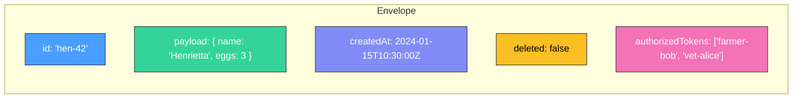
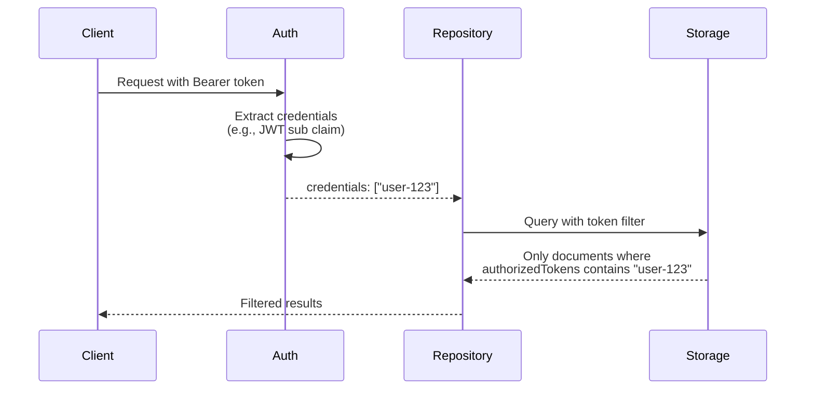
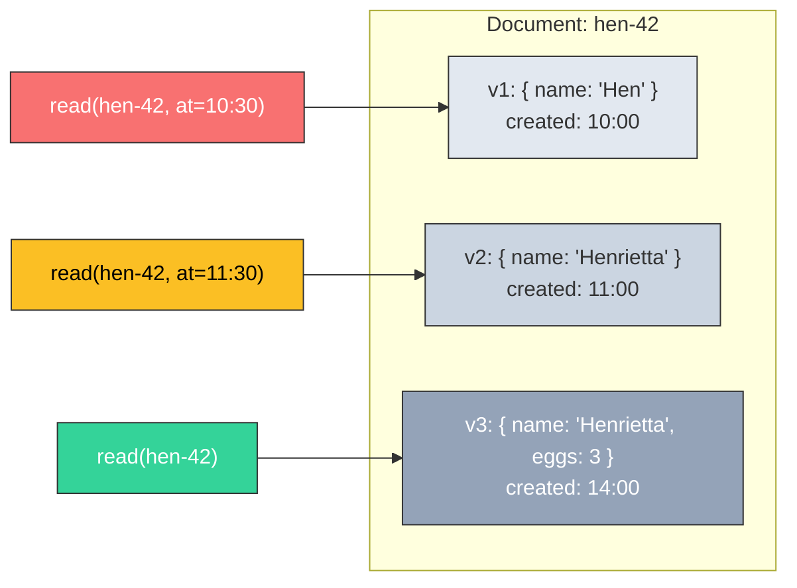
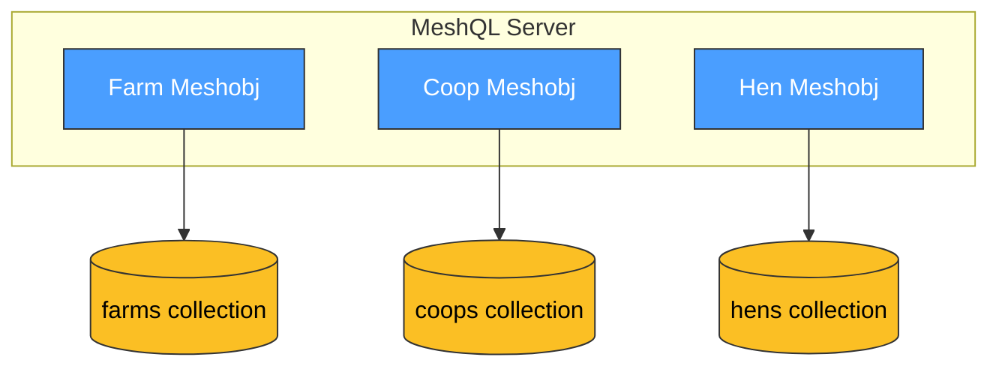
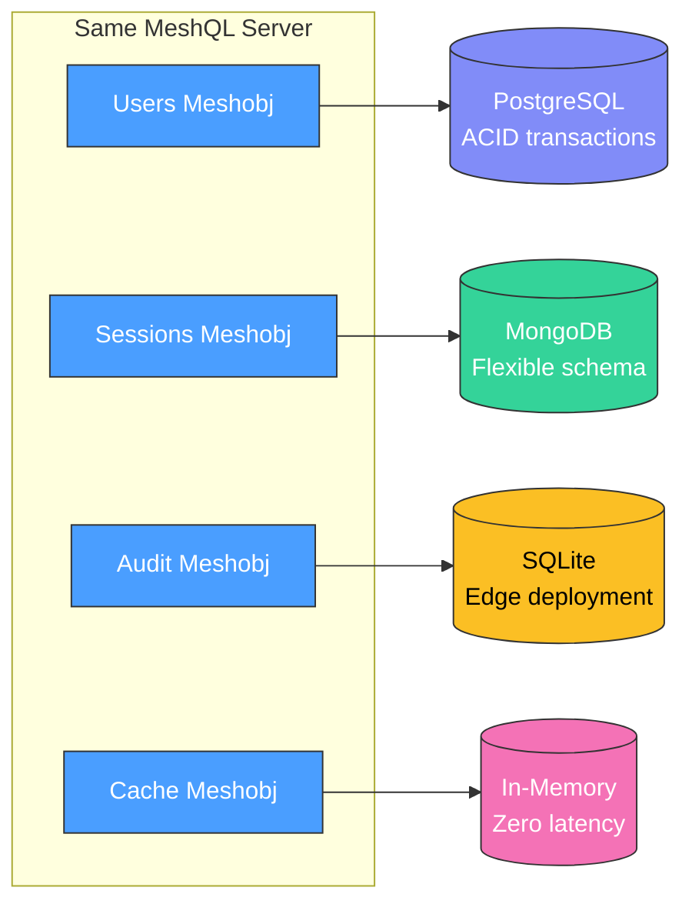

# Data Ownership

The hardest problem in distributed architecture isn't communication — it's data. Who owns it? Who can change it? What happens when two services need the same data?

MeshQL answers these questions at the framework level through the **Envelope** pattern.

---

## The Envelope

Every document in MeshQL is wrapped in an Envelope:



```java
public record Envelope(
    String id,                      // Document identity
    Stash payload,                  // Your data — opaque to the framework
    Instant createdAt,              // Version timestamp
    boolean deleted,                // Soft delete flag
    List<String> authorizedTokens   // Who can access this document
)
```

The Envelope enforces three architectural properties:

### 1. Ownership Boundary

The `payload` is opaque to MeshQL. Only the owning meshobj interprets its contents. The framework handles metadata (identity, versioning, authorization) — your business data is yours.

### 2. Authorization at the Data Level

Access control tokens live **on the document**, not in a centralized service:



This means:
- No separate authorization database to maintain
- Each document controls its own access
- Authorization travels with the data, even across service boundaries
- Different documents in the same collection can have different access rules

### 3. Immutable Version History

Every write creates a new version. Deletes are soft (the `deleted` flag). This gives you:



- **Point-in-time queries** — read data as of any timestamp
- **Audit trails** — built into the storage layer, not bolted on
- **No lost data** — soft deletes preserve history

---

## Database Per Entity

Each meshobj stores its data in its own collection or table. There is no shared storage:



This is the **database-per-service** pattern from *Architecture: The Hard Parts*. Each entity:

- Has its own storage (collection, table, or in-memory store)
- Can use a different storage backend than its neighbors
- Manages its own schema evolution
- Cannot access another entity's data directly — only through federation

---

## Polyglot Persistence

Because data ownership is enforced through the Plugin interface, different entities can use different storage backends:



A **certification test suite** (Cucumber BDD) guarantees that all backends behave identically:

- Same CRUD semantics
- Same temporal versioning
- Same authorization filtering
- Same batch operations

Swap PostgreSQL for MongoDB without changing a line of application code. The certification suite proves it works.

---

## What This Means in Practice

| Concern | How MeshQL Handles It |
|:--------|:---------------------|
| **Who owns the data?** | The meshobj that defines the schema and storage config |
| **Who can read it?** | Determined by `authorizedTokens` on each document |
| **How do others access it?** | Through GraphQL federation — never through shared storage |
| **What about historical data?** | Built-in temporal versioning — every backend, automatically |
| **What about different storage needs?** | Polyglot persistence — choose the right backend per entity |
| **How do I know backends are compatible?** | Certification test suite guarantees identical behavior |
