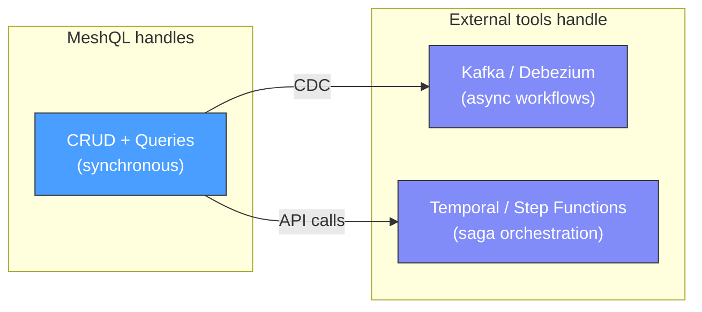

# Design Decisions

Every architecture is a set of tradeoffs. This page documents MeshQL's deliberate choices and the reasoning behind them.

---

## Synchronous Federation (No Built-in Sagas)

**Decision**: MeshQL uses synchronous GraphQL federation. There is no built-in saga orchestrator or distributed transaction coordinator.

**Why**: Sagas add significant complexity — compensating transactions, state machines, failure handling for each step. For most data API workloads, synchronous request-reply is simpler and sufficient. The failure mode is clear: a resolver returns null or an error, and the client handles it.

**When you need async workflows**: Use CDC (as shown in the [Events example](../examples/events)). MeshQL's REST API serves as the write interface; Debezium/Kafka handle the asynchronous pipeline. This keeps the framework focused on what it does well (data APIs) and delegates workflow orchestration to purpose-built tools.

---

## No Signature Verification in JWT

**Decision**: `JWTSubAuthorizer` decodes JWT tokens but does not verify signatures.

**Why**: In enterprise deployments, JWT validation is handled by the API gateway (Kong, Istio, AWS ALB, Cloudflare). Duplicating verification in every service:
- Requires distributing signing keys to every service
- Adds cryptographic overhead per request
- Creates a key rotation coordination problem
- Solves a problem that's already solved at the edge

MeshQL follows the **validate at the edge, trust internally** pattern. If you need service-to-service authentication inside your mesh, that's a network-level concern (mTLS, service mesh) — not an application framework concern.

---

## External Resolvers by Default

**Decision**: The examples use external HTTP resolvers even for meshobjs in the same JVM.

**Why**: This is the **deployability-first** approach. If your resolvers use HTTP from day one:
- Splitting into separate services requires zero code changes
- You can test distributed behavior in development
- Performance overhead within the same JVM is ~1ms per hop (negligible for most workloads)

Internal resolvers are available as an **optimization** when you've measured that HTTP overhead matters and have decided those entities should share a deployment unit. This is a conscious coupling decision, not the default.

---

## No ORM, No Annotations, No Classpath Scanning

**Decision**: MeshQL uses explicit configuration records and builder patterns. No Spring-style annotation magic.

**Why**:
- Configuration is visible — every relationship, query, and endpoint is declared in code
- No hidden behavior — nothing happens because of an annotation on a class you forgot about
- Testable — configuration is just data, easy to construct in tests
- Debuggable — step through the builder, see exactly what's registered

The cost is more boilerplate in `Main.java`. The benefit is that you can read the configuration and understand the entire system's topology.

---

## Payload Is Opaque to the Framework

**Decision**: The Envelope's `payload` field (Stash) is never interpreted by MeshQL. Only query templates and schemas reference payload fields.

**Why**: This enforces the ownership boundary. If MeshQL understood your data schema, it would create coupling between the framework and your domain model. Instead:
- **GraphQL schema** defines what's queryable
- **JSON schema** defines what's valid for REST
- **Query templates** define how to search
- **The framework** handles metadata (versioning, auth, identity)

Your data model can evolve without framework changes.

---

## Soft Deletes, Always

**Decision**: All deletes are soft — they create a new Envelope with `deleted: true`. Hard deletes are not exposed through the API.

**Why**: Hard deletes destroy history. In a system with temporal versioning, that would create inconsistencies — you could query "what did the system look like yesterday?" and get a different answer than what actually existed.

Soft deletes preserve:
- Audit trails
- Temporal query consistency
- Recovery capability
- Compliance with data retention requirements

If you need actual data removal (GDPR right to erasure), that's a storage-level operation outside MeshQL's API layer.

---

## Single-Hop Federation Constraint

**Decision**: Resolvers only go one level deep. A resolver cannot trigger another resolver.

**Why**: Without this constraint, a query like `{ farm { coops { hens { layReports { hen { coop { farm } } } } } } }` would create a resolution chain that bounces between services indefinitely. Each hop adds latency and creates failure points.

The single-hop constraint means:
- **Predictable latency** — each resolver call has bounded cost
- **No circular dependencies** — A → B → A can't happen
- **Visible topology** — every dependency is in the resolver configuration
- **Client-driven depth** — the client decides how deep to query, not the server

Clients can make multiple top-level queries if they need data from deeply nested relationships. This pushes complexity to the client (which has full context about what it needs) instead of the server (which would be guessing).

---

## Version 0.2.0 — Pre-1.0 API

**Decision**: MeshQL is versioned at 0.2.0, explicitly signaling that the API may change.

**Why**: The core interfaces (Repository, Searcher, Auth, Plugin) are stable and well-tested. The configuration API (builders, config records) has recently been refactored to fluent builders and may still evolve. Calling it 1.0 would promise stability we're not yet ready to guarantee.

What 0.2.0 means:
- **Core interfaces**: Stable — unlikely to change
- **Configuration API**: Maturing — may get convenience methods or new builder patterns
- **Storage backends**: Stable — certified and tested
- **Auth implementations**: Stable — JWT, Casbin, NoAuth are production-ready
