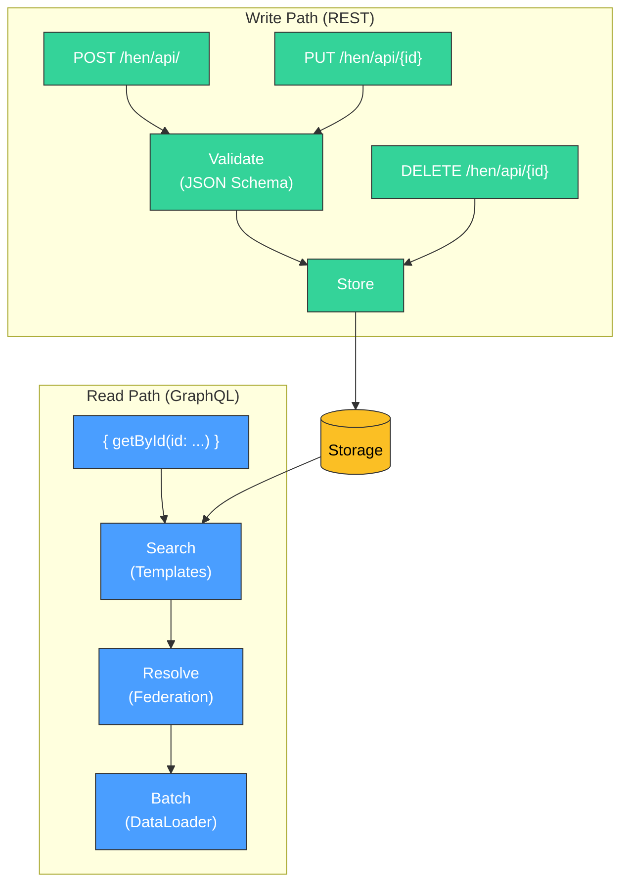
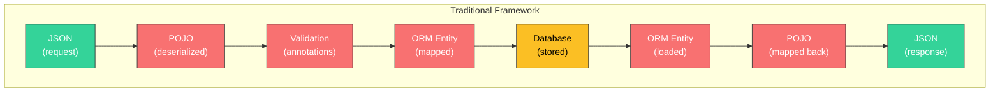
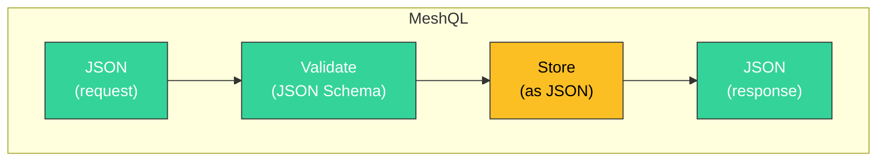

# Design Decisions

Every architecture is a set of tradeoffs. This page documents MeshQL's deliberate choices and the reasoning behind them.

---

## Primitives, Not Policies

MeshQL is a **data API framework**, not an application framework. It provides the building blocks — temporal storage, HTTP boundaries, flowing identifiers, CDC-friendly architecture — but deliberately does not prescribe how you use them for domain-specific concerns.

This is a conscious design choice. The right answer for distributed workflows, resilience, schema evolution, and observability **depends on your domain, your SLAs, and your scale**. A library that prescribes one answer is wrong for most users. A library that provides the primitives lets every user build the right answer.

See [Operational Blueprints](../reference/blueprints) for concrete patterns built on these primitives.

---

## Workflows Through Events (No Built-in Sagas)

**Decision**: MeshQL uses synchronous GraphQL federation for queries. Distributed workflows are handled through event-driven patterns external to the framework.

**Why**: Workflow logic is inherently domain-specific. What happens when an order is placed — reserve inventory? charge payment? send confirmation? — is your business logic, not something a data API framework should encode. The compensating transactions, retry policies, and failure modes are unique to each workflow.

**What MeshQL provides**: The [Events example](../examples/events) demonstrates the pattern. MeshQL's REST API serves as the write interface. CDC (Debezium/Kafka) captures changes as events. Your domain-specific processors consume those events and trigger workflows through MeshQL's API.

---

## No Signature Verification in JWT

**Decision**: `JWTSubAuthorizer` decodes JWT tokens but does not verify signatures.

**Why**: In enterprise deployments, JWT validation is handled by the API gateway (Kong, Istio, AWS ALB, Cloudflare). Duplicating verification in every service:
- Requires distributing signing keys to every service
- Adds cryptographic overhead per request
- Creates a key rotation coordination problem
- Solves a problem that's already solved at the edge

MeshQL follows the **validate at the edge, trust internally** pattern. If you need service-to-service authentication inside your mesh, that's a network-level concern (mTLS, service mesh) — not an application framework concern.

---

## REST for Writes, GraphQL for Reads

**Decision**: MeshQL splits writes and reads across two protocols. REST (Restlette) handles all mutations — create, update, delete. GraphQL (Graphlette) handles all queries — lookups, searches, federated traversals.

**There are no GraphQL mutations in MeshQL. This is deliberate.**

**Why**: Each protocol is doing what it's actually good at.

**REST is good at writes**:
- Clear HTTP semantics — POST creates, PUT updates, DELETE removes
- Atomic operations with well-understood status codes (201, 404, 409)
- Idempotent by nature (PUT the same payload twice, same result)
- JSON Schema validation on every write
- Swagger/OpenAPI documentation auto-generated

**REST is bad at reads** — complex queries devolve into RPC-style endpoints (`GET /hens?coop_id=X&min_eggs=3&sort=name&include=layReports`). Every new query pattern requires a new endpoint or parameter. Relationships require multiple round trips or awkward `?include=` parameters.

**GraphQL is good at reads**:
- Client specifies exactly the fields it needs (no over/under-fetching)
- Relationships resolved through federation (no N+1, no `?include=`)
- Single request can traverse multiple entities
- DataLoader batching optimizes the underlying queries

**GraphQL is bad at writes** — mutations have well-known problems with error handling (partial failures in nested mutations), performance (complex input validation), and semantics (what does it mean to "mutate" a graph?).

**The scaling benefit**: Because reads and writes are separate endpoints, you can scale them independently. Read-heavy? Add GraphQL replicas. Write-heavy? Scale the REST tier. This isn't full CQRS — there's no separate read model or event projection — but the same principle applies: **separating read and write paths lets you optimize each independently**.

---

## External Resolvers by Default

**Decision**: The examples use external HTTP resolvers even for meshobjs in the same JVM.

**Why**: This is the **deployability-first** approach. If your resolvers use HTTP from day one:
- Splitting into separate services requires zero code changes
- You can test distributed behavior in development
- Performance overhead within the same JVM is ~1ms per hop (negligible for most workloads)

Internal resolvers are available as an **optimization** when you've measured that HTTP overhead matters and have decided those entities should share a deployment unit. This is a conscious coupling decision, not the default.

---

## Resilience Is Your Choice

**Decision**: MeshQL provides HTTP status codes and persistent storage for recovery. It does not include automatic circuit breakers, retry policies, or fallback mechanisms.

**Why**: The right resilience strategy depends on your uptime requirements and deployment topology — and it changes as you scale horizontally. A retry policy that's correct for a 2-service monolith is wrong for a 20-service mesh. A circuit breaker threshold that works at 100 RPS is wrong at 10,000 RPS.

**What MeshQL provides**:
- Standard HTTP status codes on every response (the building blocks for client-side resilience)
- Persistent storage with temporal versioning (your data survives failures; you can recover state)
- Soft deletes (no data loss from accidental operations)
- Stateless request handling (any instance can serve any request)

See [Operational Blueprints: Resilience](../reference/blueprints#resilience) for patterns at different scales.

---

## Schema Evolution Is Domain-Specific

**Decision**: MeshQL does not enforce schema versioning or compatibility rules. Each meshobj owns its schema and evolves it independently.

**Why**: The loose contract model (consumer-defined projections) already isolates most breaking changes. When the Provider adds fields, consumers are unaffected. When the Provider removes a field, only consumers that used that field need to update — and the break is localized to that one consumer's schema, not a shared type library.

For the remaining cases — breaking changes to query interfaces, field type changes, field renames — the right strategy depends on your organization:
- Greenfield startups may prefer breaking changes with coordinated deploys
- Enterprises may require running v1/v2 meshobjs side by side
- Regulated industries may need formal deprecation periods

MeshQL supports all of these. See [Operational Blueprints: Schema Evolution](../reference/blueprints#schema-evolution) for guidance inspired by Google's protocol buffer compatibility rules.

---

## Observability Through Existing Primitives

**Decision**: MeshQL does not include a distributed tracing library, metrics collection, or structured logging framework.

**Why**: Every organization has an existing observability stack. Mandating OpenTelemetry when you use Datadog, or structured JSON logging when you use Splunk, creates friction rather than value.

**What MeshQL provides** — the building blocks for observability are already flowing through the system:
- **Document IDs** persist across federation calls and through CDC pipelines
- **Auth tokens** flow with every request, identifying the caller across hops
- **HTTP boundaries** between meshobjs are standard — any service mesh, sidecar, or proxy can observe them
- **SLF4J logging** throughout — configure your preferred backend (Logback, Log4j2) and format

Write to stdout and pipe to CloudWatch. Add a Grafana sidecar. Instrument with OpenTelemetry. Plug in Jaeger for distributed tracing. The choice is yours — and it should be, because you already know what works in your environment.

See [Operational Blueprints: Observability](../reference/blueprints#observability) for common patterns.

---

## No Java Model. JSON In, JSON Out.

**Decision**: MeshQL does not model your domain objects in Java. There are no POJOs, no entity classes, no `@Entity` annotations, no mapping layer. JSON arrives via HTTP, is validated against a schema, stored as-is, and returned as-is.

**This is the most deliberate design choice in MeshQL.**

In a traditional Java framework, your data passes through multiple representations:

Each red box is a place where things go wrong: serialization bugs, mapping mismatches, annotation conflicts, schema drift between Java classes and database columns, Jackson configuration surprises, lazy loading exceptions.

MeshQL eliminates the entire middle:

**JSON in. Validate against schema. Store as JSON. Return as JSON.** No marshalling. No mapping. No entity classes to maintain.

**Why this matters**:

- **No schema drift**: The JSON Schema and GraphQL schema are the *only* definitions of your data shape. There's no Java class that can get out of sync with the database.
- **No serialization bugs**: Data is never converted between representations. What you PUT is what you GET.
- **No framework coupling**: Your domain isn't encoded in Java annotations. It's in schema files that any language, team, or tool can read.
- **Faster iteration**: Change a field? Update the schema file. No recompile of entity classes, no migration of annotations, no ORM cache invalidation.
- **Polyglot-friendly**: The schema files (GraphQL + JSON Schema) are language-agnostic. A Python team can read your API contract without knowing Java.

The Envelope wraps your JSON payload with framework metadata (ID, timestamps, auth tokens), but the payload itself is **opaque** — MeshQL never interprets it. Query templates reference payload fields by path (`payload.name`, `payload.coop_id`), but the framework doesn't need a Java type to do that.

{: .note }
> This also means there are no annotations, no classpath scanning, and no ORM. Configuration is explicit builder patterns in `Main.java`. The cost is more boilerplate. The benefit is that you can read the configuration and understand the entire system — no hidden behavior from annotations you forgot about.

---

## Soft Deletes, Always

**Decision**: All deletes are soft — they create a new Envelope with `deleted: true`. Hard deletes are not exposed through the API.

**Why**: Hard deletes destroy history. In a system with temporal versioning, that would create inconsistencies — you could query "what did the system look like yesterday?" and get a different answer than what actually existed.

Soft deletes preserve:
- Audit trails
- Temporal query consistency
- Recovery capability
- Compliance with data retention requirements

If you need actual data removal (GDPR right to erasure), that's a storage-level operation outside MeshQL's API layer.

---

## Single-Hop Federation Constraint

**Decision**: Resolvers only go one level deep. A resolver cannot trigger another resolver.

**Why**: Without this constraint, a query like `{ farm { coops { hens { layReports { hen { coop { farm } } } } } } }` would create a resolution chain that bounces between services indefinitely. Each hop adds latency and creates failure points.

The single-hop constraint means:
- **Predictable latency** — each resolver call has bounded cost
- **No circular dependencies** — A → B → A can't happen
- **Visible topology** — every dependency is in the resolver configuration
- **Client-driven depth** — the client decides how deep to query, not the server

Clients can make multiple top-level queries if they need data from deeply nested relationships. This pushes complexity to the client (which has full context about what it needs) instead of the server (which would be guessing).

---

## Version 0.2.0 — Pre-1.0 API

**Decision**: MeshQL is versioned at 0.2.0, explicitly signaling that the API may change.

**Why**: The core interfaces (Repository, Searcher, Auth, Plugin) are stable and well-tested. The configuration API (builders, config records) has recently been refactored to fluent builders and may still evolve. Calling it 1.0 would promise stability we're not yet ready to guarantee.

What 0.2.0 means:
- **Core interfaces**: Stable — unlikely to change
- **Configuration API**: Maturing — may get convenience methods or new builder patterns
- **Storage backends**: Stable — certified and tested
- **Auth implementations**: Stable — JWT, Casbin, NoAuth are production-ready
