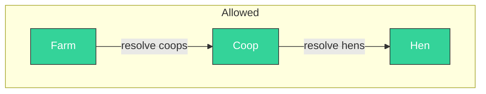
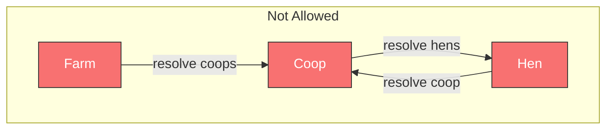
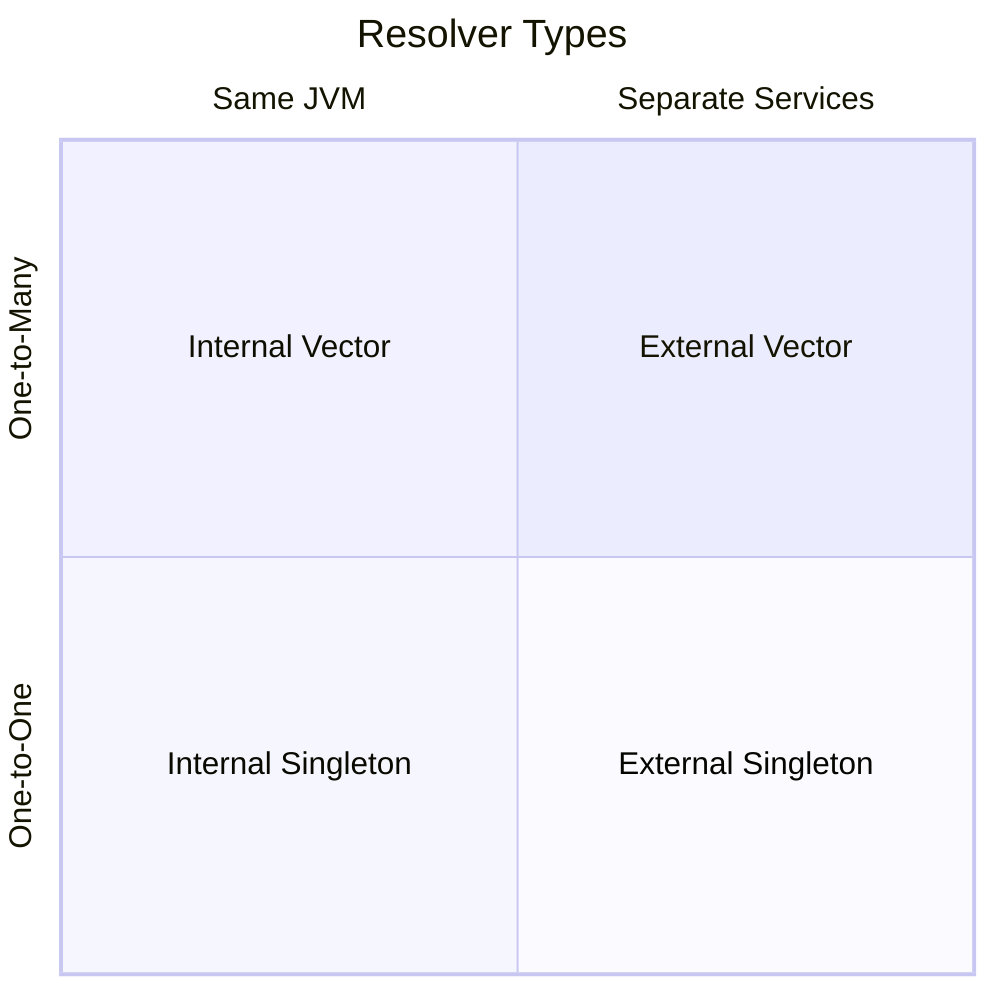
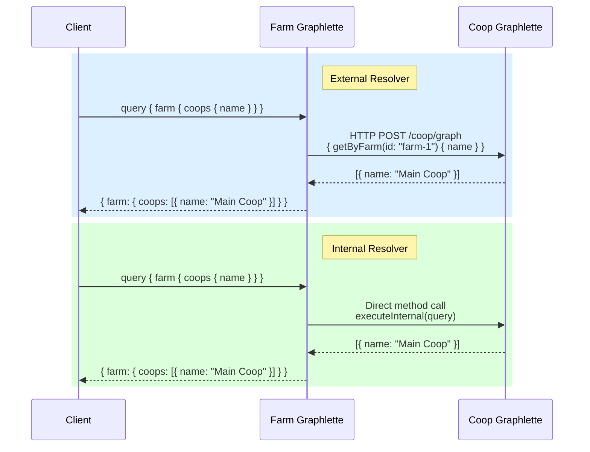
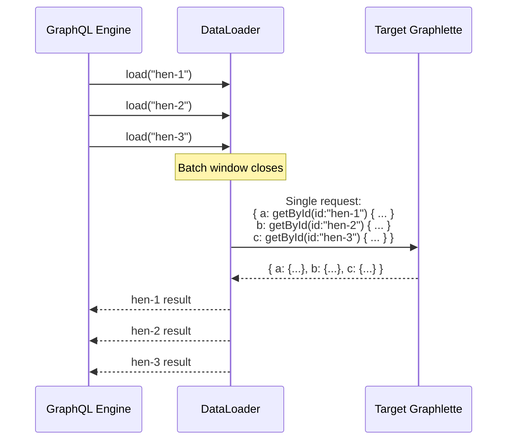
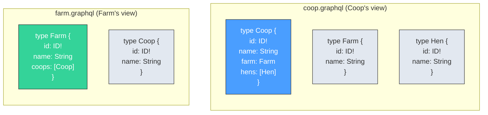
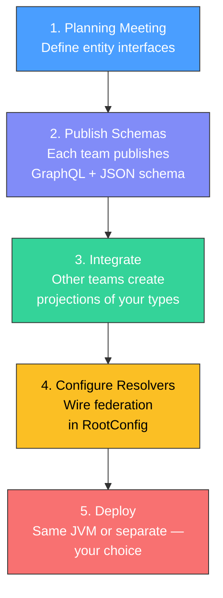

# Federation

Federation is how meshobjs connect to each other. When a Coop needs to resolve its list of Hens, it doesn't query the Hens table directly — it calls the Hen graphlette through a resolver.

This indirection is the foundation of MeshQL's scalability story.

---

## The Single-Hop Constraint

MeshQL enforces a critical architectural rule: **federation never goes beyond one hop**.





When a client queries Farm and asks for nested Coops and Hens, the *client* initiates each hop. The Farm resolver returns Coops; the client's query then triggers the Coop resolver to fetch Hens. No resolver ever triggers another resolver transitively.

This prevents:
- **Cascading failures** — a slow Hen service can't cascade through Coop to Farm
- **Unbounded latency** — each hop is explicit and measurable
- **Circular dependencies** — A calls B calls A can't happen
- **Hidden coupling** — every dependency is visible in the resolver configuration

---

## Resolver Types

MeshQL provides four resolver types, organized by cardinality and deployment:



### External Resolvers (HTTP)

For meshobjs that may be deployed as separate services:

```java
// 1:1 — Hen resolves its Coop
new SingletonResolverConfig(
    "coop",                    // Field name in GraphQL schema
    "coop_id",                 // Foreign key in this entity
    "getById",                 // Query on the target graphlette
    URI.create("http://localhost:3033/coop/graph")
)

// 1:N — Coop resolves its Hens
new VectorResolverConfig(
    "hens",                    // Field name in GraphQL schema
    "id",                      // This entity's ID (passed as parameter)
    "getByCoop",               // Query on the target graphlette
    URI.create("http://localhost:3033/hen/graph")
)
```

### Internal Resolvers (In-Process)

For meshobjs that share a JVM — same semantics, zero HTTP overhead:

```java
// 1:1 — Hen resolves its Coop (in-process)
new InternalSingletonResolverConfig(
    "coop", "coop_id", "getById", "/coop/graph"
)

// 1:N — Coop resolves its Hens (in-process)
new InternalVectorResolverConfig(
    "hens", "id", "getByCoop", "/hen/graph"
)
```



{: .note }
> Internal resolvers aren't just a performance optimization. They're a **granularity integrator** — they declare that two entities are coupled enough to share a deployment unit. Use them when entities have high affinity (frequent cross-queries, shared lifecycle, same team ownership).

---

## DataLoader Batching

Without batching, resolving N Hens for a Coop means N separate queries. MeshQL uses the DataLoader pattern to batch these into a single request:



Key details:
- **Max batch size**: 100 IDs per request
- **Request-scoped**: Fresh DataLoaderRegistry per request (no cache pollution)
- **Works for both**: External (HTTP batched) and internal (in-process batched) resolvers
- **Configurable**: `dataLoaderEnabled` flag in RootConfig
- **Aliased queries**: Uses GraphQL aliases (`item_0`, `item_1`, ...) to batch multiple lookups into one query

{: .tip }
> DataLoader batching helps, but **database indexing helps more**. A properly indexed foreign key query (e.g., `payload.coop_id`) provides 100x improvement over batching. Always index your foreign key fields first, then enable DataLoader for the remaining benefit.

---

## Contract Ownership

Each meshobj defines its own view of foreign types:



The blue/green boxes are **canonical types** — owned by that schema. The gray boxes are **projections** — the minimum the consuming service needs to know.

This is **not duplication**. It's deliberate. Each meshobj declares:
- "I own `Coop` with all its fields"
- "I need `Farm` with just `id` and `name`"
- "I need `Hen` with just `id` and `name`"

If the Farm team adds 10 new fields, the Coop schema doesn't change. If the Farm team removes a field that Coop uses, the break is localized to Coop's schema — not a shared type library that breaks everyone.

This is the **consumer-driven contract** pattern from *Architecture: The Hard Parts*.

---

## The Federation Workflow

In practice, federation follows a team workflow:



1. **Planning meeting**: Teams agree on entity boundaries and interfaces
2. **Schema publication**: Each team publishes their canonical GraphQL and JSON schemas
3. **Integration**: Other teams define slim projections of your types in their schemas
4. **Configuration**: Resolvers wired in code — explicit, visible, no magic
5. **Deployment**: Start co-located, split later when needed
