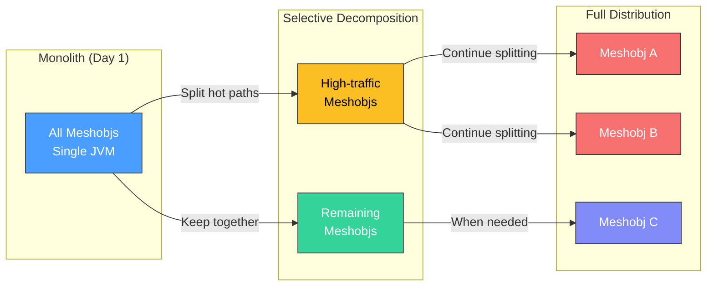
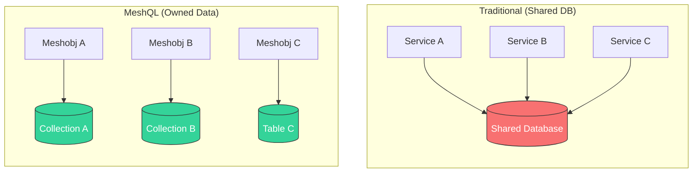
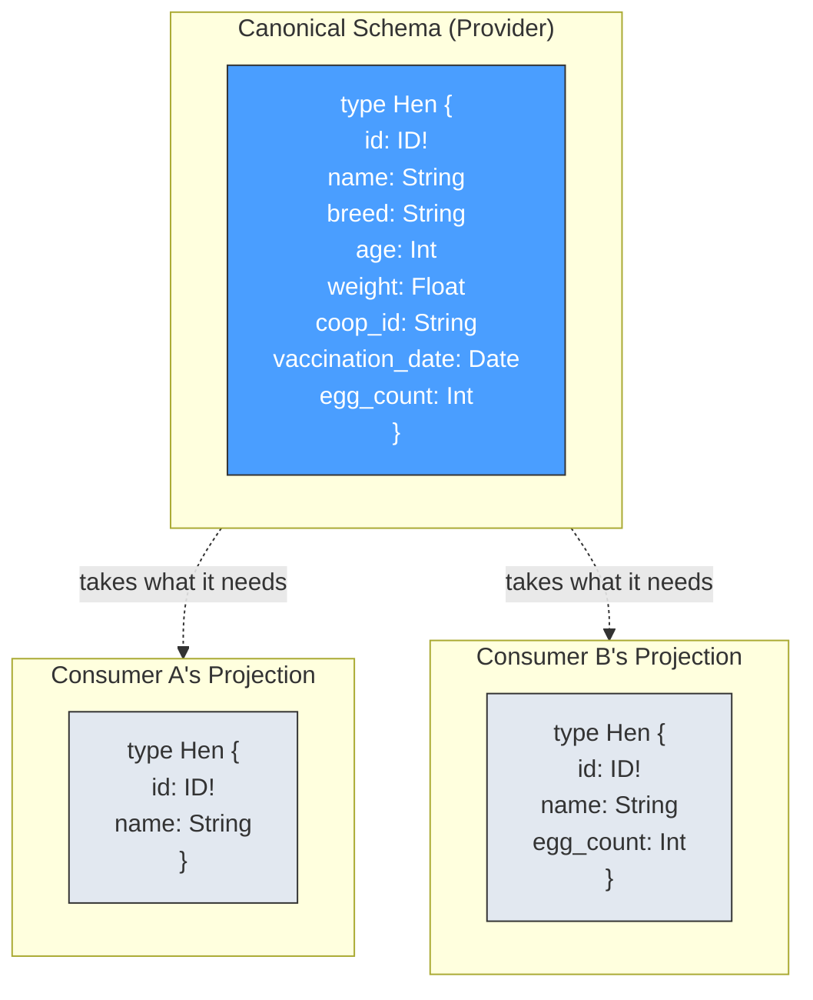
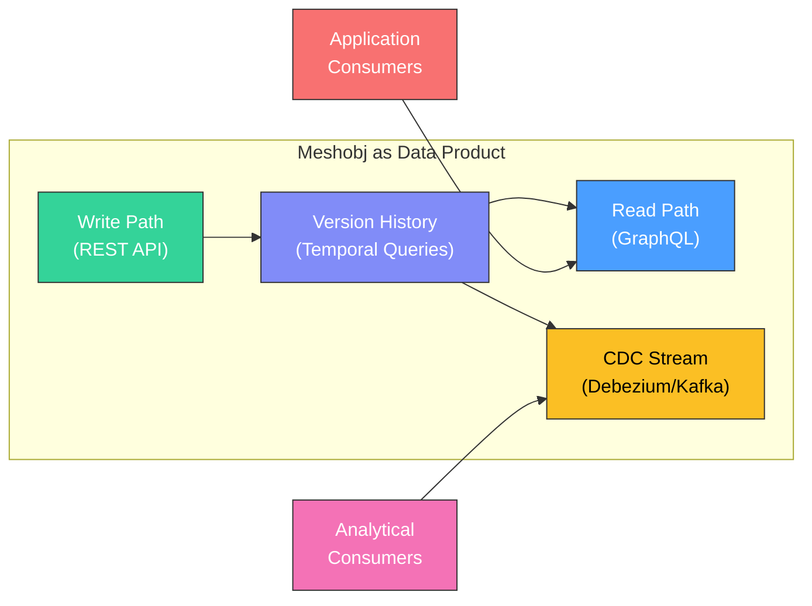
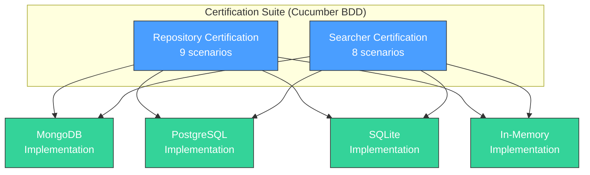

# Mapping to Architecture: The Hard Parts

MeshQL was developed as a concrete implementation of the architectural patterns described in [*Software Architecture: The Hard Parts*](https://www.oreilly.com/library/view/software-architecture-the/9781492086888/) by Neal Ford, Mark Richards, Pramod Sadalage, and Zhamak Dehghani.

This page maps each design decision in MeshQL to the specific concept from the book.

---

## Decomposition

**Book concept**: Start with a modular monolith. Identify service boundaries. Decompose when the benefits outweigh the costs.

**MeshQL's implementation**: Each meshobj is architecturally independent but deployably flexible. Federation uses HTTP boundaries from day one, so the transition from monolith to distributed is a configuration change.

**Key decision**: MeshQL uses external HTTP resolvers even within a single JVM. This pays a small cost upfront (HTTP overhead for same-process calls) to avoid a large cost later (rewriting communication patterns during decomposition). Internal resolvers are available as an optimization when you've determined that two entities should stay coupled.

---

## Service Granularity

**Book concept**: Granularity disintegrators (reasons to split) and integrators (reasons to keep together) should drive service sizing decisions.

**MeshQL's position**:

| Disintegrators (Split) | How MeshQL Supports |
|:----------------------|:-------------------|
| Different release cadences | Each meshobj has its own schema and storage — deploy independently |
| Different scaling needs | Split hot meshobjs to separate services via URL change |
| Different security requirements | Auth tokens per document, different auth strategies per meshobj |
| Fault tolerance | External resolvers isolate failures to the failing meshobj |

| Integrators (Keep Together) | How MeshQL Supports |
|:---------------------------|:-------------------|
| Shared transactions | Co-locate in same JVM, use internal resolvers |
| Data relationships | Federation resolvers with DataLoader batching |
| Workflow coupling | Internal resolvers for tightly coupled entities |
| Latency sensitivity | Internal resolvers eliminate HTTP overhead |

The default granularity is **one entity = one meshobj**. This is deliberately fine-grained. The framework then provides internal resolvers as integrators when entities need tighter coupling.

---

## Data Decomposition

**Book concept**: Breaking apart shared databases is the hardest part of decomposition. Each service should own its data.

**MeshQL's implementation**: This is enforced at the framework level.

- Each meshobj gets its own collection/table
- No JOINs across entities — only federation
- Different entities can use different backends (polyglot persistence)
- The Envelope pattern ensures consistent metadata regardless of backend
- A certification test suite guarantees behavioral equivalence across backends

**MeshQL assumes decomposed data from the start.** You never have a shared database to break apart.

---

## Contracts

**Book concept**: Strict contracts (shared types) create tight coupling. Loose contracts (consumer-defined projections) enable independent evolution.

**MeshQL uses loose contracts.** Each meshobj defines its own projection of foreign types:

When the Hen team adds `vaccination_date`, neither Consumer A nor Consumer B needs to update. When the Hen team removes `breed`, only consumers that used `breed` need to update — not every consumer.

This prevents the **shared kernel anti-pattern** where a change to a shared type definition breaks N consumers simultaneously.

---

## Inter-Service Communication

**Book concept**: Synchronous (request-reply) vs. asynchronous (event-driven) communication, each with different tradeoffs.

**MeshQL's federation is synchronous request-reply** via GraphQL:

| Aspect | MeshQL's Choice | Tradeoff |
|:-------|:----------------|:---------|
| Consistency | Strong (reads return current data) | Higher latency than cached/eventual |
| Complexity | Low (no message broker required) | No built-in async workflows |
| Failure mode | Partial failure (resolver returns null) | Upstream sees the failure |
| Temporal queries | Built-in (`at` parameter) | Storage overhead for version history |

The **events example** demonstrates the asynchronous pattern using CDC (Change Data Capture) with Debezium and Kafka, showing that MeshQL's REST API can serve as the write interface for event-driven pipelines.

---

## Analytical Data

**Book concept**: Operational and analytical data have different access patterns. Data products should be self-describing and independently governed.

**MeshQL's temporal versioning** makes each meshobj a data product:

- Each meshobj owns its data and exposes it through well-defined APIs
- Temporal versioning provides point-in-time reporting without a separate warehouse
- CDC integration (events example) enables streaming to analytical consumers
- The Searcher/Repository split mirrors CQRS read/write separation

---

## Reuse Patterns

**Book concept**: Code replication, shared library, shared service, and sidecar patterns.

**MeshQL is a shared library** — but with a twist. The certification test suite acts as an **architectural fitness function**:

The certification suite guarantees that swapping one backend for another produces identical behavior. It tests:
- CRUD operations
- Batch operations
- Temporal versioning (read at timestamp)
- Authorization filtering
- Soft deletes

This is the book's concept of **governance through fitness functions** — automated tests that ensure architectural properties are maintained.

---

## Governance Mechanisms

MeshQL implements several implicit governance mechanisms:

| Mechanism | What It Prevents |
|:----------|:----------------|
| **Single-hop constraint** | Cascading failures, circular dependencies |
| **Database-per-entity** | Shared database coupling |
| **Envelope wrapper** | Inconsistent metadata, missing audit trails |
| **Certification suite** | Backend behavioral drift |
| **Consumer-defined projections** | Shared type coupling |
| **Configuration-driven wiring** | Hidden dependencies, classpath magic |

---

## Summary

| Hard Parts Theme | MeshQL's Approach |
|:-----------------|:-----------------|
| Decomposition | Modular monolith with HTTP boundaries from day one |
| Service Granularity | One entity = one meshobj; internal resolvers as integrators |
| Data Ownership | Database-per-entity enforced by framework; Envelope pattern |
| Contracts | Loose, consumer-defined projections; no shared types |
| Communication | Synchronous GraphQL federation with DataLoader batching |
| Analytical Data | Temporal versioning + CDC integration |
| Reuse | Shared library with certification fitness functions |
| Governance | Single-hop constraint, certification suite, explicit configuration |
