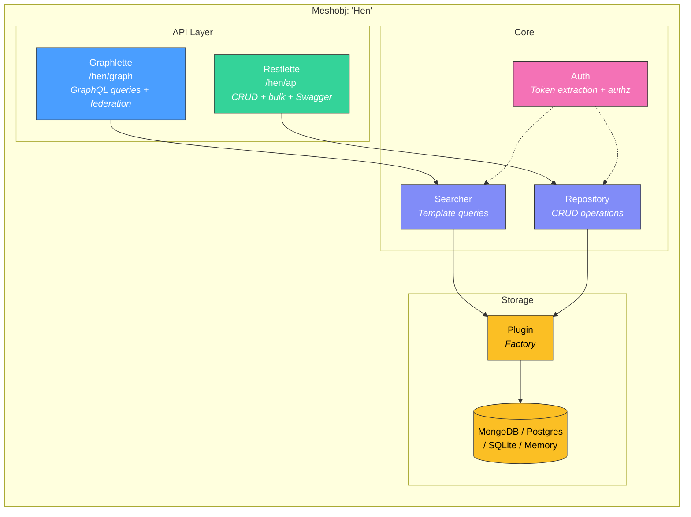
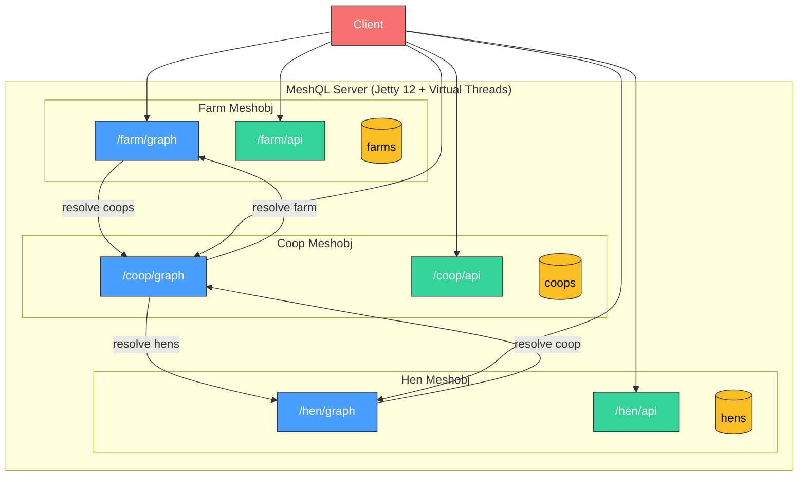

# Architecture Overview

MeshQL is built on a simple premise: **the unit of architecture is the entity, not the service**.

Traditional microservice frameworks organize around business capabilities (user service, order service, payment service). MeshQL organizes around **data entities** — each entity becomes a *meshobj* that owns its storage, exposes dual APIs, and federates with other entities through explicit contracts.

---

## The Meshobj

A meshobj is the fundamental building block. It consists of:



Each meshobj is:

- **Self-contained** — owns its schema, storage, queries, and auth rules
- **Dual-API** — REST for CRUD consumers, GraphQL for relational queries
- **Independently deployable** — can run in the same JVM or as a separate service
- **Federated** — connects to other meshobjs through resolvers, never through shared storage

---

## System Composition

A MeshQL application is a collection of meshobjs registered with a server:



The federation arrows between graphlettes are **HTTP calls** — even when running in the same JVM. This means the transition from monolith to distributed is a configuration change, not a rewrite.

---

## Core Interfaces

MeshQL's architecture is defined by five interfaces:

| Interface | Role | Used By |
|:----------|:-----|:--------|
| **Repository** | CRUD operations on Envelopes | Restlette (REST API) |
| **Searcher** | Template-driven queries | Graphlette (GraphQL API) |
| **Auth** | Token extraction + authorization checks | Both APIs |
| **Plugin** | Factory for Repository + Searcher per storage backend | Server initialization |
| **Validator** | JSON Schema validation of incoming data | Restlette (REST API) |

This separation means:
- **Repository** handles writes and ID lookups (optimized for REST patterns)
- **Searcher** handles filtered queries with Handlebars templates (optimized for GraphQL)
- Both share the same storage through a **Plugin** that creates them as a pair
- **Auth** is orthogonal to storage — any auth strategy works with any backend

---

## Configuration-Driven

A complete meshobj is defined declaratively:

```java
Config.builder()
    .graphlette(
        GraphletteConfig.builder()
            .path("/hen/graph")
            .storage(mongoConfig)
            .schema("/config/hen.graphql")
            .rootConfig(
                RootConfig.builder()
                    .singleton("getById", "{\"id\": \"{{id}}\"}")
                    .vector("getByCoop", "{\"payload.coop_id\": \"{{id}}\"}")
                    .singletonResolver("coop", "coop_id", "getById",
                        platformUrl + "/coop/graph")
                    .build()
            )
            .build()
    )
    .restlette(
        RestletteConfig.builder()
            .path("/hen/api")
            .storage(mongoConfig)
            .schema(jsonSchema)
            .build()
    )
    .port(3033)
    .build();
```

No annotations. No classpath scanning. No magic. Every relationship, query, and endpoint is explicit in the configuration.
