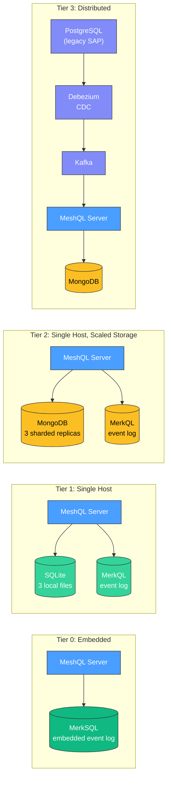
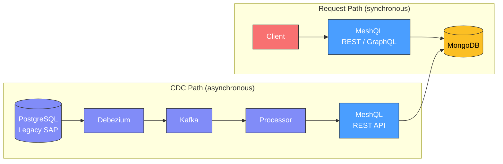
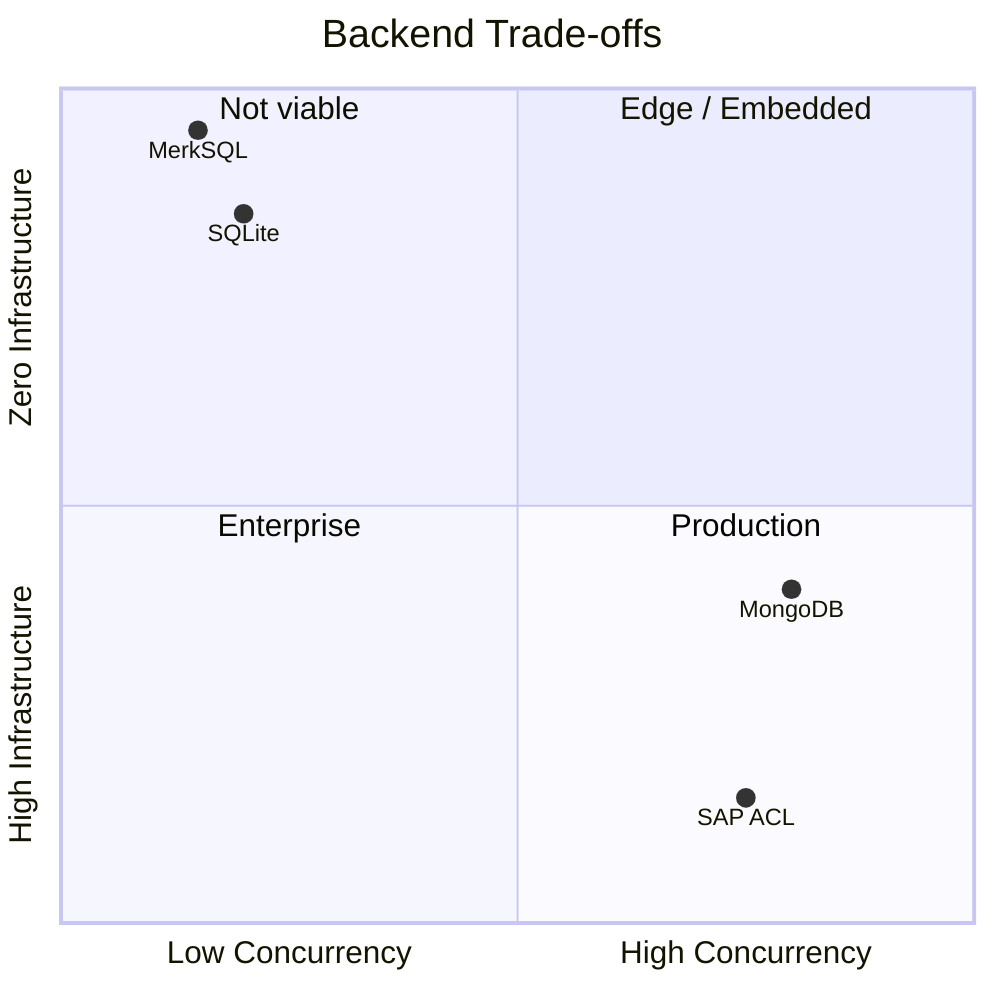

# Performance Across Backends

MeshQL runs the same 13-entity API on MerkSQL, SQLite, MongoDB, and full enterprise stacks with CDC pipelines. This page presents real benchmark data showing the trade-offs at each tier and demonstrates that adding legacy system integration has zero impact on API performance.

All measurements were taken with [k6](https://k6.io/) against the egg-economy examples — 5 actor entities, 5 event entities, 3 projection entities, and 19 internal resolvers.

---

## The Three Tiers

MeshQL's tiers follow infrastructure topology — from single-host to distributed. MerkQL provides event replay and multiple consumer support within a single host; Kafka takes over when you go multi-host. See [Scalability](scalability) for the full progression story.



| Tier | Storage | Event Processing | Services | Use case |
|:-----|:--------|:-----------------|:---------|:---------|
| **Embedded** (egg-economy-queue) | MerkSQL (JNI, local files) | Embedded in storage | 0 external services | Zero-infrastructure, prototyping, edge deployment |
| **Single Host** (egg-economy-merkql) | 3 SQLite files | MerkQL event log | 0 containers | Production single-host, edge deployment |
| **Single Host, Scaled Storage** (egg-economy) | 3 sharded MongoDB replicas | MerkQL event log | 5 containers | Write-heavy production workloads |
| **Distributed** (egg-economy-sap) | MongoDB + PostgreSQL legacy + Kafka + Debezium | Kafka + Debezium CDC | 7 containers | Multi-host, enterprise migration with anti-corruption layer |

---

## Baseline Latency (1 VU)

Single-client performance shows each backend's raw latency without contention.

### Request Duration (p95, milliseconds)

```
REST CRUD
  MerkSQL  █████▎                          5.3 ms
  SQLite   ████████████████▌              17.5 ms
  MongoDB  ████████▊                       8.8 ms
  SAP      ████████▎                       8.3 ms

GraphQL Queries
  MerkSQL  ██▊                             2.9 ms
  SQLite   ████████████████▍              16.4 ms
  MongoDB  ██████▌                         6.6 ms
  SAP      ███▌                            3.6 ms

Federation (nested resolvers)
  MerkSQL  ██▊                             2.9 ms
  SQLite   ██████████████████████▍        22.4 ms
  MongoDB  ████▏                           4.2 ms
  SAP      ███▍                            3.4 ms

Mixed Workload (writes + reads)
  MerkSQL  ██▎                             2.3 ms
  SQLite   ████████████████▏              16.2 ms
  MongoDB  █████▌                          5.6 ms
  SAP      ██▋                             2.6 ms
```

{: .note }
> All four tiers serve the same API contract. MerkSQL's embedded JNI storage eliminates all network hops — reads and writes go directly to local files via Rust FFI, yielding sub-3ms p95 across all workloads at 1 VU. SQLite aggregate HTTP metrics include write operations that hit the single-writer lock. At the individual query level with [expression indexes](tuning), all backends deliver sub-5ms latency.

### Individual Query Latency (p95, milliseconds)

| Query | MerkSQL | SQLite | MongoDB | SAP |
|:------|--------:|-------:|--------:|----:|
| `getById` | 6.0 | 4.6 | 4.2 | 4.2 |
| `getAll` | 5.2 | 8.4 | 8.0 | 6.0 |
| `getByZone` / `getByFarm` | 5.0 | 4.0 | 5.0 | 5.0 |

At the query level, performance converges. MerkSQL's `getById` is slightly higher because it scans the in-memory index rather than using a database-level primary key lookup, but aggregate throughput is the highest of any backend due to zero network overhead.

---

## The Legacy System Doesn't Affect the Clean API

This is the central claim of the anti-corruption layer architecture, and the benchmarks confirm it.

The SAP variant runs **7 Docker containers** — PostgreSQL (legacy database), Kafka, Debezium CDC, MongoDB, the MeshQL server, frontends, and nginx. Despite this infrastructure complexity, the clean MeshQL API is **as fast or faster** than the standalone MongoDB variant.

### Why?



The CDC pipeline and the API request path are **completely decoupled**:

- **Client requests** hit MeshQL, which reads/writes MongoDB directly. The legacy system is not in this path.
- **Legacy data flows** through Debezium → Kafka → processor → MeshQL REST API → MongoDB. This is asynchronous and runs on its own threads.

{: .architecture }
> The anti-corruption layer is designed so that the clean API's performance is governed only by MeshQL + MongoDB, regardless of how many legacy systems feed into it. You can add Salesforce, SAP, and mainframe CDC pipelines without degrading the API that your new applications consume.

### The Numbers

| Metric | MongoDB (standalone) | SAP (with full CDC stack) |
|:-------|---------------------:|---------------------------:|
| REST CRUD p95 | 8.8 ms | 8.3 ms |
| GraphQL p95 | 6.6 ms | 3.6 ms |
| Federation p95 | 4.2 ms | 3.4 ms |
| Mixed workload p95 | 5.6 ms | 2.6 ms |
| Throughput (mixed) | 104.7 req/s | 135.1 req/s |
| Error rate | 0% | 0% |

The SAP variant is marginally faster because it uses a single MongoDB instance (vs 3 sharded replicas), which reduces internal replication overhead. The point is: **adding the full enterprise CDC pipeline did not add latency**.

---

## Concurrency: Where Backends Diverge

Single-client latency tells you how fast a query is. Concurrency tells you how many clients you can serve simultaneously. This is where SQLite and MongoDB differ fundamentally.

### 10 Concurrent Users (Mixed Workload)

| Metric | MerkSQL | SQLite | MongoDB |
|:-------|--------:|-------:|--------:|
| **avg** | 9.8 ms | 24.6 ms | 3.1 ms |
| **med** | 0.9 ms | 13.6 ms | 2.0 ms |
| **p95** | 88.3 ms | 82.6 ms | 8.7 ms |
| **max** | 312.4 ms | 257.2 ms | 48.1 ms |
| **throughput** | 110 req/s | 96.5 req/s | 159.4 req/s |
| **error rate** | 0% | 1.19% | 0.96% |
| **p95 degradation** (vs 1 VU) | **38x** | **4.7x** | **1.0x** |

```
p95 Response Time Under Load
  MerkSQL (1 VU)   ██▎                              2.3 ms
  MerkSQL (10 VU)  ████████████████████████████████████████████████████████████████████████████████████████▎   88.3 ms
  SQLite (1 VU)    █████████████████▌              17.5 ms
  SQLite (10 VU)   ██████████████████████████████████████████████████████████████████████████████████▌   82.6 ms
  MongoDB (1 VU)   ████████▊                        8.8 ms
  MongoDB (10 VU)  ████████▋                        8.7 ms
```

{: .tip }
> MongoDB's p95 at 10 VUs (8.7ms) is **identical** to its p95 at 1 VU (8.8ms). Connection pooling and the WiredTiger storage engine handle concurrent writes without contention.

MerkSQL's median stays sub-millisecond (0.9ms) even at 10 VUs — reads are extremely fast because the data is in-process. However, the JNI write lock serializes all mutations through a single Rust call, which drives p95 up under write contention. The 0% error rate (vs SQLite's 1.19%) reflects MerkSQL's blocking-rather-than-failing approach to write contention.

SQLite's single-writer lock causes write requests to queue. At 10 VUs, REST CRUD p95 balloons 4.7x and the error rate crosses 1%. However, read-only workloads (GraphQL queries, federation) scale well with [expression indexes](tuning) — see the [Tuning](tuning) page for details.

---

## Federation Depth: In-Process vs Network

Federation resolves relationships between entities. Each resolver level adds a query to a different graphlette. The cost per level depends on whether that hop is in-process (SQLite) or over a network (MongoDB/SAP via Docker network).

### Resolver Chain Latency (avg, milliseconds)

| Depth | What it resolves | MerkSQL | SQLite | MongoDB | SAP |
|:------|:-----------------|--------:|-------:|--------:|----:|
| **2** | farm → coops | 4.2 | 7.0 | 4.6 | 5.8 |
| **3** | farm → coops → hens | 37.2 | 8.8 | 13.4 | 18.0 |
| **3+parallel** | depth 3 + farmOutput | 28.9 | 10.1 | 16.2 | 16.5 |

| Backend | Cost per resolver level | Why |
|:--------|:----------------------|:----|
| MerkSQL | ~1 ms (shallow), ~15 ms (deep) | In-process JNI with linear scan; cost grows with data volume |
| SQLite | ~2 ms | In-process JVM call, zero serialization |
| MongoDB | ~5 ms | Internal resolver over Docker loopback |
| SAP | ~6 ms | Internal resolver over Docker network |

{: .note }
> MerkSQL's depth-2 federation (4.2ms) is the fastest of all backends — the entire resolver chain stays in-process with zero serialization. At depth 3, MerkSQL's cost rises because each resolver level scans the in-memory index linearly (no B-tree indexes). SQLite and MongoDB use indexed lookups that scale better with data volume. This is a known trade-off: MerkSQL optimizes for simplicity and zero-infrastructure, not for deep federation over large datasets.

SQLite's per-level cost is lower than MongoDB/SAP because internal resolvers within the same JVM skip HTTP entirely — they call the Searcher directly. MongoDB and SAP pay a small network penalty per level even with internal resolvers, because the storage queries cross a Docker network boundary to reach the database.

This creates an interesting crossover: SQLite is **faster for deep federation chains** despite being slower for write-heavy workloads. At depth 3, SQLite's 8.8ms beats MongoDB's 13.4ms. The in-process advantage compounds with each level. With [expression indexes](tuning), this advantage grows further.

---

## Trade-Off Summary



| | MerkSQL (Embedded) | SQLite + MerkQL | MongoDB + MerkQL | MongoDB + Kafka (Distributed) |
|:---|:---|:---|:---|:---|
| **Best for** | Zero-infrastructure, prototyping, edge | Single-host production, edge | Write-heavy production | Multi-host, enterprise migration |
| **Infrastructure** | None (JNI, single directory) | None (local files) | MongoDB cluster | MongoDB + PostgreSQL + Kafka + Debezium |
| **Startup time** | Instant | Instant | ~30s (containers) | ~90s (containers + CDC init) |
| **1 VU latency** | Fastest (sub-3ms p95) | Competitive (2-5ms per query) | Fast (2-4ms per query) | Fast (1-3ms per query) |
| **10 VU latency** | Median 0.9ms, p95 degrades under writes | Degrades 4.7x | Flat | (Same as MongoDB) |
| **Federation depth** | Cheapest shallow (~1ms), grows with data | Cheapest (~2ms/level) | Moderate (~5ms/level) | Moderate (~6ms/level) |
| **Write concurrency** | JNI single writer (0% errors) | Single writer (errors under load) | Connection pool | Connection pool |
| **Legacy system impact** | N/A | N/A | N/A | Zero (async CDC) |

{: .architecture }
> The same JAR, the same API contract, the same 13 entities and 19 resolvers. The only difference is configuration: which Plugin you register, which connection URIs you provide, and whether events flow through MerkQL (single-host) or Kafka (distributed). Moving from MerkSQL to SQLite to MongoDB to a full enterprise anti-corruption layer is a configuration change, not a rewrite. See [Scalability](scalability) for the full tier progression.

---

## Running the Benchmarks

The k6 test suite lives in `performance/` at the repository root:

```bash
# Start any egg-economy variant, then:
cd meshql

# Quick validation (1 VU, 10s)
k6 run -e BASE_URL=http://localhost:5088 -e PROFILE=smoke performance/tests/rest-crud.js

# Standard load test (ramp to 10 VUs, 55s)
k6 run -e BASE_URL=http://localhost:5088 -e PROFILE=load performance/tests/rest-crud.js

# Stress test (ramp to 50 VUs, 90s)
k6 run -e BASE_URL=http://localhost:5088 -e PROFILE=stress performance/tests/rest-crud.js

# Run all 4 test suites
./performance/run-all.sh http://localhost:5088 smoke
```

Four test suites are available:

| Suite | Focus |
|:------|:------|
| `rest-crud.js` | Create, read, update, delete across actor entities |
| `graphql-queries.js` | getById, getAll, filtered queries with custom latency metrics |
| `federation-depth.js` | Nested resolver chains at depth 2 and 3 |
| `mixed-workload.js` | Interleaved REST writes + GraphQL reads (realistic usage) |
