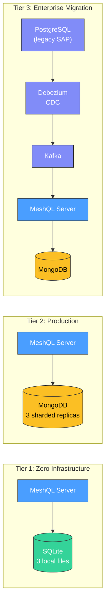
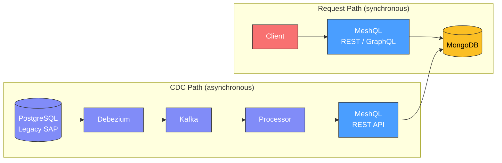
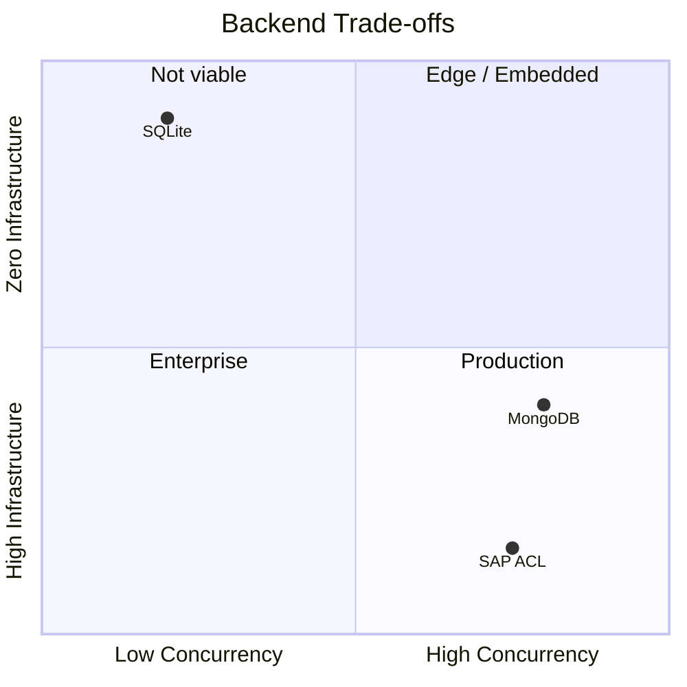

# Performance Across Backends

MeshQL runs the same 13-entity API on SQLite, MongoDB, and full enterprise stacks with CDC pipelines. This page presents real benchmark data showing the trade-offs at each tier and demonstrates that adding legacy system integration has zero impact on API performance.

All measurements were taken with [k6](https://k6.io/) against the egg-economy examples — 5 actor entities, 5 event entities, 3 projection entities, and 19 internal resolvers.

---

## The Three Tiers



| Tier | Storage | Services | Use case |
|:-----|:--------|:---------|:---------|
| **SQLite** (egg-economy-merkql) | 3 local files | 0 | Development, demos, edge deployment |
| **MongoDB** (egg-economy) | 3 sharded MongoDB replicas | 5 containers | Production workloads |
| **SAP** (egg-economy-sap) | MongoDB + PostgreSQL legacy + Kafka + Debezium | 7 containers | Enterprise migration with anti-corruption layer |

---

## Baseline Latency (1 VU)

Single-client performance shows each backend's raw latency without contention.

### Request Duration (p95, milliseconds)

```
REST CRUD
  SQLite   ████████████████▌              17.5 ms
  MongoDB  ████████▊                       8.8 ms
  SAP      ████████▎                       8.3 ms

GraphQL Queries
  SQLite   ████████████████▍              16.4 ms
  MongoDB  ██████▌                         6.6 ms
  SAP      ███▌                            3.6 ms

Federation (nested resolvers)
  SQLite   ██████████████████████▍        22.4 ms
  MongoDB  ████▏                           4.2 ms
  SAP      ███▍                            3.4 ms

Mixed Workload (writes + reads)
  SQLite   ████████████████▏              16.2 ms
  MongoDB  █████▌                          5.6 ms
  SAP      ██▋                             2.6 ms
```

{: .note }
> All three tiers serve the same API contract. SQLite is 2-3x slower on aggregate HTTP metrics because `json_extract()` WHERE clauses are more expensive than MongoDB's document queries. But at the individual query level, all three deliver sub-5ms latency.

### Individual Query Latency (p95, milliseconds)

| Query | SQLite | MongoDB | SAP |
|:------|-------:|--------:|----:|
| `getById` | 4.6 | 4.2 | 4.2 |
| `getAll` | 8.4 | 8.0 | 6.0 |
| `getByZone` / `getByFarm` | 4.0 | 5.0 | 5.0 |

At the query level, performance converges. The storage backend matters for throughput under load, not for baseline latency.

---

## The Legacy System Doesn't Affect the Clean API

This is the central claim of the anti-corruption layer architecture, and the benchmarks confirm it.

The SAP variant runs **7 Docker containers** — PostgreSQL (legacy database), Kafka, Debezium CDC, MongoDB, the MeshQL server, frontends, and nginx. Despite this infrastructure complexity, the clean MeshQL API is **as fast or faster** than the standalone MongoDB variant.

### Why?



The CDC pipeline and the API request path are **completely decoupled**:

- **Client requests** hit MeshQL, which reads/writes MongoDB directly. The legacy system is not in this path.
- **Legacy data flows** through Debezium → Kafka → processor → MeshQL REST API → MongoDB. This is asynchronous and runs on its own threads.

{: .architecture }
> The anti-corruption layer is designed so that the clean API's performance is governed only by MeshQL + MongoDB, regardless of how many legacy systems feed into it. You can add Salesforce, SAP, and mainframe CDC pipelines without degrading the API that your new applications consume.

### The Numbers

| Metric | MongoDB (standalone) | SAP (with full CDC stack) |
|:-------|---------------------:|---------------------------:|
| REST CRUD p95 | 8.8 ms | 8.3 ms |
| GraphQL p95 | 6.6 ms | 3.6 ms |
| Federation p95 | 4.2 ms | 3.4 ms |
| Mixed workload p95 | 5.6 ms | 2.6 ms |
| Throughput (mixed) | 104.7 req/s | 135.1 req/s |
| Error rate | 0% | 0% |

The SAP variant is marginally faster because it uses a single MongoDB instance (vs 3 sharded replicas), which reduces internal replication overhead. The point is: **adding the full enterprise CDC pipeline did not add latency**.

---

## Concurrency: Where Backends Diverge

Single-client latency tells you how fast a query is. Concurrency tells you how many clients you can serve simultaneously. This is where SQLite and MongoDB differ fundamentally.

### 10 Concurrent Users (REST CRUD)

| Metric | SQLite | MongoDB |
|:-------|-------:|--------:|
| **avg** | 24.6 ms | 3.1 ms |
| **med** | 13.6 ms | 2.0 ms |
| **p95** | 82.6 ms | 8.7 ms |
| **max** | 257.2 ms | 48.1 ms |
| **throughput** | 96.5 req/s | 159.4 req/s |
| **error rate** | 1.19% | 0.96% |
| **p95 degradation** (vs 1 VU) | **4.7x** | **1.0x** |

```
p95 Response Time Under Load
  SQLite (1 VU)    █████████████████▌              17.5 ms
  SQLite (10 VU)   ██████████████████████████████████████████████████████████████████████████████████▌   82.6 ms
  MongoDB (1 VU)   ████████▊                        8.8 ms
  MongoDB (10 VU)  ████████▋                        8.7 ms
```

{: .tip }
> MongoDB's p95 at 10 VUs (8.7ms) is **identical** to its p95 at 1 VU (8.8ms). Connection pooling and the WiredTiger storage engine handle concurrent writes without contention.

SQLite's single-writer lock causes requests to queue. At 10 VUs, p95 balloons 4.7x and the error rate crosses 1%. This is the fundamental trade-off: SQLite gives you zero infrastructure cost in exchange for zero concurrency tolerance.

---

## Federation Depth: In-Process vs Network

Federation resolves relationships between entities. Each resolver level adds a query to a different graphlette. The cost per level depends on whether that hop is in-process (SQLite) or over a network (MongoDB/SAP via Docker network).

### Resolver Chain Latency (avg, milliseconds)

| Depth | What it resolves | SQLite | MongoDB | SAP |
|:------|:-----------------|-------:|--------:|----:|
| **2** | farm → coops | 7.0 | 4.6 | 5.8 |
| **3** | farm → coops → hens | 8.8 | 13.4 | 18.0 |
| **3+parallel** | depth 3 + farmOutput | 10.1 | 16.2 | 16.5 |

| Backend | Cost per resolver level | Why |
|:--------|:----------------------|:----|
| SQLite | ~2 ms | In-process JVM call, zero serialization |
| MongoDB | ~5 ms | Internal resolver over Docker loopback |
| SAP | ~6 ms | Internal resolver over Docker network |

{: .note }
> SQLite's per-level cost is lower because internal resolvers within the same JVM skip HTTP entirely — they call the Searcher directly. MongoDB and SAP pay a small network penalty per level even with internal resolvers, because the storage queries cross a Docker network boundary to reach the database.

This creates an interesting crossover: SQLite is **faster for deep federation chains** despite being slower for everything else. At depth 3, SQLite's 8.8ms beats MongoDB's 13.4ms. The in-process advantage compounds with each level.

---

## Trade-Off Summary



| | SQLite | MongoDB | SAP Anti-Corruption |
|:---|:---|:---|:---|
| **Best for** | Dev, demos, single-user, edge | Production, multi-user | Enterprise migration |
| **Infrastructure** | None | MongoDB cluster | MongoDB + PostgreSQL + Kafka + Debezium |
| **Startup time** | Instant | ~30s (containers) | ~90s (containers + CDC init) |
| **1 VU latency** | Competitive (2-5ms per query) | Fast (2-4ms per query) | Fast (1-3ms per query) |
| **10 VU latency** | Degrades 4.7x | Flat | (Same as MongoDB) |
| **Federation depth** | Cheapest (~2ms/level) | Moderate (~5ms/level) | Moderate (~6ms/level) |
| **Write concurrency** | Single writer | Connection pool | Connection pool |
| **Legacy system impact** | N/A | N/A | Zero (async CDC) |

{: .architecture }
> The same JAR, the same API contract, the same 13 entities and 19 resolvers. The only difference is configuration: which Plugin you register and which connection URIs you provide. Moving from SQLite to MongoDB to a full enterprise anti-corruption layer is a configuration change, not a rewrite.

---

## Running the Benchmarks

The k6 test suite lives in `performance/` at the repository root:

```bash
# Start any egg-economy variant, then:
cd meshql

# Quick validation (1 VU, 10s)
k6 run -e BASE_URL=http://localhost:5088 -e PROFILE=smoke performance/tests/rest-crud.js

# Standard load test (ramp to 10 VUs, 55s)
k6 run -e BASE_URL=http://localhost:5088 -e PROFILE=load performance/tests/rest-crud.js

# Stress test (ramp to 50 VUs, 90s)
k6 run -e BASE_URL=http://localhost:5088 -e PROFILE=stress performance/tests/rest-crud.js

# Run all 4 test suites
./performance/run-all.sh http://localhost:5088 smoke
```

Four test suites are available:

| Suite | Focus |
|:------|:------|
| `rest-crud.js` | Create, read, update, delete across actor entities |
| `graphql-queries.js` | getById, getAll, filtered queries with custom latency metrics |
| `federation-depth.js` | Nested resolver chains at depth 2 and 3 |
| `mixed-workload.js` | Interleaved REST writes + GraphQL reads (realistic usage) |
