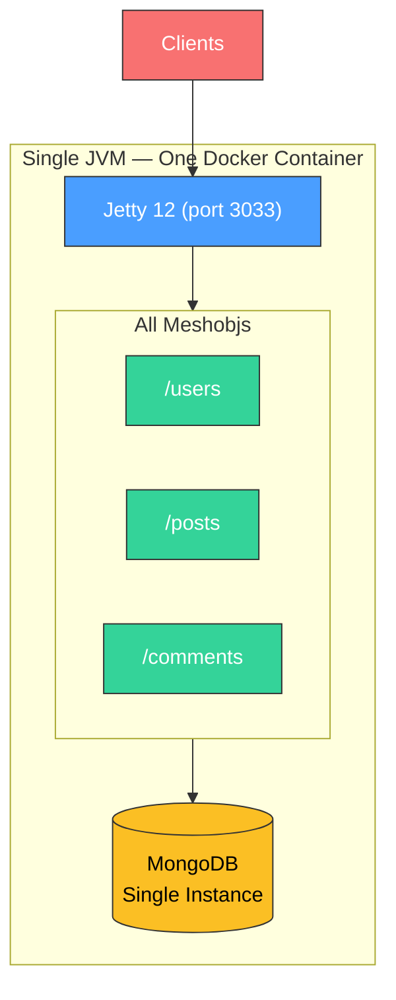
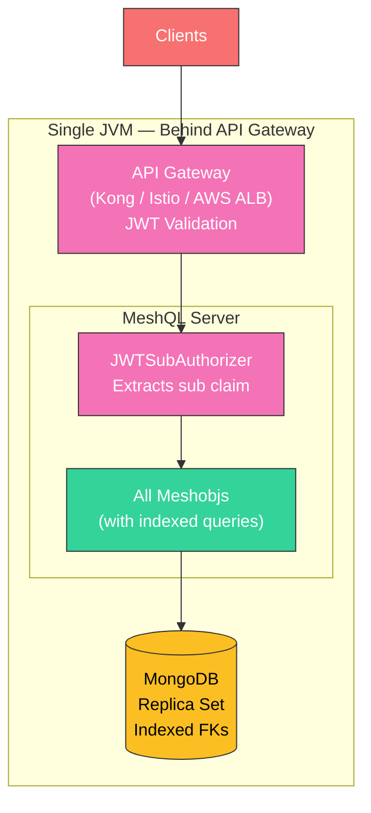
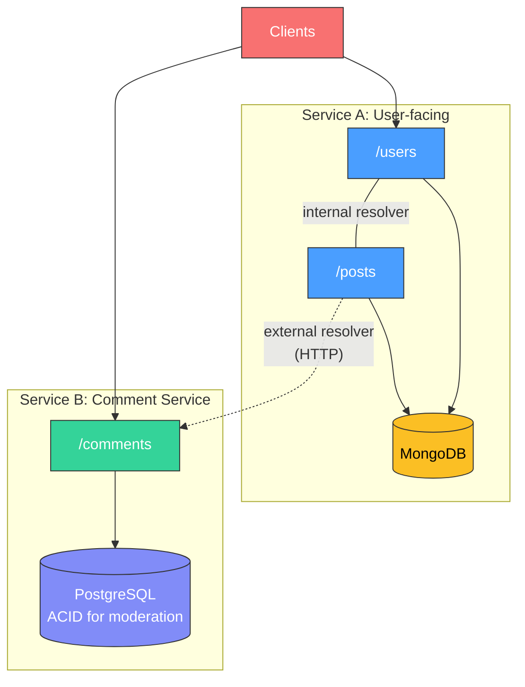
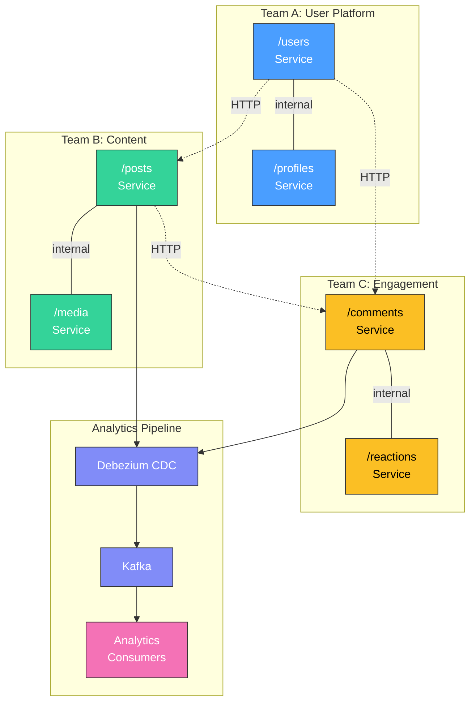

# From MVP to Scale

MeshQL is designed for the startup trajectory: build fast, prove the business, then scale without rewriting.

---

## Phase 1: MVP (Week 1)

**Goal**: Ship something that works.

Deploy everything as a single JAR. All meshobjs share one JVM, one port, one deployment pipeline. Use MongoDB (flexible schema, fast iteration) and NoAuth (no auth overhead during development).



**What you get for free**:
- REST CRUD + Swagger for every entity
- GraphQL with federation between entities
- Temporal versioning (you'll want this later for auditing)
- Document-level auth tokens (ready when you add auth)

**What you defer**:
- Authentication (use NoAuth)
- Distributed deployment
- Performance optimization

**Performance at this stage**: Good enough. Jetty 12 with virtual threads handles thousands of concurrent connections. External resolvers add ~1ms of HTTP overhead per hop within the same JVM. For most MVPs, this is invisible.

---

## Phase 2: Product-Market Fit (Month 3)

**Goal**: Add security, handle real users.

Swap NoAuth for JWT (your API gateway already validates tokens). Add JSON Schema validation on REST endpoints. Index your foreign key fields in MongoDB.



**Changes from Phase 1**:

| Change | Code Impact |
|:-------|:-----------|
| Add JWT auth | Change `new NoAuth()` to `new JWTSubAuthorizer()` |
| Add RBAC | Wrap with `CasbinAuth.create(model, policy, jwtAuth)` |
| Index foreign keys | Database operation, zero code changes |
| MongoDB replica set | Change connection URI |

**Performance optimization**: Index your foreign key fields. This is the single highest-impact change you can make:

```javascript
// These indexes provide ~100x improvement over unindexed queries
db.comments.createIndex({'payload.post_id': 1});
db.posts.createIndex({'payload.user_id': 1});
```

{: .tip }
> Database indexing provides 100x improvement. DataLoader batching provides 3-5x. Always index first.

---

## Phase 3: Growth (Month 6-12)

**Goal**: Handle increasing load. Some entities are hot, others are not.

Switch hot-path resolvers from external (HTTP) to internal (in-process). Split the truly hot meshobjs into separate services. Maybe move some entities to PostgreSQL for ACID transactions.



**Changes from Phase 2**:

| Change | Code Impact |
|:-------|:-----------|
| External → internal resolvers | Change `SingletonResolverConfig` to `InternalSingletonResolverConfig` |
| Split to separate service | Change resolver URL from `localhost` to `comments-service:3033` |
| MongoDB → PostgreSQL | Change `MongoConfig` to `PostgresConfig`, change plugin registration |
| Add DataLoader batching | Already enabled by default |

**The key insight**: None of these changes require restructuring your code. They're configuration changes. The architectural boundaries were there from day one.

---

## Phase 4: Scale (Year 2+)

**Goal**: Handle the hockey stick. Multiple teams, independent deployment, real-time analytics.

Full distributed deployment. Each team owns their meshobjs. CDC pipelines feed analytics. Temporal queries power compliance reporting.



**What's happening**:
- Teams own their meshobjs independently
- Internal resolvers within team boundaries (high affinity)
- External resolvers across team boundaries (low coupling)
- CDC feeds analytics without impacting operational APIs
- Temporal queries power compliance and audit reporting
- Each team chooses their own storage backend

---

## What Changes at Each Phase

| Concern | MVP | PMF | Growth | Scale |
|:--------|:----|:----|:-------|:------|
| **Auth** | NoAuth | JWT | JWT + Casbin | JWT + Casbin |
| **Storage** | MongoDB | MongoDB (indexed) | Polyglot | Polyglot |
| **Resolvers** | External | External | Mixed | Mixed |
| **Deployment** | Single JVM | Single JVM | 2-3 services | N services |
| **Teams** | 1 | 1-2 | 2-4 | N |
| **Analytics** | None | None | Optional CDC | CDC pipelines |
| **Code changes** | N/A | 1 line (auth) | Config only | Config only |

The pattern is clear: **infrastructure complexity grows linearly with business complexity, and almost never requires code changes.**

---

## Performance Characteristics

MeshQL on Jetty 12 with virtual threads (Project Loom):

- **Concurrency**: Thousands of concurrent requests without thread pool exhaustion
- **I/O efficiency**: Virtual threads waiting on DB or HTTP don't consume platform thread resources
- **Federation overhead**: ~1ms per hop within same JVM (external), ~0ms (internal)
- **DataLoader batching**: Up to 100 IDs per batch request
- **Temporal queries**: Marginal overhead (~5-10%) over non-temporal queries

The bottleneck is almost always the database, not the framework. Invest in indexing first, topology second.
