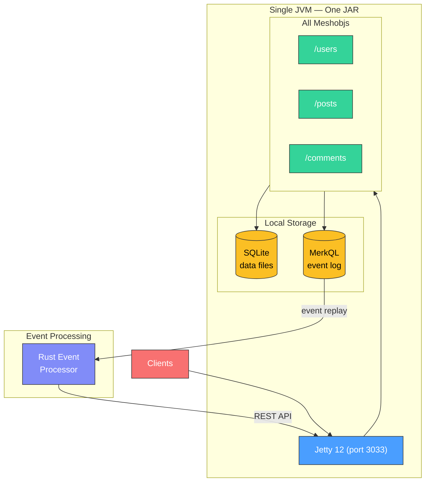
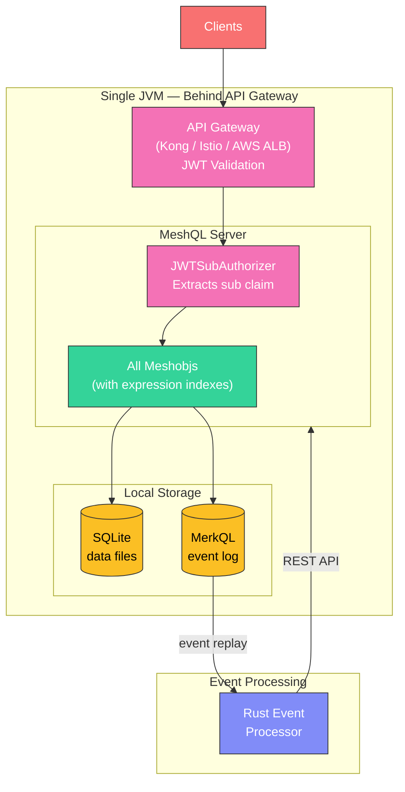
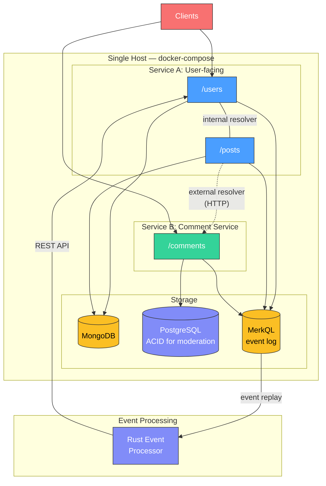
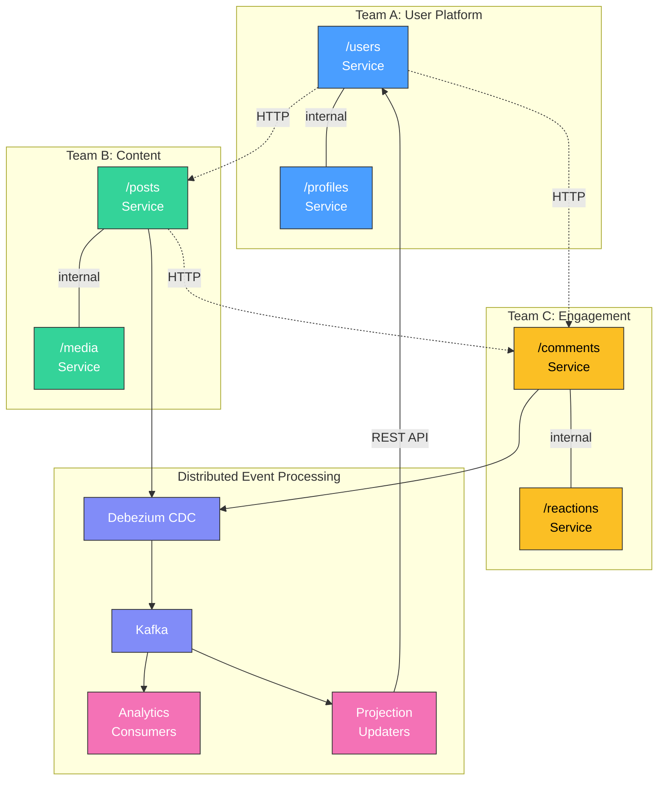

# From MVP to Scale

MeshQL is designed for the startup trajectory: build fast, prove the business, then scale without rewriting. The progression follows infrastructure topology, not application capability — the same JAR serves thousands of users on SQLite and millions on MongoDB.

---

## Phase 1: MVP (Week 1)

**Goal**: Ship something that works. In production. Today.

Deploy everything as a single JAR. All meshobjs share one JVM, one port, one deployment pipeline. Use SQLite (zero infrastructure) and MerkQL (tamper-proof event log for projections and workflows). No containers, no databases to manage — just a JAR and a directory for data files.

**What you get for free**:
- REST CRUD + Swagger for every entity
- GraphQL with federation between entities
- Temporal versioning (you'll want this later for auditing)
- Document-level auth tokens (ready when you add auth)
- MerkQL event log for projections, workflows, and audit trails
- Expression indexes on JSON fields for sub-5ms query latency

**What you defer**:
- Authentication (use NoAuth)
- Distributed deployment
- Write concurrency optimization

**Performance at this stage**: Production-capable. Individual queries return in 2-5ms with expression indexes. Jetty 12 with virtual threads handles thousands of concurrent connections. MerkQL provides event replay with multiple consumer support. The only bottleneck is SQLite's single-writer lock — and for most applications, that's not a bottleneck at all.

---

## Phase 2: Product-Market Fit (Month 3)

**Goal**: Add security, handle real users. Still zero infrastructure.

Swap NoAuth for JWT (your API gateway already validates tokens). Add JSON Schema validation on REST endpoints. Expression indexes already handle query performance. MerkQL handles event replay, audit trails, and projection updates. Same single JAR, same single host.

**Changes from Phase 1**:

| Change | Code Impact |
|:-------|:-----------|
| Add JWT auth | Change `new NoAuth()` to `new JWTSubAuthorizer()` |
| Add RBAC | Wrap with `CasbinAuth.create(model, policy, jwtAuth)` |
| Add JSON Schema validation | Already in the framework, just add schema files |
| Expression indexes | Already configured in Phase 1 |

{: .tip }
> Phase 2 is a 1-line auth change, not an infrastructure change. You're still running one JAR on one host with zero external dependencies.

---

## Phase 3: Growth (Month 6-12)

**Goal**: Handle increasing write concurrency. Some entities are hot, others are not.

When write concurrency exceeds SQLite's single-writer lock, replay your MerkQL log into a MongoDB-backed service. MerkQL's event log provides built-in migration — replay all events against the new storage backend. Still single-host, still MerkQL for event processing. Maybe move some entities to PostgreSQL for ACID transactions.

**Changes from Phase 2**:

| Change | Code Impact |
|:-------|:-----------|
| SQLite → MongoDB | Change `SQLiteConfig` to `MongoConfig`, change plugin registration |
| External → internal resolvers | Change `SingletonResolverConfig` to `InternalSingletonResolverConfig` |
| Split to separate service | Change resolver URL from `localhost` to `comments-service:3033` |
| MongoDB → PostgreSQL (some entities) | Change `MongoConfig` to `PostgresConfig`, change plugin registration |
| MerkQL event processing | Unchanged — same event log, same processors |

**The key insight**: The MerkQL event log carries forward across storage backends. Your event processors, projections, and workflows continue working unchanged. The migration is a storage swap, not a rewrite.

---

## Phase 4: Scale (Year 2+)

**Goal**: Handle the hockey stick. Multiple teams, independent deployment, multi-host infrastructure.

When you graduate out of docker-compose into multi-host or Kubernetes, replace MerkQL with Kafka for distributed event processing. This is the decision point: **MerkQL is the queue for single-host deployments. Kafka is the queue for distributed deployments.** The trigger is infrastructure topology, not application capability.

**What's happening**:
- Teams own their meshobjs independently
- Internal resolvers within team boundaries (high affinity)
- External resolvers across team boundaries (low coupling)
- Kafka for distributed consumers, cross-service events, data lake feeds
- CDC pipelines for legacy system integration
- Temporal queries power compliance and audit reporting
- Each team chooses their own storage backend

---

## What Changes at Each Phase

| Concern | MVP | PMF | Growth | Scale |
|:--------|:----|:----|:-------|:------|
| **Auth** | NoAuth | JWT | JWT + Casbin | JWT + Casbin |
| **Storage** | SQLite | SQLite | Polyglot (MongoDB, PostgreSQL) | Polyglot |
| **Event Processing** | MerkQL | MerkQL | MerkQL | Kafka + Debezium |
| **Resolvers** | External | External | Mixed | Mixed |
| **Deployment** | Single JAR | Single JAR | docker-compose | Kubernetes / multi-host |
| **Teams** | 1 | 1-2 | 2-4 | N |
| **Infrastructure** | None | None | Docker containers | Distributed |
| **Code changes** | N/A | 1 line (auth) | Config only | Config only |

The pattern is clear: **infrastructure complexity grows linearly with business complexity, and almost never requires code changes.** MerkQL bridges the gap between "zero infrastructure" and "full Kafka" — you get event-driven workflows from day one without paying the infrastructure tax until you need multi-host distribution.

---

## The Queue Decision Point

The key architectural decision in the MeshQL progression is **when to switch from MerkQL to Kafka**. It's not about capability — MerkQL supports event replay, multiple consumers, and tamper-proof audit logs. It's about topology:

| | MerkQL | Kafka |
|:--|:-------|:------|
| **Deployment** | Single host | Multi-host |
| **Consumers** | Same JVM or local processes | Distributed across hosts |
| **Event replay** | Built-in | Built-in |
| **Ordering** | Total order (single log) | Partition-level order |
| **Infrastructure** | None (file-based) | Kafka cluster + Debezium |
| **When to use** | Phases 1-3 | Phase 4 |

See [Performance](performance) for benchmark data across all tiers, and [Design Decisions](design-decisions#the-database-is-the-queue) for the architectural rationale.

---

## Performance Characteristics

MeshQL on Jetty 12 with virtual threads (Project Loom):

- **Concurrency**: Thousands of concurrent requests without thread pool exhaustion
- **I/O efficiency**: Virtual threads waiting on DB or HTTP don't consume platform thread resources
- **Federation overhead**: ~1ms per hop within same JVM (external), ~0ms (internal)
- **DataLoader batching**: Up to 100 IDs per batch request
- **Temporal queries**: Marginal overhead (~5-10%) over non-temporal queries
- **SQLite query latency**: 2-5ms per query with expression indexes
- **MerkQL event processing**: Local file I/O, no network overhead

The bottleneck is almost always the database, not the framework. Invest in indexing first, topology second. See [Performance](performance) for detailed benchmark data and [Tuning](tuning) for optimization techniques.
