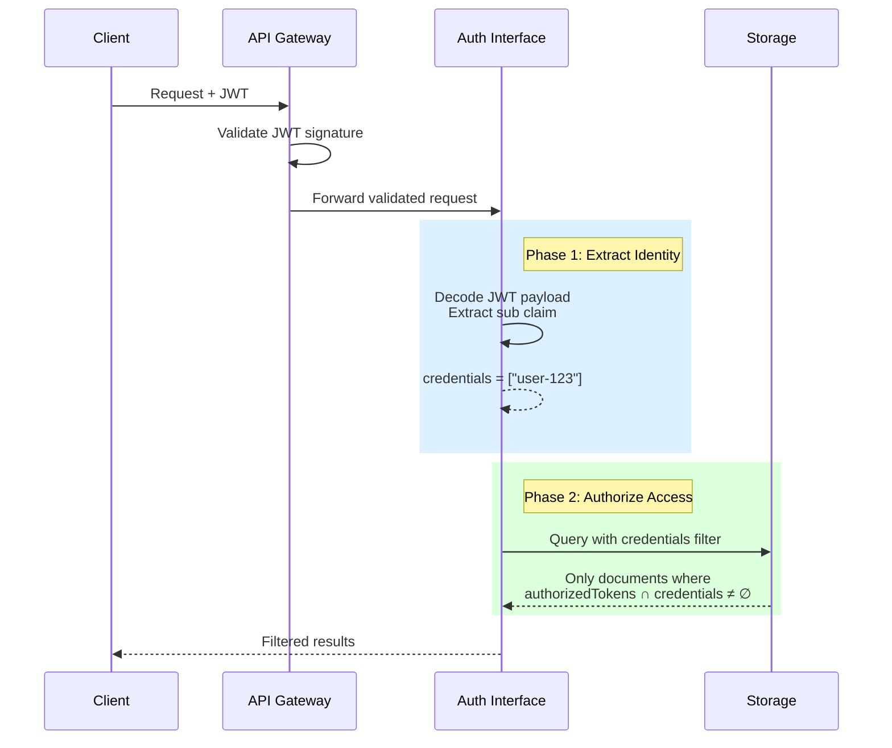
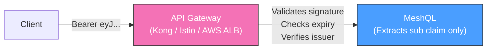
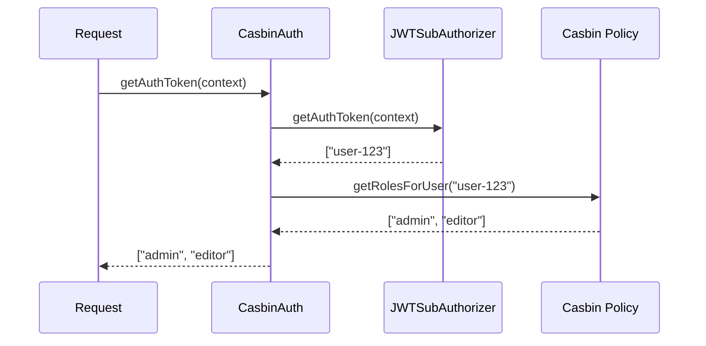
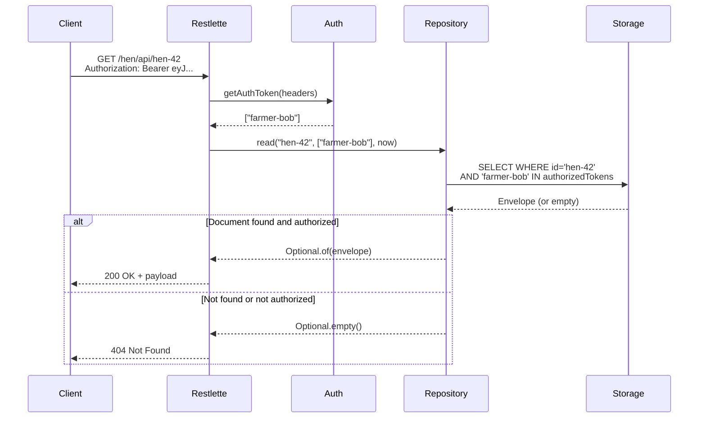
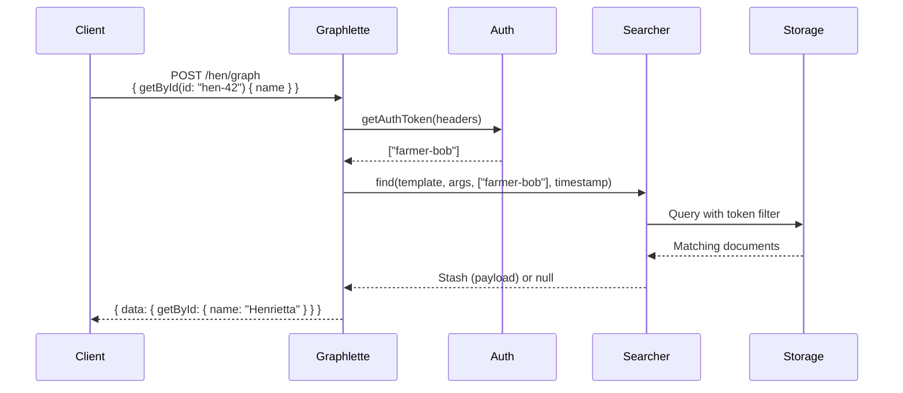

# Authentication and Authorization

MeshQL provides pluggable authentication designed for enterprise deployment behind API gateways.

---

## The Two-Phase Model

Authentication in MeshQL happens in two phases:



**Phase 1 — Identity Extraction** (`getAuthToken`):
Extract the caller's identity from the request context. Returns a list of credentials (user IDs, roles, or both).

**Phase 2 — Authorization Check** (`isAuthorized`):
For each document, check if the caller's credentials overlap with the document's `authorizedTokens`. Documents without matching tokens are filtered out.

---

## Auth Implementations

### JWT (`JWTSubAuthorizer`)

Extracts the `sub` claim from a Bearer token. **Does not verify the signature.**

```java
Auth auth = new JWTSubAuthorizer();
```

This is intentional:



**Why no signature verification?**
- Your API gateway already validates JWTs (Kong, Istio, AWS ALB, Cloudflare)
- MeshQL doesn't need access to signing keys
- No cryptographic overhead per request
- Follows the enterprise pattern: **validate at the edge, trust internally**

### Casbin RBAC (`CasbinAuth`)

Wraps another Auth (typically JWT) to add role-based access control:

```java
Auth jwtAuth = new JWTSubAuthorizer();
CasbinAuth auth = CasbinAuth.create("model.conf", "policy.csv", jwtAuth);
```



The caller's credentials become their **roles**, not their user ID. Documents are authorized by role:

```java
// This document is accessible by admins and editors
new Envelope("doc-1", payload, now, false,
    List.of("admin", "editor"));

// This document is only accessible by admins
new Envelope("doc-2", payload, now, false,
    List.of("admin"));
```

### NoAuth (Development)

Always authorizes. Every document is accessible by everyone.

```java
Auth auth = new NoAuth();  // Returns ["Token"], always authorizes
```

Use during development and testing. Never in production.

---

## Authorization Flow by API

### REST API



Note: unauthorized access and not-found are **indistinguishable** to the caller. This prevents information leakage — you can't probe for document existence.

### GraphQL API



---

## Writing Your Own Auth

The `Auth` interface is two methods:

```java
public interface Auth {
    List<String> getAuthToken(Stash context);
    boolean isAuthorized(List<String> credentials, Envelope data);
}
```

`getAuthToken` extracts identity from the request context. `isAuthorized` checks whether those credentials can access a given document. That's the entire contract.

Most enterprises will write their own implementation — and that's expected. Your organization has its own identity provider, its own token format, its own authorization model. The built-in modules are starting points:

- **JWT** shows how to extract identity from a standard token format
- **Casbin** demonstrates how to layer role resolution on top of identity extraction — it's a **blueprint**, not a production-ready RBAC solution. Your policy store, role hierarchy, and tenant model will be specific to your organization.
- **NoAuth** keeps development friction-free

A custom implementation typically takes a single class. If your gateway passes a custom header with pre-resolved roles, the entire auth module might be:

```java
public class GatewayAuth implements Auth {
    public List<String> getAuthToken(Stash context) {
        Stash headers = (Stash) context.get("headers");
        String roles = headers.get("x-gateway-roles").toString();
        return List.of(roles.split(","));
    }

    public boolean isAuthorized(List<String> credentials, Envelope data) {
        if (data.authorizedTokens().isEmpty()) return true;
        return data.authorizedTokens().stream()
            .anyMatch(credentials::contains);
    }
}
```

---

## Choosing an Auth Strategy

| Strategy | Use Case | Credentials | Signature Verification |
|:---------|:---------|:------------|:----------------------|
| **NoAuth** | Development, testing | Static token | None |
| **JWT** | Production behind API gateway | User ID from `sub` | Gateway handles it |
| **Casbin** | Blueprint for role-based access | Roles from policy | Gateway handles JWT; Casbin handles RBAC |
| **Custom** | Your organization's auth model | Whatever you need | Your call |
