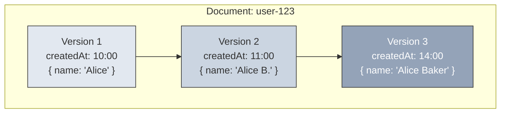
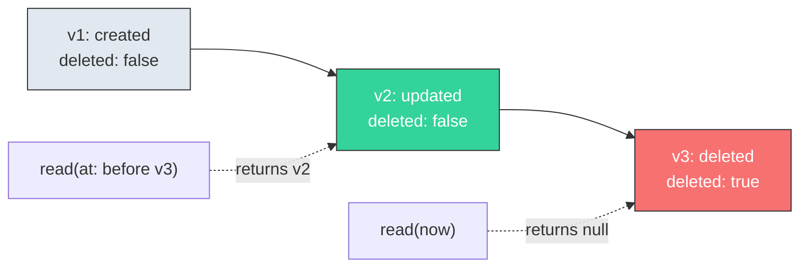

# The Envelope

Every document in MeshQL is wrapped in an Envelope — an immutable record that carries your data along with the metadata needed for versioning, authorization, and audit.

```java
public record Envelope(
    String id,                      // Unique document identifier
    Stash payload,                  // Your data (opaque to the framework)
    Instant createdAt,              // When this version was created
    boolean deleted,                // Soft-delete flag
    List<String> authorizedTokens   // Who can access this document
)
```

---

## Why Not Just Store the Data?

Most frameworks store your data directly. MeshQL wraps it because every document needs the same four guarantees:

### 1. Identity

Every document has a framework-managed `id`. REST creates use auto-generated UUIDs. The ID is stable across versions — updating a document creates a new Envelope with the same ID but a new `createdAt`.

### 2. Versioning



Every write creates a new version. Reads default to the latest version, but can request any point in time:

```java
// Latest version
repository.read("user-123", tokens, Instant.now());

// Version as of 11:30 — returns Version 2
repository.read("user-123", tokens, Instant.parse("2024-01-15T11:30:00Z"));
```

### 3. Soft Deletes

Deleting a document sets `deleted: true` on a new version. The document's history is preserved:



### 4. Document-Level Authorization

Access tokens are stored on the document itself:

```java
// Document accessible by farmer-bob and vet-alice
new Envelope("hen-42", payload, now, false,
    List.of("farmer-bob", "vet-alice"));
```

When a request arrives:
1. **Auth** extracts the caller's identity (e.g., JWT `sub` claim → `"farmer-bob"`)
2. **Repository/Searcher** filters results to only documents where `authorizedTokens` contains the caller's credential
3. Documents without matching tokens are invisible to that caller

---

## The Payload

The `payload` field uses `Stash` — a flexible key-value container from the [TailoredShapes](https://github.com/tsmarsh) library. Think of it as a `Map<String, Object>` that handles JSON serialization.

The framework never interprets your payload. It stores it, returns it, and passes it to templates. Your data schema is defined by your GraphQL and JSON schemas, not by the framework.

---

## How Backends Store Envelopes

Each storage backend maps the Envelope to its native format:

| Backend | ID | Payload | Timestamps | Auth Tokens | Versioning |
|:--------|:---|:--------|:-----------|:------------|:-----------|
| **MongoDB** | `id` field | BSON subdocument | `java.util.Date` | Array in document | Multiple docs per ID |
| **PostgreSQL** | `id TEXT` | `JSONB` column | `TIMESTAMP` | Separate relation table | Multiple rows per ID |
| **SQLite** | `id TEXT` | `TEXT` (JSON) | `INTEGER` (ms) | JSON array column | Multiple rows per ID |
| **In-Memory** | Map key | Java object | `Instant` | List in Envelope | `List<Envelope>` per ID |

Despite different physical storage, the **certification test suite** guarantees identical behavior: same CRUD semantics, same temporal queries, same authorization filtering.

---

## REST vs. GraphQL Representation

The Envelope is an internal structure. APIs expose data differently:

**REST** returns the payload only (without envelope metadata):
```json
// POST /hen/api/ → 201 Created
{
  "id": "hen-42",
  "name": "Henrietta",
  "eggs": 3,
  "coop_id": "coop-1"
}
```

**GraphQL** returns fields defined by the schema, with resolvers filling in relationships:
```json
// { getById(id: "hen-42") { name eggs coop { name } } }
{
  "data": {
    "getById": {
      "name": "Henrietta",
      "eggs": 3,
      "coop": {
        "name": "Main Coop"
      }
    }
  }
}
```

The Envelope's metadata (versioning, auth tokens) is used internally for filtering and time-travel but doesn't leak into API responses.
