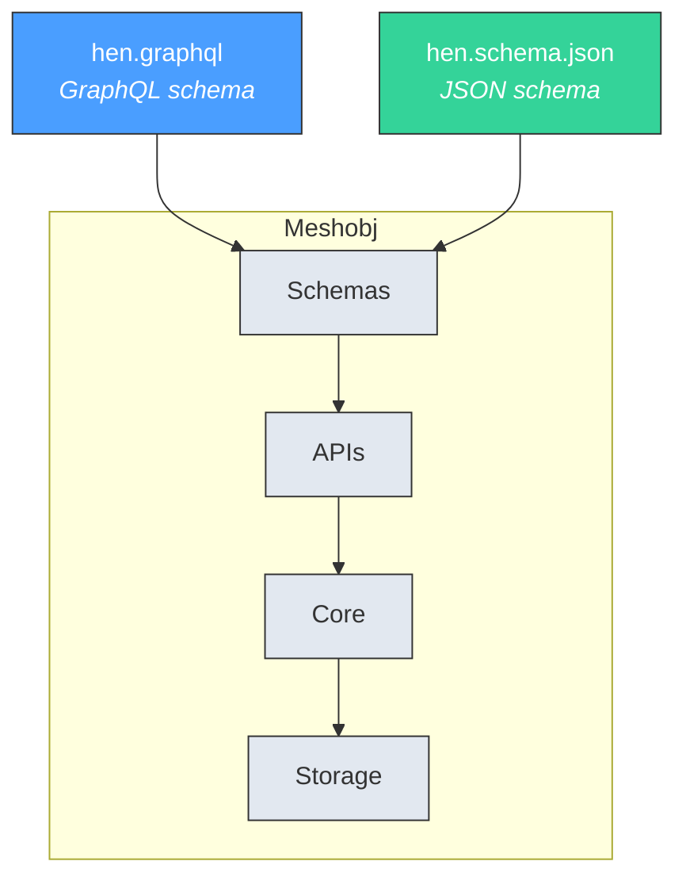
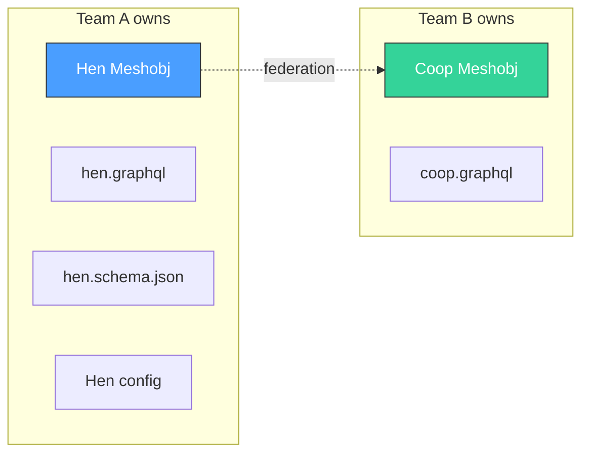

# The Meshobj

A meshobj is MeshQL's fundamental building block: **a single data entity with everything it needs to be independently developed, tested, and deployed**.

---

## Anatomy

Every meshobj consists of:



| Layer | Components | Purpose |
|:------|:-----------|:--------|
| **Schemas** | `.graphql` file, `.schema.json` file | Define the entity's shape and validation rules |
| **APIs** | Graphlette (GraphQL), Restlette (REST) | Expose the entity to consumers |
| **Core** | Searcher (queries), Repository (CRUD), Auth | Business logic and access control |
| **Storage** | Plugin + backend (Mongo/Postgres/SQLite/Memory) | Persistent state |

---

## What You Write

To create a meshobj, you provide:

**1. A GraphQL schema** defining queries and types:

```graphql
scalar Date

type Query {
    getById(id: ID!, at: Float): Hen
    getByCoop(id: ID!, at: Float): [Hen]
    getByName(name: String!, at: Float): [Hen]
}

type Hen {
    id: ID!
    name: String
    eggs: Int
    dob: Date
    coop: Coop
    layReports: [LayReport]
}

# Projections of foreign types (not the canonical definition)
type Coop {
    id: ID!
    name: String
}

type LayReport {
    id: ID!
    eggs: Int
}
```

**2. A JSON schema** for REST validation:

```json
{
  "type": "object",
  "properties": {
    "name": { "type": "string" },
    "eggs": { "type": "integer", "minimum": 0, "maximum": 10 },
    "dob": { "type": "string", "format": "date-time" },
    "coop_id": { "type": "string" }
  },
  "required": ["name"]
}
```

**3. Configuration** wiring it all together:

```java
GraphletteConfig.builder()
    .path("/hen/graph")
    .storage(mongoConfig)
    .schema("/config/graph/hen.graphql")
    .rootConfig(
        RootConfig.builder()
            .singleton("getById", "{\"id\": \"{{id}}\"}")
            .vector("getByCoop", "{\"payload.coop_id\": \"{{id}}\"}")
            .vector("getByName", "{\"payload.name\": \"{{name}}\"}")
            .singletonResolver("coop", "coop_id", "getById",
                platformUrl + "/coop/graph")
            .vectorResolver("layReports", null, "getByHen",
                platformUrl + "/lay_report/graph")
            .build()
    )
    .build()
```

---

## What You Get

From those three inputs, MeshQL gives you:

### REST API (automatic)
```
POST   /hen/api/           → Create a hen
GET    /hen/api/           → List all hens
GET    /hen/api/{id}       → Read a hen
PUT    /hen/api/{id}       → Update a hen
DELETE /hen/api/{id}       → Soft-delete a hen
POST   /hen/api/bulk       → Batch create
GET    /hen/api/bulk?ids=  → Batch read
GET    /hen/api/api-docs   → Swagger UI
```

### GraphQL API (schema-driven)
```graphql
# Singleton query
{ getById(id: "hen-42") { name eggs coop { name } } }

# Vector query
{ getByCoop(id: "coop-1") { name eggs } }

# Temporal query — data as of yesterday
{ getById(id: "hen-42", at: 1705276800) { name eggs } }
```

### Federation
Other meshobjs can resolve Hen data by calling `/hen/graph` with the appropriate query.

### Temporal versioning
Every write creates a new version. Any read can specify a timestamp.

### Document-level authorization
Each document stores its own access tokens. Auth is enforced on every read.

---

## Independent Deployability

A meshobj is designed to be developed and released by a single team:



Team A can:
- Change Hen's schema without affecting Coop
- Add fields, queries, or resolvers independently
- Choose a different storage backend
- Deploy on a different release schedule
- Run their own test suite

The only contract between teams is the **published GraphQL query interface** — the set of queries that other meshobjs call through resolvers.
