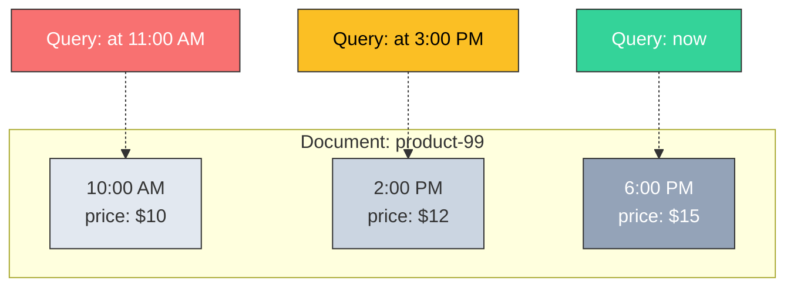
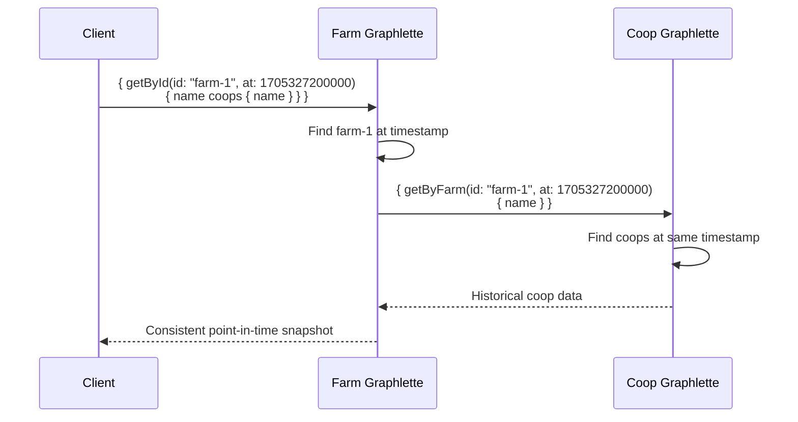

# Temporal Queries

Every MeshQL backend stores the full version history of every document. Any read — REST or GraphQL — can request data as of a specific point in time.

---

## How It Works

When you write a document, MeshQL creates a new version with the current timestamp. It never overwrites the previous version:



A temporal query finds the **latest version created at or before the requested timestamp**.

---

## Using Temporal Queries

### GraphQL

Every query supports an optional `at` parameter (Unix timestamp in milliseconds):

```graphql
# Current data
{ getById(id: "product-99") { name price } }

# Data as of January 15, 2024 at 3:00 PM UTC
{ getById(id: "product-99", at: 1705327200000) { name price } }
```

### REST

The Repository interface accepts a timestamp on reads:

```java
// Current version
repository.read("product-99", tokens, Instant.now());

// Historical version
repository.read("product-99", tokens,
    Instant.parse("2024-01-15T15:00:00Z"));
```

### Federation

Temporal queries propagate through federation. When a resolver fetches related data, it passes the timestamp:



This gives you a **consistent snapshot across federated entities** — all data reflects the same moment in time.

---

## Use Cases

### Audit and Compliance
See exactly what a document looked like at any point. No separate audit table needed — the version history *is* the audit trail.

### Debugging
"What did this record look like when the bug was reported?" Query with the incident timestamp.

### Regulatory Reporting
Generate reports as of a specific date. Financial data, inventory snapshots, regulatory filings — all queryable at any historical point.

### Undo / Recovery
Deleted a document? It's still there (soft delete). Need the previous version? Query with an earlier timestamp.

---

## Storage Overhead

Temporal versioning does use more storage than a simple overwrite model. Each update creates a new row/document rather than modifying in place.

For most applications, this is a good tradeoff:
- Storage is cheap
- Audit requirements often mandate history anyway
- The alternative (building a separate audit system) is more expensive to build and maintain
- Old versions can be archived or compacted in a maintenance window if storage becomes a concern

---

## Backend Implementation Details

| Backend | Version Storage | Temporal Query | Precision |
|:--------|:---------------|:---------------|:----------|
| **MongoDB** | Multiple documents per ID | Aggregation: `$group` by ID, `$first` by `createdAt DESC` | Milliseconds |
| **PostgreSQL** | Multiple rows per ID | `DISTINCT ON (id) ORDER BY created_at DESC` with `<= timestamp` filter | Microseconds |
| **SQLite** | Multiple rows per ID | CTE with `MAX(created_at)` per ID | Milliseconds |
| **In-Memory** | `List<Envelope>` per ID | Java stream: `max(comparing(createdAt))` with `isBefore` filter | Nanoseconds |

All backends return identical results for the same logical timestamp. The certification test suite verifies this.
