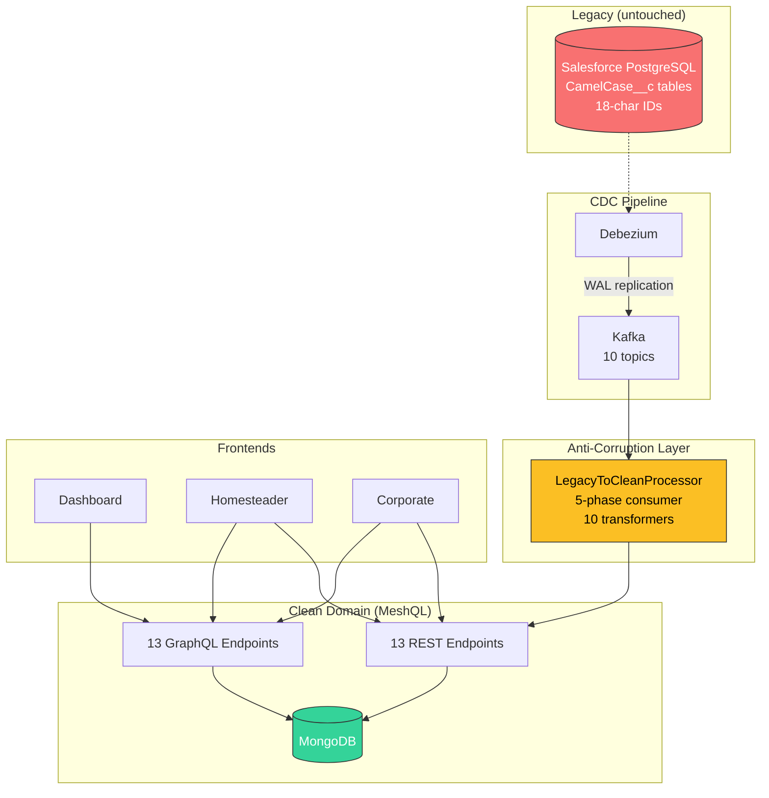

# Egg Economy Salesforce: Anti-Corruption Layer for Salesforce Migration

Demonstrates using MeshQL as a **transitional architecture** for migrating off Salesforce — extracting your data and business logic from a platform that was never designed to let go.

[View source on GitHub](https://github.com/tsmarsh/meshql/tree/main/examples/egg-economy-salesforce){: .btn .btn-outline .mr-2 }
[Run with Docker Compose](#running-it){: .btn .btn-outline }

---

## The Enterprise Problem

Salesforce orgs grow organically. What starts as a CRM becomes the de facto application platform: custom objects (`__c`), Process Builder flows, Apex triggers, validation rules, formula fields — all tightly coupled to the Salesforce runtime. Eventually the org reaches a point where:

- **Platform costs scale with headcount**, not with value delivered — governor limits force architectural compromises
- **Custom object sprawl** means your data model is locked inside a proprietary schema with 18-character IDs and picklist dependencies
- **Integration complexity** compounds: every connected system must speak Salesforce's API, handle its pagination, respect its rate limits, and decode its naming conventions
- **Org migrations** (merging acquired companies, splitting business units) become multi-quarter projects because the data model is the platform

The anti-corruption layer lets you **decouple from Salesforce incrementally**. New applications consume a clean API. Salesforce data flows through automatically via CDC. When you're ready to cut over, the clean side is already running.

---

## Architecture



**Salesforce is never modified.** It continues to serve existing users, workflows, and reports. New applications are built exclusively against the clean MeshQL API.

---

## What Gets Transformed

| Salesforce (Legacy) | Clean (MeshQL) | Transformation |
|:--------------------|:---------------|:---------------|
| `Farm__c.Id: "a0B5f000001ABC01"` | `legacy_sf_id: "a0B5f000001ABC01"` | Preserved for traceability |
| `Farm__c.Farm_Type__c: "Megafarm"` | `farm_type: "megafarm"` | Picklist to lowercase |
| `Coop__c.Farm__c: "a0B5f000001ABC01"` | `farm_id: <meshql-uuid>` | SF lookup → ID cache resolution |
| `Hen__c.Status__c: "Active"` | `status: "active"` | Picklist to lowercase |
| `Storage_Deposit__c.Source_Type__c: "Farm"` | `source_type: "farm"` | Picklist to lowercase |
| `Consumption_Report__c.Purpose__c: "Baking"` | `purpose: "baking"` | Picklist to lowercase |
| `*.IsDeleted: true` | *(filtered out)* | Salesforce soft-delete filter |
| `*.CreatedDate` | `createdAt` | ISO timestamp passthrough |

Salesforce naming conventions are more readable than SAP's, but the coupling is deeper: 18-character opaque IDs, lookup relationships as foreign key columns named after the parent object, picklist values that drive Apex logic, and `IsDeleted` soft-delete semantics that every consumer must understand.

---

## Salesforce Table Mapping

| Clean Entity | SF Custom Object | Relationship | Key Custom Fields |
|:--|:--|:--|:--|
| Farm | Farm__c | Top-level (has OwnerId) | Farm_Type__c, Zone__c, Owner_Name__c |
| Coop | Coop__c | Master-Detail to Farm | Farm__c(MD), Capacity__c, Coop_Type__c |
| Hen | Hen__c | Master-Detail to Coop | Coop__c(MD), Breed__c, Date_of_Birth__c, Status__c |
| Container | Storage_Container__c | Top-level (has OwnerId) | Container_Type__c, Capacity__c, Zone__c |
| Consumer | Consumer_Account__c | Top-level (has OwnerId) | Consumer_Type__c, Zone__c, Weekly_Demand__c |
| LayReport | Lay_Report__c | Lookup (has OwnerId) | Name(auto-number), Hen__c, Farm__c, Egg_Count__c, Quality__c |
| StorageDeposit | Storage_Deposit__c | Lookup (has OwnerId) | Name(auto-number), Container__c, Source_Type__c, Egg_Count__c |
| StorageWithdrawal | Storage_Withdrawal__c | Lookup (has OwnerId) | Name(auto-number), Container__c, Egg_Count__c, Reason__c |
| ContainerTransfer | Container_Transfer__c | Lookup (has OwnerId) | Name(auto-number), Source_Container__c, Dest_Container__c, Egg_Count__c |
| ConsumptionReport | Consumption_Report__c | Lookup (has OwnerId) | Name(auto-number), Consumer__c, Container__c, Egg_Count__c, Purpose__c |

All tables include Salesforce standard fields: Id (18-char), Name, CreatedDate, CreatedById, LastModifiedDate, LastModifiedById, SystemModstamp, IsDeleted.

### Schema Fidelity

This example models a realistic Salesforce org as it would appear after replication to PostgreSQL (e.g., via Heroku Connect or ETL):

- **Standard fields on every object** — CreatedDate, CreatedById, LastModifiedDate, LastModifiedById, SystemModstamp, IsDeleted. Tools like Heroku Connect depend on SystemModstamp for sync; its absence would be immediately obvious to a Salesforce developer.
- **OwnerId modeled per relationship type** — Top-level objects and Lookup children have their own OwnerId. Master-Detail children (Coop, Hen) do not — they inherit ownership from their master.
- **Master-Detail vs Lookup relationships** — Coop is Master-Detail to Farm (cascade delete, shared owner, required FK). Transaction records use Lookup relationships (independent ownership).
- **Auto-number Name fields** on transaction records — `LR-00001`, `SD-00001`, `CT-00001`, `CR-00001`
- **18-character Salesforce IDs** with correct key prefixes per object type — `a0B` for Farm, `005` for User records
- **Picklist values in Title Case** — `Megafarm`, `Free Range`, `Grade A`, `Double Yolk`
- **Lowercase table and column names** — matches what tools like Heroku Connect produce when replicating to PostgreSQL

---

## Migration Strategy

This example demonstrates a three-stage platform replacement path:

### Stage 1: Shadow (this example)
Salesforce remains the system of record. Debezium replicates changes in real-time via CDC. New applications are built against the clean MeshQL API. Existing Salesforce users, reports, dashboards, and workflows continue unchanged. **Zero risk, immediate value.**

### Stage 2: Parallel Operation
New capabilities are built directly in MeshQL. Salesforce functionality is progressively retired object by object. Each custom object decommissioned is a reduction in Salesforce license scope and platform complexity.

### Stage 3: Cutover
Salesforce is decommissioned. The CDC pipeline is removed. MeshQL is the sole system of record. Every application built against the clean API since Stage 1 continues working without modification. License costs drop to zero.

The critical advantage: **you stop building on Salesforce on day one.** Every feature built against the clean API is a feature that doesn't need to be migrated later.

---

## CDC in Production: Getting Data Out of Salesforce

This example uses Debezium on a PostgreSQL replica to keep things simple and self-contained. In a real Salesforce integration, you have several options — including Salesforce's own CDC platform feature, which is one of the more mature vendor-provided CDC implementations available.

### Salesforce's Native CDC

**Change Data Capture** is a first-class Salesforce platform feature. When enabled for an object, Salesforce monitors DML operations and publishes change events — JSON payloads containing the operation type (CREATE, UPDATE, DELETE, UNDELETE), the changed fields, and metadata including the committing user, transaction key, and commit timestamp.

Events are published to the Salesforce Event Bus and consumed via two APIs:

- **Pub/Sub API** (recommended): gRPC over HTTP/2 with Avro-encoded payloads. Supports `Subscribe` (pull-based streaming), `ManagedSubscribe` (server-side replay tracking, open beta), and `Publish`. Proto definition at [github.com/forcedotcom/pub-sub-api](https://github.com/forcedotcom/pub-sub-api).

- **CometD / Bayeux** (legacy): HTTP long-polling with JSON payloads. Channel format: `/data/ChangeEvents` (all selected entities) or `/data/<Object>ChangeEvent` (single entity). Salesforce provides the [EMP Connector](https://github.com/forcedotcom/EMP-Connector) as a Java reference implementation.

**What a change event looks like:**

```json
{
  "ChangeEventHeader": {
    "entityName": "Farm__c",
    "changeType": "CREATE",
    "recordIds": ["a0B5f000001ABC01"],
    "commitUser": "005RM000001vI54mYAE",
    "commitTimestamp": 1569443783000,
    "transactionKey": "00051c2e-a75a-3f97-03fc-cdf4e16d9d3c",
    "changedFields": [],
    "changeOrigin": "com/salesforce/api/soap/47.0"
  },
  "Name": "Sunny Valley Megafarm",
  "Farm_Type__c": "Megafarm",
  "Zone__c": "north"
}
```

For CREATE events, all writable fields are included. For UPDATE, only changed fields (the `changedFields` array lists which ones). For DELETE, only the record ID appears in the header.

**Allocations and limits:**

| | Enterprise Edition | Performance/Unlimited |
|:--|:--|:--|
| Max selected entities | 5 | 5 |
| Max event notifications / 24 hours | 25,000 | 50,000 |

With the CDC add-on license, the entity limit is removed and the 24-hour cap rises to 125,000–150,000. Change events are retained for 72 hours on the Event Bus, allowing replay within that window via `replayId`.

**Gap and overflow events**: When Salesforce can't generate normal change events (errors, overload), it sends gap events with no record data — subscribers must query Salesforce directly to reconcile. Transactions exceeding 100,000 changes produce overflow events after the first 100K.

### Event Relay to AWS

**Salesforce Event Relay** is a managed, no-code service that forwards CDC events (and Platform Events) to Amazon EventBridge. From there, you can route to Lambda, SQS, S3, Kinesis, or Step Functions. The relay handles health monitoring, checkpoint tracking, and automatic resume after connectivity issues. This is the simplest path for AWS-native architectures.

### Debezium and Salesforce

**Debezium does not have a Salesforce connector.** Salesforce is a SaaS platform with no direct database access — Debezium's log-based CDC model (reading WAL/binlog/redo logs) doesn't apply. Getting Salesforce CDC data into Kafka requires a different connector.

### Kafka Connect for Salesforce

The **Confluent Salesforce CDC Source Connector** is the primary way to get Salesforce change events into Kafka:

- Uses Salesforce Streaming API v45.0+ (CometD/Bayeux) under the hood
- Subscribes to change event channels (e.g., `/data/Farm__cChangeEvent`)
- Authentication via OAuth2, username/password + security token, or JWT bearer
- Delivery guarantee: at-least-once (may produce duplicates on restart)
- Limited to 1 task (no parallelism) — subject to Salesforce rate limits
- Available on both Confluent Cloud (fully managed) and Confluent Platform (self-managed)

### Other Integration Options

| Solution | Type | Latency | Best For |
|:---------|:-----|:--------|:---------|
| **Pub/Sub API** (direct) | gRPC streaming | Near real-time | Custom consumers in any language (Java, Python, Go, etc.) |
| **Confluent SF CDC Connector** | Kafka Connect | Near real-time | Kafka-native architectures |
| **Event Relay → EventBridge** | Managed relay | Near real-time | AWS-native, no code |
| **MuleSoft** (Salesforce-owned) | iPaaS | Near real-time | Replay Channel Listener with checkpoint persistence |
| **Heroku Connect** | Managed sync | Eventual (polling) | Heroku Postgres mirror of Salesforce data |
| **Fivetran / Airbyte** | Batch sync | 5 min – 24 hours | Data warehouse loading (Snowflake, BigQuery) |

### What This Example Models

This example simulates the Salesforce scenario using a PostgreSQL database with Salesforce naming conventions and Debezium for CDC. In a production deployment, you would replace the Debezium step with one of the approaches above — most likely the Pub/Sub API for a custom consumer, or the Confluent connector for a Kafka-based architecture. The anti-corruption layer (the transformers, the phased processor, the clean MeshQL API) remains identical regardless of how the change events arrive.

---

## Processing Phases

FK dependencies between entities require ordered processing:

1. **Phase 1**: Farm, Container, Consumer — root entities with no FK dependencies
2. **Phase 2**: Coop — depends on Farm (resolves `Farm__c` lookup → `farm_id`)
3. **Phase 3**: Hen — depends on Coop (resolves `Coop__c` lookup → `coop_id`)
4. **Phase 4**: All 5 event topics — depend on all actors, plus inline projection updates
5. **Phase 5**: Continuous consumption of all 10 topics for ongoing CDC

---

## Running It

```bash
cd examples/egg-economy-salesforce
docker compose up --build
```

| URL | App |
|:----|:----|
| `http://localhost:8090/dashboard/` | National Egg Dashboard |
| `http://localhost:8090/homestead/` | Homesteader App |
| `http://localhost:8090/corporate/` | Corporate Portal |
| `http://localhost:8090/api/` | MeshQL API |

| Service | Port |
|:--------|:-----|
| MeshQL App | 5090 |
| nginx | 8090 |
| PostgreSQL | 5435 |

---

## See Also

- [**Egg Economy**](egg-economy) — the clean domain, native MeshQL
- [**Egg Economy SAP**](egg-economy-sap) — same domain, SAP as legacy source
- [**Springfield Electric**](legacy) — the foundational anti-corruption layer pattern
- [**Mesher**](/meshql/reference/mesher) — CLI tool that generates anti-corruption layers automatically

[Back to Examples](/meshql/examples){: .btn .btn-outline }
