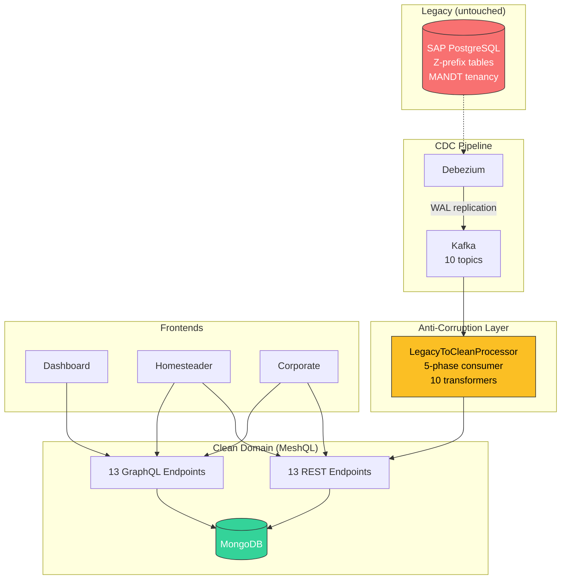

# Egg Economy SAP: Anti-Corruption Layer for SAP Migration

Demonstrates using MeshQL as a **transitional architecture** for migrating away from an over-customized SAP system — without a big-bang cutover and without modifying the legacy system.

[View source on GitHub](https://github.com/tsmarsh/meshql/tree/main/examples/egg-economy-sap){: .btn .btn-outline .mr-2 }
[Run with Docker Compose](#running-it){: .btn .btn-outline }

---

## The Enterprise Problem

SAP implementations accumulate decades of customization. Z-tables, custom transaction codes, abbreviated German column names, MANDT-scoped tenancy, YYYYMMDD date strings, single-character code maps — the system works, but it has become the bottleneck:

- **Vendor lock-in**: Every new feature requires SAP consultants at SAP rates
- **Integration tax**: Every downstream system must understand SAP's internal data model
- **Upgrade paralysis**: Heavy customization makes SAP upgrades multi-year projects
- **Talent scarcity**: Finding developers who understand both SAP ABAP and modern architectures is increasingly difficult

The anti-corruption layer pattern lets you **start migrating today** without touching SAP. New applications consume a clean API while legacy data flows through automatically.

---

## Architecture



The legacy system is **never modified**. SAP continues to operate exactly as before. New applications are built exclusively against the clean MeshQL API.

---

## What Gets Transformed

| SAP (Legacy) | Clean (MeshQL) | Transformation |
|:-------------|:---------------|:---------------|
| `ZFARM_MSTR.FARM_TYP_CD: "M"` | `farm_type: "megafarm"` | Single-char code map |
| `ZFARM_MSTR.ERDAT: "20150301"` | `createdAt: "2015-03-01T08:00:00"` | YYYYMMDD to ISO-8601 |
| `ZFARM_MSTR.MANDT: "100"` | *(filtered out)* | Client 100 only |
| `ZSTALL_MSTR.WERKS` | `farm_id: <meshql-uuid>` | FK resolution via ID cache |
| `ZEQUI_HEN.RASSE_CD: "RIR"` | `breed: "Rhode Island Red"` | Breed code map |
| `ZEQUI_HEN.STAT_CD: "A"` | `status: "active"` | Status code map |
| `ZAFRU_LEGE.QUAL_CD: "A"` | `quality: "Grade A"` | Quality code map |
| `ZMSEG_261.ZWECK_CD: "C"` | `purpose: "cooking"` | Purpose code map |

Every transformer handles the specific encoding patterns that accumulate in long-lived SAP systems: abbreviated column names (`BEHAELT_NR` for container number), packed dates (`ERFAS_DT` + `ERFAS_ZT`), single-character codes that only exist in tribal knowledge or ancient ABAP data elements.

---

## SAP Table Mapping

| Clean Entity | SAP Table | Primary Key | Key Business Columns |
|:--|:--|:--|:--|
| Farm | ZFARM_MSTR | (MANDT, WERKS) | BUKRS, FARM_NM, FARM_TYP_CD, ZONE_CD, EIGR |
| Coop | ZSTALL_MSTR | (MANDT, STALL_NR) | WERKS(FK), STALL_NM, KAPZT, STALL_TYP_CD |
| Hen | ZEQUI_HEN | (MANDT, EQUNR) | STALL_NR(FK), HENNE_NM, RASSE_CD, GEB_DT, STAT_CD |
| Container | ZBEHAELT_MSTR | (MANDT, BEHAELT_NR) | BEHAELT_NM, BEHAELT_TYP_CD, KAPZT, ZONE_CD, LGORT |
| Consumer | ZKUNDE_VBR | (MANDT, KUNNR) | KUND_NM, VBR_TYP_CD, ZONE_CD, WOCH_BEDARF |
| LayReport | ZAFRU_LEGE | (MANDT, AUFNR) | EQUNR(FK), WERKS(FK), BUKRS, EI_MENGE, ERFAS_DT+ZT, QUAL_CD |
| StorageDeposit | ZMSEG_101 | (MANDT, MBLNR, MJAHR) | BEHAELT_NR(FK), BUKRS, QUELL_TYP_CD, EI_MENGE |
| StorageWithdrawal | ZMSEG_201 | (MANDT, MBLNR, MJAHR) | BEHAELT_NR(FK), BUKRS, EI_MENGE, GRUND_CD |
| ContainerTransfer | ZMSEG_301 | (MANDT, MBLNR, MJAHR) | QUELL_BEH_NR(FK), ZIEL_BEH_NR(FK), BUKRS, EI_MENGE |
| ConsumptionReport | ZMSEG_261 | (MANDT, MBLNR, MJAHR) | KUNNR(FK), BEHAELT_NR(FK), BUKRS, EI_MENGE, ZWECK_CD |

All tables include standard SAP admin fields: ERNAM/ERDAT/ERZET (created by/date/time) and AENAM/AEDAT/AEZET (last changed by/date/time).

### Schema Fidelity

This example models a realistic SAP Z-table landscape as it would appear after SLT replication to PostgreSQL:

- **MANDT on every table as part of a composite primary key** — the defining characteristic of SAP's multi-tenant architecture
- **No database-level foreign key constraints** — SAP handles referential integrity in the ABAP application layer, not at the database level
- **Standard admin fields** (ERNAM/ERDAT/ERZET/AENAM/AEDAT/AEZET) on every table, with user names in SAP SY-UNAME format (max 12 chars, uppercase)
- **SAP number formats** — WERKS as 4-char plant codes (`1000`), KUNNR as 10-digit customer numbers (`0000100001`), EQUNR as 18-char equipment numbers (`000000000000000001`), MBLNR as 10-digit material document numbers (`4900000001`)
- **BUKRS** (company code), **LGORT** (storage location), and **MJAHR** (material document year) where they would appear in a real SAP landscape
- **ZMSEG naming** references real SAP movement types: 101 (goods receipt), 201 (goods issue), 301 (transfer posting), 261 (consumption)

---

## Migration Strategy

This example demonstrates a three-stage vendor replacement path:

### Stage 1: Shadow (this example)
SAP remains the system of record. Debezium replicates changes in real-time. New applications are built against the clean API. Legacy applications continue unchanged. **Zero risk to production.**

### Stage 2: Dual-Write
New applications write to MeshQL directly. A reverse sync pushes changes back to SAP for legacy consumers. Both systems are authoritative during the transition window.

### Stage 3: Cutover
SAP is decommissioned. The Debezium pipeline is removed. MeshQL becomes the sole system of record. All applications already work — they've been consuming the clean API since Stage 1.

The key insight: **Stage 1 costs almost nothing and delivers immediate value.** Every new application built against the clean API is one fewer application that needs migration at cutover.

---

## CDC in Production: Getting Data Out of SAP

This example uses Debezium on a PostgreSQL replica to keep things simple and self-contained. In a real SAP landscape, the CDC pipeline has more moving parts. Here's what actually exists.

### SAP's Native CDC Options

**SAP SLT (Landscape Transformation Replication Server)** is SAP's primary real-time replication technology. SLT installs database triggers on the source SAP system's underlying database (Oracle, DB2, SQL Server, or HANA), writes change records to logging tables, and an ABAP-based SLT server reads those logs and replicates to a target. It supports initial load plus ongoing delta replication with latency in the seconds range. SLT is part of the DMIS (Data Migration Server) add-on, currently DMIS 2018 SP08+ / DMIS 2020. Its primary target is SAP HANA, but it can replicate to other databases via SDI/SDA.

**ODP (Operational Data Provisioning)** is SAP's canonical extraction framework for S/4HANA. ODP providers include traditional BW extractors (e.g., `2LIS_11_VAHDR` for sales order headers), ABAP CDS Views annotated with `@Analytics.dataExtraction.enabled: true`, and SLT-based replication objects. Each provider defines its delta mechanism — timestamp-based, pointer-based (delta queue), or additive. The delta queue is managed via transaction `ODQMON`. ODP is SAP's recommended extraction path from S/4HANA because the underlying data model changed significantly (e.g., `ACDOCA` universal journal replaces multiple FI/CO tables), making direct table replication unreliable.

**SAP HANA Change Tracking** (HANA 2.0 SPS 03+) allows querying changes since a specific timestamp or commit ID via `ALTER TABLE ... ENABLE CHANGE TRACKING`. Useful for micro-batch CDC patterns where a consumer periodically queries for changes.

**SAP Event Mesh** (part of SAP BTP) is a cloud-native event broker built on Solace PubSub+. S/4HANA Cloud can emit application-level business events ("Business Partner Created", "Sales Order Changed") directly to Event Mesh over AMQP 1.0, MQTT, or HTTP. These are semantic events, not row-level CDC — they carry business meaning. The event catalog is published in the SAP Business Accelerator Hub.

### Debezium and SAP

**Debezium does not have an SAP HANA connector** — not official, incubating, or community. HANA's transaction log format is proprietary and undocumented, making log-based CDC connector development impractical without SAP's cooperation.

The standard production pattern is a **two-hop architecture**:

```
SAP system → SLT/ODP → PostgreSQL or SQL Server → Debezium → Kafka
```

This is exactly what this example models. SLT replicates SAP tables to a PostgreSQL database; Debezium captures changes from PostgreSQL's WAL. The intermediate database must be sized and managed, and the two-hop adds seconds of latency, but the approach is proven and requires no SAP modifications.

Debezium's JDBC source connector can connect to HANA via JDBC for polling-based capture (using a timestamp or incrementing column), but this is not true CDC — it has higher latency and cannot detect hard deletes.

### Third-Party CDC Solutions

| Solution | SAP Support | Mechanism | Target |
|:---------|:------------|:----------|:-------|
| **Qlik Replicate** (formerly Attunity) | Dedicated SAP Application endpoint (RFC, change documents, ODP) + SAP HANA endpoint (trigger-based + log-based) | Direct SAP connection | Kafka, Snowflake, BigQuery, S3, databases |
| **Fivetran HVR** (formerly HVR) | SAP HANA (trigger-based CDC) + SAP ERP (RFC extraction) | Direct SAP connection | Kafka, cloud warehouses, databases |
| **Striim** | SAP HANA CDC reader (trigger-based, row + column store) + SAP ERP (RFC/ODP) | Direct SAP connection with in-memory stream processing | Kafka, cloud targets |
| **Precisely Connect** (formerly Syncsort) | Log-based CDC on SAP's underlying database (Oracle, DB2, SQL Server) + SAP-aware connector for transparent/cluster/pooled tables | Database-level log reading | Kafka, cloud warehouses |

Confluent does not have a native SAP connector. Their recommended path is SLT → supported database → Debezium, or partner integrations with Qlik/Striim.

### Recommended Architecture by Scenario

| Scenario | Recommended Path | Latency |
|:---------|:-----------------|:--------|
| SAP ECC with Oracle/DB2 underneath | SLT → PostgreSQL → Debezium → Kafka | Seconds to minutes |
| SAP S/4HANA on-premise | ODP/CDS Views → SAP Datasphere, or SLT → PostgreSQL → Debezium | Minutes |
| SAP S/4HANA Cloud | SAP Event Mesh → Kafka (via bridge or Solace connector) | Sub-second |
| Budget available for commercial tooling | Qlik Replicate or Fivetran HVR → Kafka directly | Seconds |
| Low-volume batch-tolerant | RFC/BAPI polling via SAP JCo 3.1.x | Minutes to hours |

The key takeaway: **there is no single, simple, open-source CDC path from SAP to Kafka** comparable to what Debezium provides for PostgreSQL. Most production SAP CDC architectures involve SAP's own replication tools (SLT, ODP) as a first hop, or commercial third-party tools that have invested years in building SAP-specific connectors.

---

## Processing Phases

FK dependencies between entities require ordered processing:

1. **Phase 1**: Farm, Container, Consumer — root entities with no FK dependencies
2. **Phase 2**: Coop — depends on Farm (resolves `WERKS` → `farm_id`)
3. **Phase 3**: Hen — depends on Coop (resolves `STALL_NR` → `coop_id`)
4. **Phase 4**: All 5 event topics — depend on all actors, plus inline projection updates
5. **Phase 5**: Continuous consumption of all 10 topics for ongoing CDC

---

## Running It

```bash
cd examples/egg-economy-sap
docker compose up --build
```

| URL | App |
|:----|:----|
| `http://localhost:8089/dashboard/` | National Egg Dashboard |
| `http://localhost:8089/homestead/` | Homesteader App |
| `http://localhost:8089/corporate/` | Corporate Portal |
| `http://localhost:8089/api/` | MeshQL API |

| Service | Port |
|:--------|:-----|
| MeshQL App | 5089 |
| nginx | 8089 |
| PostgreSQL | 5434 |

---

## See Also

- [**Egg Economy**](egg-economy) — the clean domain, native MeshQL
- [**Egg Economy Salesforce**](egg-economy-salesforce) — same domain, Salesforce as legacy source
- [**Springfield Electric**](legacy) — the foundational anti-corruption layer pattern
- [**Mesher**](/meshql/reference/mesher) — CLI tool that generates anti-corruption layers automatically

[Back to Examples](/meshql/examples){: .btn .btn-outline }
