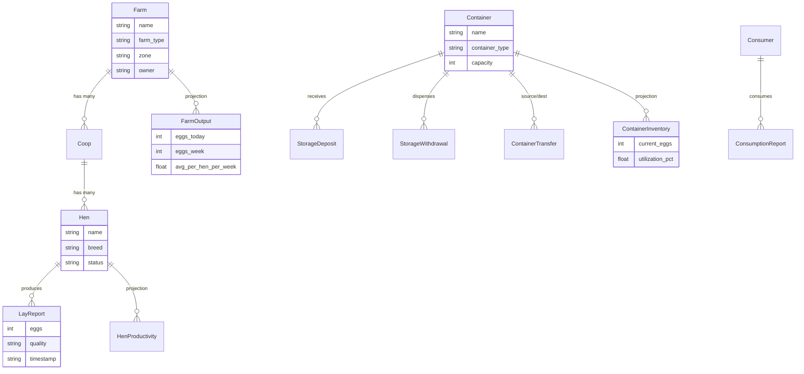

# Case Study: National Egg Economy

An event-sourced egg economy demonstrating **CDC workflow processing**, **materialized projections**, and **MongoDB sharding** — three separate databases, one unified API. 13 entities, 19 internal resolvers, a Debezium → Kafka CDC pipeline, and three frontend apps built by three different "teams."

[View source on GitHub](https://github.com/tsmarsh/meshql/tree/main/examples/egg-economy){: .btn .btn-outline .mr-2 }
[Run with Docker Compose](#running-it){: .btn .btn-outline }

---

## The Allegory

This example models a national egg economy as an allegory for energy grid management:

| Egg Economy | Energy Grid |
|:------------|:------------|
| Farm | Grid zone |
| Coop | Facility (solar array, turbine) |
| Hen | Generating unit (panel, turbine) |
| Container | Storage/distribution point |
| Consumer | Energy consumer |
| LayReport | Generation event |
| ContainerInventory | Storage state projection |
| FarmOutput | Zone output projection |

The egg economy needs the same architecture as a real energy grid: high-volume event ingestion, CDC-driven projection updates, sharded storage for different access patterns, and multiple frontend applications for different personas.

---

## Domain Model



13 entities split into three categories:

- **5 Actors**: Farm, Coop, Hen, Container, Consumer — low write volume, frequent reads
- **5 Events**: LayReport, StorageDeposit, StorageWithdrawal, ContainerTransfer, ConsumptionReport — append-only, high volume
- **3 Projections**: ContainerInventory, HenProductivity, FarmOutput — materialized by the CDC workflow processor

---

## Architecture


The key architectural features:

1. **Three MongoDB shards** — actors, events, and projections each get their own database. Sharding is pure configuration — each entity's `MongoConfig` points at the appropriate shard.

2. **CDC pipeline** — Events are POSTed via REST to the events shard. Debezium captures MongoDB change streams and publishes to Kafka (5 topics). The `EventWorkflowProcessor` consumes events and routes them to updaters that read-modify-write projections via GraphQL GET + REST PUT.

3. **19 internal resolvers** — All federation is in-JVM (zero HTTP overhead). A single GraphQL query can traverse Farm → Coops → Hens → LayReports → HenProductivity.

---

## Three Frontends, Three Personas

### National Egg Dashboard

**Persona**: Public reporting — anyone can view national and regional egg production statistics.

**Stack**: Alpine.js 3 + DaisyUI 4 + Chart.js 4 (all CDN, no build step)


{: .mb-6 }

| Section | Content | Data Source |
|:--------|:--------|:------------|
| Summary Cards | Total farms, eggs this week, active hens, avg eggs/hen/week | `farm_output/graph` |
| Production Charts | Bar: eggs by farm type. Doughnut: farm type distribution | `farm_output/graph` |
| Container Utilization | Horizontal bar chart + stat cards (in storage, consumed) | `container_inventory/graph`, `container/graph` |
| Top Producers | Top 10 farms by weekly eggs, top 10 hens by total eggs | `farm_output/graph`, `hen_productivity/graph` |
| Consumption | Doughnut by purpose, recent consumption table | `consumption_report/graph` |

All data loads on init via `Promise.all()` of GraphQL queries. The zone filter in the navbar updates all charts and tables client-side without re-fetching. Read-only — no writes.

### Homesteader App

**Persona**: Small-scale farmer using a phone once or twice a week to log eggs and manage a small flock.

**Stack**: React 19 + Vite 6 + Tailwind 4, PWA with `manifest.json` and service worker


{: .mb-6 }


{: .mb-6 }

| Tab | Purpose | API Calls |
|:----|:--------|:----------|
| **Log Eggs** | Big touch-friendly form: select hen card, +/- egg count, quality picker | `GET /coop/graph` (getByFarm), `POST /lay_report/api` |
| **My Hens** | Hen list grouped by coop, tap to see lay report history | `GET /coop/graph` (getByFarm), `GET /lay_report/graph` (getByHen) |
| **My Coops** | View/add coops, add hens inline | `GET /coop/graph` (getByFarm), `POST /coop/api`, `POST /hen/api` |
| **Summary** | Weekly KPI cards + hen leaderboard from projections | `GET /farm_output/graph` (getByFarm), `GET /hen_productivity/graph` (getAll) |

Large tap targets (min 48px), big fonts for outdoor use. Warm amber/green palette. Bottom tab bar. PWA installable with offline shell caching. Farm ID stored in localStorage after first-run farm picker.

### Corporate Portal

**Persona**: Farm operations manager at a megafarm or regional office. Desktop browser, bulk operations.

**Stack**: React 19 + Vite 6 + Tailwind 4


{: .mb-6 }


{: .mb-6 }

| Section | Purpose | API Calls |
|:--------|:--------|:----------|
| **Dashboard** | KPI cards: eggs today/week/month, active hens, avg/hen/week | `GET /farm_output/graph` (getByFarm) |
| **Coops** | Sortable table with capacity & hen count, add coop form | `GET /coop/graph` (getByFarm), `POST /coop/api` |
| **Hens** | Sortable/filterable table by coop, CSV bulk upload | `GET /coop/graph` (getByFarm), `POST /hen/api` |
| **Events** | Lay report table with manual entry + CSV bulk upload | `GET /lay_report/graph` (getByFarm), `POST /lay_report/api` |
| **Containers** | Container inventory with utilization badges | `GET /container/graph` (getAll), `GET /container_inventory/graph` (getAll) |

Professional blue/slate palette, fixed sidebar with SVG icons. Farm selector dropdown for multi-farm support. CSV upload with client-side parse and progress bar. Sortable table headers.

### Summary

| App | Stack | Protocol | Pattern | Key Operation |
|:----|:------|:---------|:--------|:--------------|
| **Dashboard** | Alpine.js + Chart.js | GraphQL | Flat reads, client-side aggregation | `getAll` on projections in parallel |
| **Homesteader** | React PWA | REST + GraphQL | Mobile-first, touch forms | `POST /lay_report/api` + federated reads |
| **Corporate** | React + Vite | REST + GraphQL | Desktop, bulk CSV upload | CSV → `POST /hen/api` (batch) + sorted tables |

Three teams, three stacks, three access patterns. One backend. Zero coordination.

---

## The CDC Pipeline

This is what makes the egg economy event-sourced. Events flow through a four-stage pipeline:


1. Events are POSTed via REST to MongoDB (events shard)
2. Debezium captures change streams and publishes to Kafka (5 topics)
3. `EventWorkflowProcessor` consumes events and routes to updaters
4. Updaters read-modify-write projections via GraphQL GET + REST PUT
5. Projections are queryable via GraphQL with full federation

The workflow processor handles all five event types:

| Event | Updates | Logic |
|:------|:--------|:------|
| LayReport | HenProductivity, FarmOutput | Increment egg counts, recalculate averages |
| StorageDeposit | ContainerInventory | Add eggs, recalculate utilization |
| StorageWithdrawal | ContainerInventory | Remove eggs, recalculate utilization |
| ContainerTransfer | ContainerInventory (x2) | Remove from source, add to destination |
| ConsumptionReport | ContainerInventory | Decrement eggs, track consumption |

---

## The Backend

### Three MongoDB Shards

Each shard is an independent MongoDB replica set:

| Shard | Collections | Purpose |
|:------|:------------|:--------|
| `mongodb-actors` | farm, coop, hen, container, consumer | Low writes, frequent reads |
| `mongodb-events` | lay_report, storage_deposit, storage_withdrawal, container_transfer, consumption_report | High writes, append-only, CDC source |
| `mongodb-projections` | container_inventory, hen_productivity, farm_output | Moderate writes (CDC updates), frequent reads |

Sharding in MeshQL is pure configuration — each entity's `MongoConfig` points at the appropriate shard URI:

```java
// Actors → Shard 1
MongoConfig farmDB = createMongoConfig(actorsMongoUri, prefix, env, "farm");

// Events → Shard 2
MongoConfig layReportDB = createMongoConfig(eventsMongoUri, prefix, env, "lay_report");

// Projections → Shard 3
MongoConfig farmOutputDB = createMongoConfig(projectionsMongoUri, prefix, env, "farm_output");
```

### 19 Internal Resolvers

All resolvers are in-JVM — zero HTTP overhead. Example traversal:

```graphql
{
  getAll {
    name
    farm_type
    coops {
      name
      hens {
        name
        productivity { eggs_week quality_rate }
        layReports { eggs timestamp }
      }
    }
    farmOutput { eggs_week avg_per_hen_per_week }
  }
}
```

Full resolver map:

| Source Entity | Field | Type | Target Query | Target Path |
|:-------------|:------|:-----|:-------------|:------------|
| Farm | `coops` | Vector | `getByFarm` | `/coop/graph` |
| Farm | `farmOutput` | Vector | `getByFarm` | `/farm_output/graph` |
| Coop | `farm` | Singleton | `getById` | `/farm/graph` |
| Coop | `hens` | Vector | `getByCoop` | `/hen/graph` |
| Hen | `coop` | Singleton | `getById` | `/coop/graph` |
| Hen | `layReports` | Vector | `getByHen` | `/lay_report/graph` |
| Hen | `productivity` | Vector | `getByHen` | `/hen_productivity/graph` |
| Container | `inventory` | Vector | `getByContainer` | `/container_inventory/graph` |
| Consumer | `consumptionReports` | Vector | `getByConsumer` | `/consumption_report/graph` |
| LayReport | `hen` | Singleton | `getById` | `/hen/graph` |
| StorageDeposit | `container` | Singleton | `getById` | `/container/graph` |
| StorageWithdrawal | `container` | Singleton | `getById` | `/container/graph` |
| ContainerTransfer | `sourceContainer` | Singleton | `getById` | `/container/graph` |
| ContainerTransfer | `destContainer` | Singleton | `getById` | `/container/graph` |
| ConsumptionReport | `consumer` | Singleton | `getById` | `/consumer/graph` |
| ConsumptionReport | `container` | Singleton | `getById` | `/container/graph` |
| ContainerInventory | `container` | Singleton | `getById` | `/container/graph` |
| HenProductivity | `hen` | Singleton | `getById` | `/hen/graph` |
| FarmOutput | `farm` | Singleton | `getById` | `/farm/graph` |

---

## Running It

### Docker Compose

```bash
cd examples/egg-economy
docker compose up --build
```

This starts 10 services:

| Service | Image | Port | Purpose |
|:--------|:------|:-----|:--------|
| `mongodb-actors` | mongo:8 | — | Actors shard (farm, coop, hen, container, consumer) |
| `mongodb-events` | mongo:8 | — | Events shard (lay_report, storage_deposit, etc.) |
| `mongodb-projections` | mongo:8 | — | Projections shard (container_inventory, etc.) |
| `kafka` | apache/kafka:3.7.0 | 9092 | Event streaming (KRaft mode) |
| `debezium` | debezium/server:2.6 | 8080 | CDC from events MongoDB |
| `egg-economy` | Built from `Dockerfile` | 5088 | MeshQL API (13 entities) |
| `homesteader-app` | Built from `homesteader-app/` | — | React PWA (mobile farmer) |
| `corporate-app` | Built from `corporate-app/` | — | React portal (operations manager) |
| `dashboard-app` | Built from `dashboard-app/` | — | Alpine.js dashboard (public) |
| `nginx` | nginx:alpine | **8088** | Reverse proxy (all frontends + API) |

### Seed Data

```bash
./scripts/seed.sh
```

Creates 5 farms, 8 coops, 20 hens, 6 containers, 5 consumers, and ~85 events. Waits for the CDC pipeline to materialize projections, then verifies the data.

### Access

| URL | App |
|:----|:----|
| `http://localhost:8088/dashboard/` | National Egg Dashboard |
| `http://localhost:8088/homestead/` | Homesteader App |
| `http://localhost:8088/corporate/` | Corporate Portal |
| `http://localhost:8088/api/` | MeshQL API (direct access) |

### Direct API

```bash
# GraphQL — full federation query
curl -X POST http://localhost:5088/farm/graph \
  -H "Content-Type: application/json" \
  -d '{"query": "{ getAll { name farm_type coops { name hens { name } } } }"}'

# REST — create a new lay report
curl -X POST http://localhost:5088/lay_report/api \
  -H "Content-Type: application/json" \
  -d '{"hen_id": "...", "coop_id": "...", "farm_id": "...", "eggs": 3, "quality": "grade_a", "timestamp": "2026-01-15T08:00:00Z"}'
```

---

## What This Demonstrates

- **Event sourcing with CDC** — Events are immutable, append-only documents. Projections are materialized views computed by the workflow processor. The CDC pipeline (Debezium → Kafka → processor) decouples write-side from read-side.

- **MongoDB sharding as configuration** — Three independent MongoDB instances, each optimized for its access pattern. No application code changes — just different `MongoConfig` URIs per entity.

- **Internal resolvers for zero-overhead federation** — All 19 resolvers run in-JVM. A five-level deep GraphQL query (Farm → Coop → Hen → LayReport → HenProductivity) resolves without a single HTTP call between entities.

- **Three frontend stacks, one backend** — Alpine.js for the public dashboard (no build step, CDN only), React PWA for the mobile farmer (touch-first, offline-capable), React + Vite for the corporate desktop portal (tables, CSV uploads). All three consume the same 13 REST + 13 GraphQL endpoints.

- **Scale target** — The seed data is small for demonstration, but the architecture supports production scale: 900,000 hens across 10,105 farms, ~5.4M events/week, 60,530 containers, 1,000,000 consumers.

[Back to Examples](/meshql/examples){: .btn .btn-outline }
