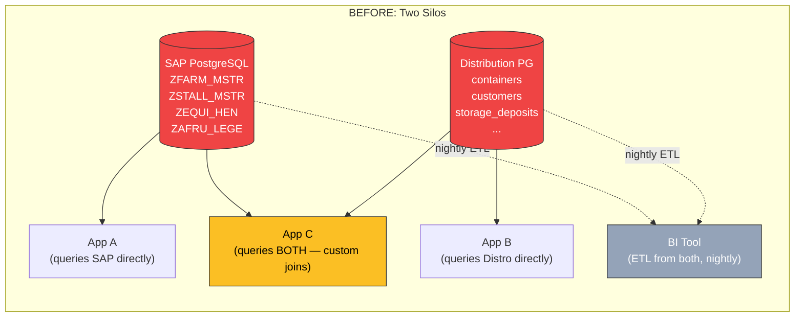
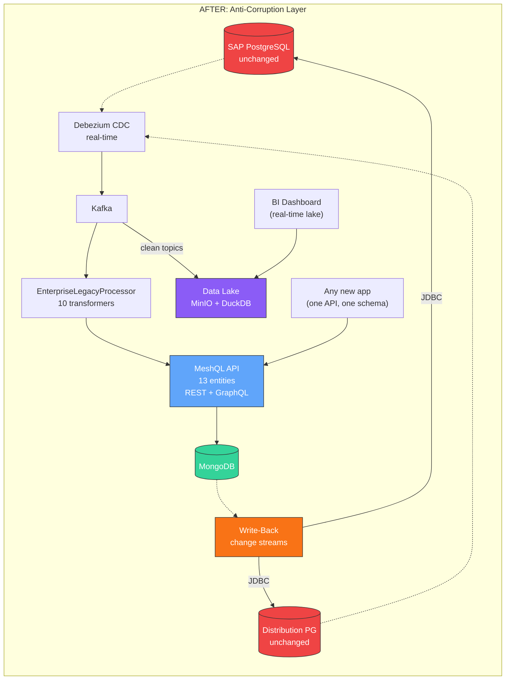
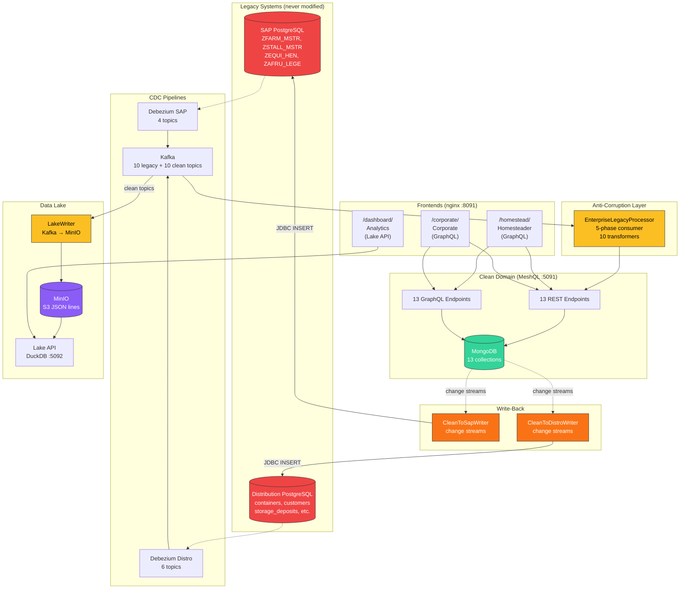
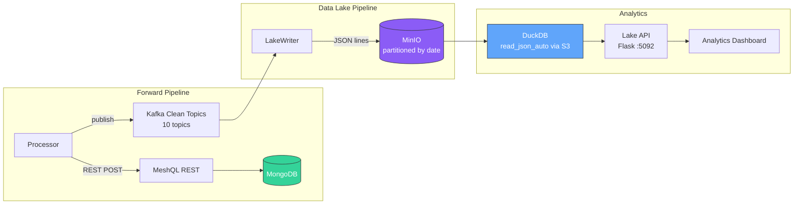
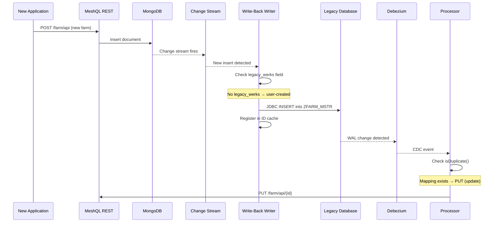
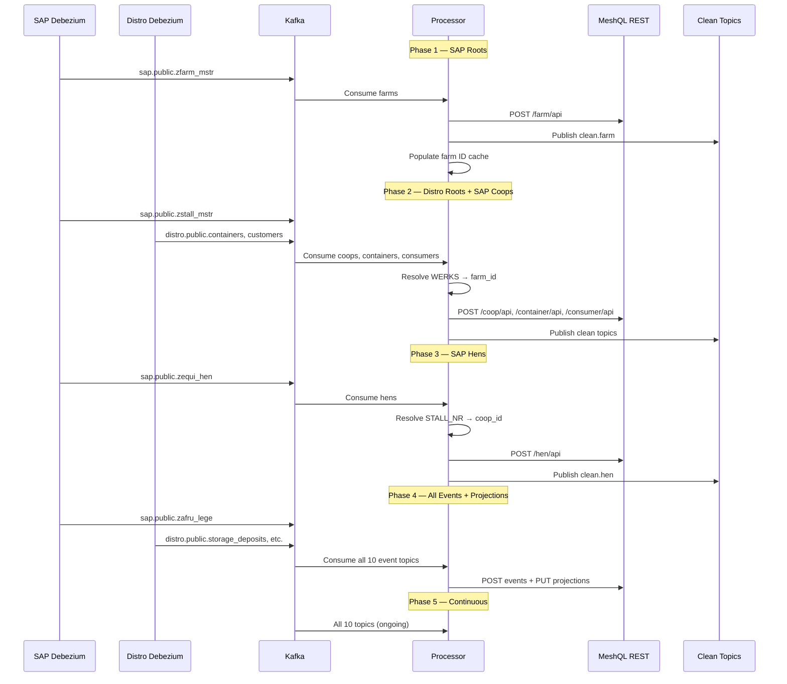

# Case Study: The Enterprise

**Two legacy databases. One clean domain. A data lake for BI. Write-back to both sources. 13 services. 55 files. One `docker compose up`.**

This is the capstone MeshQL example — the culmination of every pattern introduced across the [example series](/meshql/examples). An SAP ERP and a distribution PostgreSQL each own part of the same business domain. Neither will be replaced. Both must be unified for downstream applications, analytics, and new feature development — without touching either legacy system.

[View source on GitHub](https://github.com/tsmarsh/meshql/tree/main/examples/enterprise){: .btn .btn-outline .mr-2 }
[Run with Docker Compose](#running-it){: .btn .btn-outline }

---

## The Business Problem

You run a national egg economy. Two systems run the business:

**SAP** (deployed 2005, upgraded 2012, on-prem PostgreSQL) manages production — farms, coops, hens, and daily lay reports. Z-tables with German column names, composite VARCHAR keys, YYYYMMDD date strings, single-character status codes. Four teams maintain it. Nobody wants to touch the ABAP.

**Distribution PostgreSQL** (deployed 2015, cloud-hosted) manages logistics — containers, consumers, storage deposits, withdrawals, transfers, and consumption reports. Rails-era conventions: plural tables, SERIAL integers, real timestamps, readable column names. Two developers maintain it part-time.

Both systems work. Both have years of institutional knowledge baked into their schemas and business logic.

But the business needs are outgrowing the silos:

| Stakeholder | Need | Blocked By |
|:------------|:-----|:-----------|
| **BI Team** | Cross-system reporting: production yield vs. distribution efficiency | Data lives in two databases with different schemas, no shared identifiers |
| **Product Team** | Unified API for new mobile apps — farmers see both their hens and their containers | Would need to query both systems, map keys manually, handle different date formats in the client |
| **Operations** | Real-time dashboards showing production → distribution pipeline | No event stream connecting the two systems |
| **Management** | "Replace SAP" eventually, without a big-bang migration | Can't replace SAP while other systems depend on its schema, IDs, and conventions |
| **Compliance** | Audit trail showing data lineage from legacy source to clean API | Nothing connects legacy records to their clean equivalents |

### The Traditional Approach

A typical enterprise integration programme for this scenario involves:

- **ETL pipelines** (Informatica, Talend, or Airflow): extract from both sources nightly, transform in staging tables, load into a warehouse. 3-6 months to build, ongoing maintenance as either schema changes.
- **API gateway + custom integration layer**: hand-build REST endpoints that query both databases, merge results, map identifiers. Each new entity requires new code in the integration layer.
- **Data lake** (Spark + S3 + Airflow): separate ingestion pipeline, separate transformation logic, separate scheduling. A data platform team to run it.
- **Write-back service**: custom JDBC code for each legacy system, distributed transaction management, dedup logic, error recovery.
- **Separate BI tool** (Tableau, Looker): connects to the warehouse, not the operational API.

Total: 4-6 separate systems, 3-4 teams, 12-18 months before the first cross-system query works.

### The MeshQL Approach

Two Debezium instances stream CDC from both databases into Kafka. A single `EnterpriseLegacyProcessor` transforms events from both sources — SAP abbreviations and distribution conventions — into one clean 13-entity domain. Clean entities land in MongoDB via MeshQL's REST API. Kafka clean topics feed a `LakeWriter` that writes JSON lines to MinIO. A Python + DuckDB service queries the lake for analytics. MongoDB change streams drive write-back to both legacy systems. Three frontends consume the result — analytics from the data lake, operations from GraphQL. Neither legacy database is modified.

**Time to first query**: `docker compose up --build`, wait for health checks, open the dashboard.

---

## Before and After



Every new application must decide which legacy system to query — or both. Cross-system queries require custom integration code. BI data is stale by the time the ETL runs.



New applications query one API. BI queries the lake in real-time. Write-back keeps legacy systems as the system of record. Neither legacy database schema is modified.

---

## Architecture



Both legacy databases sit on the left — never modified by the forward pipeline. Each has its own Debezium instance streaming WAL changes through Kafka. The processor handles both sources with 10 transformers (4 SAP + 6 distro). Clean entities land in MongoDB. Clean Kafka topics feed the lake writer. MongoDB change streams drive write-back. Three frontends consume the result — the analytics dashboard reads from the data lake, while operational apps read from GraphQL.

---

## Data Ownership

This is not an academic exercise. In real enterprises, data ownership is a governance decision with legal, compliance, and audit implications. The architecture respects that:

| System | Entities | Owned By | Rationale |
|:-------|:---------|:---------|:----------|
| **SAP** (production ERP) | Farm, Coop, Hen, LayReport | SAP | Asset master data and production events — SAP's core domain |
| **Distribution PG** (logistics) | Container, Consumer, StorageDeposit, StorageWithdrawal, ContainerTransfer, ConsumptionReport | Distribution team | Warehouse operations and customer management — separate system, separate team |
| **Projections** (computed) | HenProductivity, FarmOutput, ContainerInventory | Neither — derived | Computed inline from events, not owned by either legacy system |

The clean API **presents everything and collects from both**, but each legacy system remains the system of record for its entities. Write-back respects this ownership boundary — a new farm created through MeshQL flows back to SAP, a new container flows back to the distribution system.

---

## Two Legacy Systems, Two Conventions

The architectural value of this example is in the contrast. Both databases model parts of the same business domain, but with radically different conventions that accumulated over their respective lifetimes:

| Aspect | SAP PostgreSQL | Distribution PostgreSQL |
|:-------|:---------------|:------------------------|
| **PK strategy** | VARCHAR composite (`MANDT` + `WERKS`) | `SERIAL` integer |
| **Date format** | `YYYYMMDD` VARCHAR | `TIMESTAMP` |
| **Column naming** | German abbreviations (`STALL_NR`, `BEHAELT_NR`) | English readable (`container_id`) |
| **Table naming** | Singular with Z-prefix (`ZFARM_MSTR`) | Plural (`containers`) |
| **FK enforcement** | None (handled in ABAP layer) | Database-level `REFERENCES` |
| **Multi-tenancy** | `MANDT` column on every table | Single-tenant |
| **Status codes** | Single char (`M`, `F`, `H`) | Full strings (`warehouse`, `household`) |
| **Timestamps** | `ERDAT` (date) + `ERZET` (time) as VARCHAR | `created_at` TIMESTAMP |

These conventions are not arbitrary — they reflect the era, the team, and the platform each system was built on. The anti-corruption layer absorbs both, so downstream applications see neither.

### What Gets Transformed

**From SAP:**

| SAP (Legacy) | Clean (MeshQL) | Transformation |
|:-------------|:---------------|:---------------|
| `ZFARM_MSTR.FARM_TYP_CD: "M"` | `farm_type: "megafarm"` | Single-char code map |
| `ZFARM_MSTR.ERDAT: "20150301"` | `createdAt: "2015-03-01T08:00:00"` | YYYYMMDD to ISO-8601 |
| `ZFARM_MSTR.MANDT: "100"` | *(filtered out)* | Client 100 only |
| `ZSTALL_MSTR.WERKS` | `farm_id: <meshql-uuid>` | FK resolution via ID cache |
| `ZEQUI_HEN.RASSE_CD: "RIR"` | `breed: "Rhode Island Red"` | Breed code map |
| `ZAFRU_LEGE.QUAL_CD: "A"` | `quality: "grade_a"` | Quality code map |

**From Distribution:**

| Distribution (Legacy) | Clean (MeshQL) | Transformation |
|:----------------------|:---------------|:---------------|
| `containers.id: 1` | `legacy_distro_id: "1"` | Integer PK to string |
| `containers.container_type: "warehouse"` | `container_type: "warehouse"` | Pass-through (already clean) |
| `customers.customer_type: "household"` | `consumer_type: "household"` | Rename table + field |
| `storage_deposits.container_id: 1` | `container_id: <meshql-uuid>` | Integer FK to UUID resolution |
| `container_transfers.created_at` | `timestamp: "2024-01-15T10:30:00Z"` | Debezium timestamp normalization |

The SAP transformers do heavy lifting — code maps, date parsing, multi-field FK resolution. The distro transformers are simpler — the data is already mostly clean, but the integer PKs need string conversion and FK resolution.

---

## Domain Model


13 entities. SAP entities carry `legacy_werks`, `legacy_stall_nr`, `legacy_equnr`, `legacy_aufnr` for traceability back to SAP. Distribution entities carry `legacy_distro_id`. Projections have no legacy fields — they're derived from events. Downstream applications see one unified domain model regardless of which legacy system the data originated from.

---

## The Data Lake

The operational MeshQL API (MongoDB + GraphQL) handles transactional queries. But BI and reporting have different access patterns — full-table scans, cross-entity aggregation, ad-hoc SQL. Querying operational storage for analytics degrades both workloads.

The data lake separates these concerns:



### How It Works

1. The `EnterpriseLegacyProcessor` publishes to `clean.{entity}` Kafka topics after each successful REST POST
2. The `LakeWriter` subscribes to all 10 clean topics, buffers events, and flushes to MinIO as JSON lines every 10 seconds or 100 events
3. Files are partitioned by entity type and date: `lake/{entity_type}/{yyyy-MM-dd}/{timestamp}.jsonl`
4. DuckDB queries MinIO via S3 protocol using `read_json_auto('s3://enterprise-lake/lake/lay_report/**/*.jsonl')` — globs all partitions automatically
5. The Python Flask Lake API exposes 4 analytics endpoints

### Lake API Endpoints

| Endpoint | Source Data | Computation |
|:---------|:-----------|:------------|
| `GET /api/v1/farm_output` | lay_report events | Aggregate eggs by farm, count reports, calculate average |
| `GET /api/v1/hen_productivity` | lay_report events | Aggregate eggs by hen, quality rate as proportion of grade_a + double_yolk |
| `GET /api/v1/container_inventory` | 4 event types | Net inventory: deposits - withdrawals - transfers_out + transfers_in - consumed |
| `GET /api/v1/summary` | All entity/event files | Cross-system totals: farms, eggs produced, eggs consumed, containers, consumers |

The container inventory query is the most interesting — it joins data from four different event streams (storage deposits, withdrawals, transfers, consumption reports) that originate from the distribution PostgreSQL, computing a running balance per container. In the operational API, this is handled by the `ContainerInventoryUpdater` projection. In the lake, DuckDB computes it on-the-fly from raw events.

### Why Not Just Query MongoDB?

| Concern | Operational API (MongoDB) | Data Lake (DuckDB + MinIO) |
|:--------|:-------------------------|:---------------------------|
| **Query pattern** | Point lookups, small joins | Full scans, aggregations, ad-hoc SQL |
| **Latency** | Milliseconds | Seconds (acceptable for BI) |
| **Scaling** | Vertical / replica sets | Horizontal (add storage) |
| **Schema changes** | Requires MongoDB migration | Append-only; old data retains old schema |
| **Retention** | Active data | Full history (every event since day one) |
| **Cost** | MongoDB compute | S3-priced storage |
| **Access control** | Application-level | Separate Lake API (different auth boundary) |

This is the [CQRS pattern](https://martinfowler.com/bliki/CQRS.html) applied at the infrastructure level. The operational store is optimized for writes and point reads. The analytical store is optimized for scans and aggregations. The `LakeWriter` bridges them via Kafka clean topics.

---

## Bidirectional Write-Back

The [Egg Economy SAP](egg-economy-sap) example discusses write-back as a future stage. This example **implements it**.



### The Dedup Strategy

When a user creates a farm through the clean API, the write-back creates a corresponding row in SAP PostgreSQL. Debezium then detects this new row and sends it through the forward pipeline. Without dedup, this would create a duplicate entity in MongoDB.

The solution: **the write-back writer immediately registers the legacy-to-MeshQL ID mapping in the `IdResolver` cache** after the legacy INSERT. When the forward pipeline processes the CDC event seconds later, `isDuplicate()` finds the existing mapping and issues a PUT (update) instead of a POST (create). The clean entity's `legacy_werks` field gets populated with the SAP-assigned value, confirming the round-trip.

### Write-Back Ownership Boundaries

| Writer | Watches | Skips If | Writes To |
|:-------|:--------|:---------|:----------|
| `CleanToSapWriter` | MongoDB `farm` collection | `legacy_werks` is populated (CDC-origin) | SAP PostgreSQL `ZFARM_MSTR` |
| `CleanToDistroWriter` | MongoDB `container` collection | `legacy_distro_id` is populated (CDC-origin) | Distribution PostgreSQL `containers` |

Both writers use MongoDB change streams (`MongoCollection.watch()`) — no additional Debezium instances needed. MongoDB runs as a replica set to enable change streams.

---

## The Frontends

Three frontends serve three personas. Each queries a different backend — demonstrating that the anti-corruption layer supports operational and analytical workloads simultaneously.

### Analytics Dashboard

**Persona**: BI analysts and management — need cross-system reporting that joins SAP production data with distribution consumption data.

**Stack**: Alpine.js 3 + DaisyUI 4 + Chart.js 4 (all CDN, no build step)

**Data source**: Lake API REST endpoints (DuckDB queries over MinIO) — **not** GraphQL


{: .mb-4 }

The top row shows the key metric: **data from both legacy systems in one view**. "Farms (SAP)" and "Containers (Distro)" are labelled by source to make the point — the dashboard is reading from the data lake, which contains transformed data from both legacy systems, queryable with standard SQL.

| Section | Lake API Endpoint | What It Shows |
|:--------|:-----------------|:--------------|
| Cross-System Summary | `GET /api/v1/summary` | Farms (SAP), containers (distro), eggs produced/consumed — unified |
| Farm Production | `GET /api/v1/farm_output` | Eggs aggregated by farm with bar charts — SAP origin |
| Hen Productivity | `GET /api/v1/hen_productivity` | Per-hen egg totals and quality rates — SAP origin |
| Container Inventory | `GET /api/v1/container_inventory` | Net eggs per container from 4 distro event streams |

Scrolling down reveals the container inventory section — the most computationally interesting view, joining four event types from the distribution system:


{: .mb-6 }

### Homesteader App

**Persona**: Small-scale farmers — need a mobile-friendly interface to log daily egg production and manage their hens.

**Stack**: React + Tailwind CSS (reused from [Egg Economy](egg-economy) without modification)

**Data source**: GraphQL + REST (MeshQL operational API over MongoDB)


{: .mb-4 }

The farmer navigates to "My Hens" to see their flock, breed, and coop assignment:


{: .mb-6 }

This app is **identical** to the one in the [Egg Economy](egg-economy) example. No code changes. It queries the same GraphQL schema, which serves the same clean domain — regardless of whether the data originated from SAP, the distribution system, or a direct write through MeshQL. The frontend doesn't know and doesn't care.

### Corporate Portal

**Persona**: Operations managers — need a desktop dashboard to monitor farm performance, manage resources, and review the event stream.

**Stack**: React + Tailwind CSS (reused from [Egg Economy](egg-economy) without modification)

**Data source**: GraphQL + REST (MeshQL operational API over MongoDB)


{: .mb-4 }

The Events view shows the unified event stream — lay reports from SAP and storage operations from the distribution system, interleaved chronologically:


{: .mb-6 }

### Frontend Reuse: The Payoff

The Homesteader and Corporate apps are reused verbatim from the [Egg Economy](egg-economy) example. They work because the clean API contract is identical across all variants:

| Example | Backend | Frontends Modified? |
|:--------|:--------|:-------------------|
| [Egg Economy](egg-economy) | Native MeshQL (MongoDB) | Baseline |
| [Egg Economy SAP](egg-economy-sap) | SAP CDC anti-corruption layer | No |
| [Egg Economy Salesforce](egg-economy-salesforce) | Salesforce CDC anti-corruption layer | No |
| **The Enterprise** | Multi-source (SAP + Distro) + data lake + write-back | No |

Four different backend implementations. The same frontend code. That's the payoff of the anti-corruption layer pattern.

---

## The Backend

### 5-Phase CDC Processing

Both SAP and distribution CDC events flow through the same processor, ordered by FK dependencies:



Phase ordering ensures FK targets exist before FK sources are processed. SAP topics use prefix `sap.public.*`, distribution topics use `distro.public.*`. After each phase, the processor queries GraphQL to populate its ID resolution caches.

### 10 Transformers

| # | Transformer | Source Table | Key Transforms |
|:--|:------------|:-------------|:---------------|
| 1 | `FarmTransformer` | `ZFARM_MSTR` | `FARM_TYP_CD` M/L/H to megafarm/local_farm/homestead |
| 2 | `CoopTransformer` | `ZSTALL_MSTR` | `WERKS` to `farm_id` FK resolution |
| 3 | `HenTransformer` | `ZEQUI_HEN` | `RASSE_CD` RIR/LEG/PLY to breed names |
| 4 | `LayReportTransformer` | `ZAFRU_LEGE` | Triple FK: `EQUNR` to hen, `WERKS` to farm, hen to coop |
| 5 | `DistroContainerTransformer` | `containers` | Integer PK to string `legacy_distro_id` |
| 6 | `DistroConsumerTransformer` | `customers` | `customer_type` to `consumer_type` rename |
| 7 | `DistroStorageDepositTransformer` | `storage_deposits` | `container_id` integer FK to UUID resolution |
| 8 | `DistroStorageWithdrawalTransformer` | `storage_withdrawals` | Same FK pattern as deposits |
| 9 | `DistroContainerTransferTransformer` | `container_transfers` | Dual FK: source + dest container resolution |
| 10 | `DistroConsumptionReportTransformer` | `consumption_reports` | Consumer + container dual FK resolution |

The SAP transformers are the same ones from the [Egg Economy SAP](egg-economy-sap) example — they handle the heavy lifting of SAP conventions. The distribution transformers are simpler — the data is already mostly clean, but integer PKs need string conversion and FK resolution through the `IdResolver`.

### 19 Internal Resolvers

All federation is in-JVM — zero HTTP overhead:

| Source Entity | Field | Type | Target Query | Target Path |
|:-------------|:------|:-----|:-------------|:------------|
| Farm | `coops` | Vector | `getByFarm` | `/coop/graph` |
| Farm | `farmOutput` | Vector | `getByFarm` | `/farm_output/graph` |
| Coop | `farm` | Singleton | `getById` | `/farm/graph` |
| Coop | `hens` | Vector | `getByCoop` | `/hen/graph` |
| Hen | `coop` | Singleton | `getById` | `/coop/graph` |
| Hen | `layReports` | Vector | `getByHen` | `/lay_report/graph` |
| Hen | `productivity` | Vector | `getByHen` | `/hen_productivity/graph` |
| Container | `inventory` | Vector | `getByContainer` | `/container_inventory/graph` |
| Consumer | `consumptionReports` | Vector | `getByConsumer` | `/consumption_report/graph` |
| LayReport | `hen` | Singleton | `getById` | `/hen/graph` |
| StorageDeposit | `container` | Singleton | `getById` | `/container/graph` |
| StorageWithdrawal | `container` | Singleton | `getById` | `/container/graph` |
| ContainerTransfer | `sourceContainer` | Singleton | `getById` | `/container/graph` |
| ContainerTransfer | `destContainer` | Singleton | `getById` | `/container/graph` |
| ConsumptionReport | `consumer` | Singleton | `getById` | `/consumer/graph` |
| ConsumptionReport | `container` | Singleton | `getById` | `/container/graph` |
| ContainerInventory | `container` | Singleton | `getById` | `/container/graph` |
| HenProductivity | `hen` | Singleton | `getById` | `/hen/graph` |
| FarmOutput | `farm` | Singleton | `getById` | `/farm/graph` |

A single GraphQL query can traverse Farm → Coops → Hens → LayReports → Hen, or Container → Inventory → Container — spanning data that originated from both SAP and the distribution system, resolved server-side with zero network overhead.

---

## Migration Strategy

The Enterprise example implements **Stage 2** of the three-stage migration strategy described in the [Egg Economy SAP](egg-economy-sap) case study, extended to multiple sources:

### Stage 1: Shadow Read (low risk, high value)

CDC pipelines stream data from both legacy systems into the clean domain. New applications read from MeshQL (GraphQL/REST). Legacy applications continue unchanged. The data lake provides immediate BI value.

**What you get**: unified read API, real-time analytics, no legacy changes.
**What it costs**: Kafka + MongoDB + MinIO infrastructure, transformer development.
**Risk**: Near zero — legacy systems are unaware of the shadow pipeline.

### Stage 2: Bidirectional (this example)

New applications can **write** through MeshQL. Write-back flows data to the correct legacy system based on entity ownership. Dedup prevents duplicates on the CDC round-trip. Both legacy systems remain the system of record.

**What you get**: new features can be built against the clean API. Legacy and modern applications coexist.
**What it costs**: write-back development, dedup logic, change stream infrastructure.
**Risk**: Low — write-back failures are isolated; legacy systems can reject writes without affecting the forward pipeline.

### Stage 3: Cutover (future)

When legacy systems are no longer the system of record, remove write-back. MeshQL becomes the primary. Legacy systems become read-only archives or are decommissioned. The clean API contract doesn't change — downstream applications are unaffected.

**What you get**: legacy system decommissioning, reduced infrastructure, simplified operations.
**What it costs**: organizational change management, data migration verification.

Each stage is independently valuable. You can stay at Stage 1 indefinitely — many organizations do, and it still delivers the unified API, the data lake, and the BI dashboard. Stage 2 adds write capability when the business needs it. Stage 3 happens when the organization is ready, not when the technology demands it.

---

## Scale Projections

The demo dataset is small (a handful of farms and containers). The architecture is designed for production scale:

| Dimension | Demo | Production Target |
|:----------|:-----|:------------------|
| **Farms** (SAP) | ~5 | 10,000+ |
| **Hens** (SAP) | ~50 | 900,000 |
| **Lay reports/week** (SAP) | ~200 | 5,400,000 |
| **Containers** (Distro) | ~10 | 60,000 |
| **Consumers** (Distro) | ~10 | 1,000,000 |
| **Storage events/week** (Distro) | ~100 | 500,000 |
| **Lake size/month** | KB | ~50 GB |
| **Concurrent API users** | 1 | 1,000+ |

### What Scales Horizontally

- **Kafka**: partition topics for parallel consumption
- **MongoDB**: shard collections by entity type or tenant
- **MinIO**: add storage nodes; DuckDB queries scale with read parallelism
- **MeshQL**: run multiple application instances behind a load balancer
- **Lake API**: stateless — scale horizontally behind a load balancer

### What Stays Single

- **Debezium**: one instance per source database (stateful CDC slot)
- **Write-back writers**: single instance per legacy system (ordered change streams)
- **Processor phases 1-4**: initial catchup is sequential (FK ordering); phase 5 can be parallelized

---

## Running It

### Docker Compose

```bash
cd examples/enterprise
docker compose up --build
```

This starts 13 services:

| # | Service | Port | Purpose |
|:--|:--------|:-----|:--------|
| 1 | `sap-postgres` | 5434 | SAP-style legacy DB (4 tables, WAL=logical) |
| 2 | `distro-postgres` | 5436 | Distribution system DB (6 tables, WAL=logical) |
| 3 | `mongodb` | — | Clean domain storage (replica set for change streams) |
| 4 | `kafka` | — | Event backbone (KRaft mode, 20 topics) |
| 5 | `debezium-sap` | — | CDC for SAP PostgreSQL |
| 6 | `debezium-distro` | — | CDC for Distribution PostgreSQL |
| 7 | `minio` | 9000/9001 | Data lake object storage (S3-compatible) |
| 8 | `enterprise-app` | 5091 | MeshQL + processor + lake writer + write-back |
| 9 | `lake-api` | 5092 | DuckDB analytics over MinIO |
| 10 | `dashboard-app` | — | BI dashboard (reads from Lake API) |
| 11 | `homesteader-app` | — | Operational app (reused from egg-economy) |
| 12 | `corporate-app` | — | Operational app (reused from egg-economy) |
| 13 | `nginx` | **8091** | Reverse proxy (all frontends + API + Lake API) |

### What Happens on Startup

1. Both PostgreSQL instances initialize with seed data and enable logical replication
2. MongoDB starts as a replica set (required for change streams)
3. Kafka starts in KRaft mode (no ZooKeeper)
4. Both Debezium instances connect and begin streaming existing data as CDC events
5. The enterprise app starts: MeshQL API (13 entities), then the 5-phase processor consumes the initial CDC snapshot
6. The LakeWriter begins flushing clean events to MinIO
7. Write-back writers start watching MongoDB change streams
8. The Lake API starts querying MinIO via DuckDB
9. Frontends start and nginx begins routing

### Access

| URL | App | Data Source |
|:----|:----|:-----------|
| `http://localhost:8091/dashboard/` | Analytics Dashboard | Lake API (DuckDB over MinIO) |
| `http://localhost:8091/homestead/` | Homesteader App | GraphQL (MongoDB) |
| `http://localhost:8091/corporate/` | Corporate Portal | GraphQL + REST (MongoDB) |
| `http://localhost:8091/api/` | MeshQL API | Direct access to 13 entities |
| `http://localhost:8091/lake-api/` | Lake API | DuckDB analytics |
| `http://localhost:9001/` | MinIO Console | Browse `enterprise-lake` bucket (minioadmin/minioadmin) |

### Try It

```bash
# GraphQL — traverse from farm to hens across the SAP anti-corruption layer
curl -s -X POST http://localhost:5091/farm/graph \
  -H "Content-Type: application/json" \
  -d '{"query": "{ getAll { name farm_type zone legacy_werks coops { name hens { name breed } } farmOutput { eggs_week } } }"}' | jq .

# GraphQL — distribution entities with inventory projections
curl -s -X POST http://localhost:5091/container/graph \
  -H "Content-Type: application/json" \
  -d '{"query": "{ getAll { name container_type capacity legacy_distro_id inventory { current_eggs total_deposits total_consumed } } }"}' | jq .

# Lake API — cross-system analytics (no GraphQL, no MongoDB — pure DuckDB over MinIO)
curl -s http://localhost:5092/api/v1/summary | jq .

# REST — create a new farm (triggers write-back to SAP PostgreSQL)
curl -s -X POST http://localhost:5091/farm/api \
  -H "Content-Type: application/json" \
  -d '{"name": "Green Valley Farm", "farm_type": "local_farm", "zone": "northeast", "owner": "Jane Doe"}' | jq .

# Verify write-back: the new farm should appear in SAP PostgreSQL within seconds
docker exec -it enterprise-sap-postgres-1 psql -U postgres -d enterprise_sap \
  -c "SELECT * FROM ZFARM_MSTR ORDER BY ERDAT DESC LIMIT 1;"
```

---

## What This Demonstrates

This example is the culmination of the MeshQL example series. Each capability builds on patterns introduced in earlier examples:

| Capability | First Introduced | Extended Here |
|:-----------|:----------------|:-------------|
| REST + GraphQL dual API | [Farm](farm) | 13 entities, 19 internal resolvers |
| CDC anti-corruption layer | [Springfield Electric](legacy) | Two sources, 10 transformers, 5-phase processing |
| SAP conventions | [Egg Economy SAP](egg-economy-sap) | Combined with a second source |
| Materialized projections | [Egg Economy](egg-economy) | Cross-source (SAP production + distro inventory) |
| Frontend reuse | [Egg Economy](egg-economy) | Same apps, fourth backend variant |
| Data lake (CQRS) | — | **New**: MinIO + DuckDB, LakeWriter, Lake API |
| Bidirectional write-back | [Egg Economy SAP](egg-economy-sap) (discussed) | **Implemented**: change streams, reverse transform, dedup |
| Multi-source unification | — | **New**: two legacy databases, one clean domain |

### For the Technical Director

If you're evaluating MeshQL for a legacy integration programme:

- **It's not a proof of concept.** 13 services running together with health checks, dependency ordering, CDC, write-back, and a data lake. This is production-realistic infrastructure.
- **It respects data ownership.** Each legacy system remains the system of record. The anti-corruption layer doesn't usurp governance — it adds a clean read/write interface on top.
- **It's incremental.** Start with Stage 1 (shadow read) for immediate value. Add write-back when needed. Decommission legacy when ready. Each stage is independently valuable.
- **It reuses existing patterns.** The SAP transformers are the same ones from the single-source example. The frontends are reused without modification. The GraphQL schema is identical across all variants. Adding a new legacy source means adding transformers and a Debezium instance — not redesigning the architecture.
- **It separates operational and analytical workloads.** GraphQL for applications. DuckDB for BI. Different query engines, different storage, different scaling characteristics. No contention.

---

## See Also

- [**Egg Economy**](egg-economy) — the clean domain, native MeshQL (single source)
- [**Egg Economy SAP**](egg-economy-sap) — single SAP source, migration strategy discussion
- [**Egg Economy Salesforce**](egg-economy-salesforce) — single Salesforce source
- [**Springfield Electric**](legacy) — the foundational anti-corruption layer pattern
- [**Global Power Plants**](power-plants) — Mesher-generated anti-corruption layer
- [**Mesher**](/meshql/reference/mesher) — CLI tool that generates anti-corruption layers automatically

[Back to Examples](/meshql/examples){: .btn .btn-outline }
