# Case Study: The Enterprise

The capstone MeshQL example. Two legacy databases — SAP and a distribution PostgreSQL — feed the **same clean domain** through independent CDC pipelines. A **data lake** (MinIO + DuckDB) separates operational and analytical query patterns. **Bidirectional write-back** keeps the legacy systems as the systems of record throughout the transition. 13 entities, 13 services, 55 files.

[View source on GitHub](https://github.com/tsmarsh/meshql/tree/main/examples/enterprise){: .btn .btn-outline .mr-2 }
[Run with Docker Compose](#running-it){: .btn .btn-outline }

---

## The Problem

Your egg economy has outgrown a single legacy system. Production data (farms, coops, hens, lay reports) lives in an over-customized **SAP ERP** with Z-tables, MANDT tenancy, YYYYMMDD dates, and single-character codes. Distribution data (containers, consumers, storage, transfers, consumption) lives in a separate **PostgreSQL system** built by a logistics team a decade later — Rails-era conventions, SERIAL integers, real timestamps, readable column names.

Both systems work. Nobody's touching either.

But management wants:
- A **unified operational API** where internal apps see farms, hens, containers, and consumers as one coherent domain — not two databases with different naming conventions, key strategies, and date formats
- A **data lake** for BI/analytics — cross-system reporting that joins SAP production data with distribution consumption data, without querying either operational system directly
- **Write-back** — new applications should be able to create entities through the clean API, and the writes should flow back to whichever legacy system owns that entity type

Traditional approach: build a data warehouse with ETL, maintain a separate integration layer, keep both in sync, manage the inevitable drift. Build the data lake separately with its own ingestion pipeline. Stand up a write-back service for each legacy system. Hire specialists for each.

**MeshQL approach**: Two Debezium instances stream CDC from both legacy databases through Kafka. A single `EnterpriseLegacyProcessor` transforms data from both sources — SAP abbreviations and distribution conventions — into one clean domain. Clean entities are POSTed to MeshQL's REST API, landing in MongoDB. Kafka clean topics feed a `LakeWriter` that persists JSON lines to MinIO. A Python + DuckDB service queries the lake for analytics. MongoDB change streams drive write-back to both legacy databases. One unified GraphQL API for operational queries. One Lake API for BI. Both legacy databases remain untouched.

---

## Architecture


Both legacy databases sit on the left — never modified by the forward pipeline. Each has its own Debezium instance streaming WAL changes through Kafka. The processor handles both sources with 10 transformers (4 SAP + 6 distro). Clean entities land in MongoDB. Clean Kafka topics feed the lake writer. MongoDB change streams drive write-back. Three frontends consume the result — the analytics dashboard reads from the data lake, while operational apps read from GraphQL.

---

## Data Ownership

This is not an academic exercise. In real enterprises, data ownership is a governance decision with legal, compliance, and audit implications. The architecture respects that:

| System | Entities | Owned By | Rationale |
|:-------|:---------|:---------|:----------|
| **SAP** (production ERP) | Farm, Coop, Hen, LayReport | SAP | Asset master data and production events — SAP's core domain |
| **Distribution PG** (logistics) | Container, Consumer, StorageDeposit, StorageWithdrawal, ContainerTransfer, ConsumptionReport | Distribution team | Warehouse operations and customer management — separate system, separate team |
| **Projections** (computed) | HenProductivity, FarmOutput, ContainerInventory | Neither — derived | Computed inline from events, not owned by either legacy system |

The clean API **presents everything and collects from both**, but each legacy system remains the system of record for its entities. Write-back respects this ownership boundary.

---

## Two Legacy Systems, Two Conventions

The architectural value of this example is in the contrast. Both databases model parts of the same business domain, but with radically different conventions that accumulated over their respective lifetimes:

| Aspect | SAP PostgreSQL | Distribution PostgreSQL |
|:-------|:---------------|:------------------------|
| **PK strategy** | VARCHAR composite (`MANDT` + `WERKS`) | `SERIAL` integer |
| **Date format** | `YYYYMMDD` VARCHAR | `TIMESTAMP` |
| **Column naming** | German abbreviations (`STALL_NR`, `BEHAELT_NR`) | English readable (`container_id`) |
| **Table naming** | Singular with Z-prefix (`ZFARM_MSTR`) | Plural (`containers`) |
| **FK enforcement** | None (handled in ABAP layer) | Database-level `REFERENCES` |
| **Multi-tenancy** | `MANDT` column on every table | Single-tenant |
| **Status codes** | Single char (`M`, `F`, `H`) | Full strings (`warehouse`, `household`) |
| **Timestamps** | `ERDAT` (date) + `ERZET` (time) as VARCHAR | `created_at` TIMESTAMP |

These conventions are not arbitrary — they reflect the era, the team, and the platform each system was built on. The anti-corruption layer absorbs both, so downstream applications see neither.

### What Gets Transformed

**From SAP:**

| SAP (Legacy) | Clean (MeshQL) | Transformation |
|:-------------|:---------------|:---------------|
| `ZFARM_MSTR.FARM_TYP_CD: "M"` | `farm_type: "megafarm"` | Single-char code map |
| `ZFARM_MSTR.ERDAT: "20150301"` | `createdAt: "2015-03-01T08:00:00"` | YYYYMMDD to ISO-8601 |
| `ZFARM_MSTR.MANDT: "100"` | *(filtered out)* | Client 100 only |
| `ZSTALL_MSTR.WERKS` | `farm_id: <meshql-uuid>` | FK resolution via ID cache |
| `ZEQUI_HEN.RASSE_CD: "RIR"` | `breed: "Rhode Island Red"` | Breed code map |
| `ZAFRU_LEGE.QUAL_CD: "A"` | `quality: "grade_a"` | Quality code map |

**From Distribution:**

| Distribution (Legacy) | Clean (MeshQL) | Transformation |
|:----------------------|:---------------|:---------------|
| `containers.id: 1` | `legacy_distro_id: "1"` | Integer PK → string |
| `containers.container_type: "warehouse"` | `container_type: "warehouse"` | Pass-through (already clean) |
| `customers.customer_type: "household"` | `consumer_type: "household"` | Rename table + field |
| `storage_deposits.container_id: 1` | `container_id: <meshql-uuid>` | Integer FK → UUID resolution |
| `container_transfers.created_at` | `timestamp: "2024-01-15T10:30:00Z"` | Debezium timestamp normalization |

The SAP transformers do heavy lifting — code maps, date parsing, multi-field FK resolution. The distro transformers are simpler — the data is already mostly clean, but the integer PKs need string conversion and FK resolution.

---

## Domain Model


13 entities. SAP entities carry `legacy_werks`, `legacy_stall_nr`, `legacy_equnr`, `legacy_aufnr` for traceability back to SAP. Distribution entities carry `legacy_distro_id`. Projections have no legacy fields — they're derived from events. Downstream applications see one unified domain model regardless of which legacy system the data originated from.

---

## The Data Lake

The operational MeshQL API (MongoDB + GraphQL) handles transactional queries. But BI and reporting have different access patterns — full-table scans, cross-entity aggregation, ad-hoc SQL. Querying operational storage for analytics degrades both workloads.

The data lake separates these concerns:


### How It Works

1. The `EnterpriseLegacyProcessor` publishes to `clean.{entity}` Kafka topics after each successful REST POST
2. The `LakeWriter` subscribes to all 10 clean topics, buffers events, and flushes to MinIO as JSON lines every 10 seconds or 100 events
3. Files are partitioned by entity type and date: `lake/{entity_type}/{yyyy-MM-dd}/{timestamp}.jsonl`
4. DuckDB queries MinIO via S3 protocol using `read_json_auto('s3://enterprise-lake/lake/lay_report/**/*.jsonl')` — globs all partitions automatically
5. The Python Flask Lake API exposes 4 analytics endpoints

### Lake API Endpoints

| Endpoint | Source Data | Computation |
|:---------|:-----------|:------------|
| `GET /api/v1/farm_output` | lay_report events | Aggregate eggs by farm, count reports, calculate average |
| `GET /api/v1/hen_productivity` | lay_report events | Aggregate eggs by hen, quality rate as proportion of grade_a + double_yolk |
| `GET /api/v1/container_inventory` | 4 event types | Net inventory: deposits - withdrawals - transfers_out + transfers_in - consumed |
| `GET /api/v1/summary` | All entity/event files | Cross-system totals: farms, eggs produced, eggs consumed, containers, consumers |

The container inventory query is the most interesting — it joins data from four different event streams (storage deposits, withdrawals, transfers, consumption reports) that originate from the distribution PostgreSQL, computing a running balance per container. In the operational API, this is handled by the `ContainerInventoryUpdater` projection. In the lake, DuckDB computes it on-the-fly from raw events.

---

## Bidirectional Write-Back

The [Egg Economy SAP](egg-economy-sap) example discusses write-back as a future stage. This example **implements it**.


### The Dedup Strategy

When a user creates a farm through the clean API, the write-back creates a corresponding row in SAP PostgreSQL. Debezium then detects this new row and sends it through the forward pipeline. Without dedup, this would create a duplicate entity in MongoDB.

The solution: **the write-back writer immediately registers the legacy-to-MeshQL ID mapping in the `IdResolver` cache** after the legacy INSERT. When the forward pipeline processes the CDC event seconds later, `isDuplicate()` finds the existing mapping and issues a PUT (update) instead of a POST (create). The clean entity's `legacy_werks` field gets populated with the SAP-assigned value, confirming the round-trip.

### Write-Back Ownership Boundaries

| Writer | Watches | Skips If | Writes To |
|:-------|:--------|:---------|:----------|
| `CleanToSapWriter` | MongoDB `farm` collection | `legacy_werks` is populated (CDC-origin) | SAP PostgreSQL `ZFARM_MSTR` |
| `CleanToDistroWriter` | MongoDB `container` collection | `legacy_distro_id` is populated (CDC-origin) | Distribution PostgreSQL `containers` |

Both writers use MongoDB change streams (`MongoCollection.watch()`) — no additional Debezium instances needed. MongoDB runs as a replica set to enable change streams.

---

## The Analytics Dashboard

**Persona**: Management and BI analysts who need cross-system reporting — production data from SAP combined with distribution data from the logistics system.

**Stack**: Alpine.js 3 + DaisyUI 4 + Chart.js 4 (all CDN, no build step)

**Data source**: Lake API REST endpoints (DuckDB queries over MinIO), **not** GraphQL


{: .mb-6 }

The dashboard demonstrates the key architectural point: **operational apps query GraphQL (MongoDB), analytics apps query the Lake API (DuckDB over MinIO)**. Same data, different query engines, different access patterns, different performance profiles.

| Section | Data Source | What It Shows |
|:--------|:-----------|:--------------|
| Cross-System Summary | `GET /api/v1/summary` | Farms (SAP), containers (distro), eggs produced/consumed — unified view across both legacy systems |
| Farm Production | `GET /api/v1/farm_output` | Eggs aggregated by farm with charts — data originates from SAP lay reports |
| Hen Productivity | `GET /api/v1/hen_productivity` | Per-hen statistics with quality rates — SAP origin |
| Container Inventory | `GET /api/v1/container_inventory` | Net inventory per container — computed from 4 distro event streams |

### Operational Apps

The Homesteader and Corporate apps are **reused from the egg-economy example** without modification. They consume the same GraphQL API, which serves the same clean domain regardless of whether the data originated from SAP, the distribution system, or a direct write through MeshQL. The frontends don't know and don't care.

---

## The Backend

### 5-Phase CDC Processing

Both SAP and distribution CDC events flow through the same processor, ordered by FK dependencies:

```mermaid
sequenceDiagram
    participant SAP as SAP Debezium
    participant DIST as Distro Debezium
    participant K as Kafka
    participant PROC as Processor
    participant REST as MeshQL REST
    participant KFC as Clean Topics

    Note over PROC: Phase 1 — SAP Roots
    SAP->>K: sap.public.zfarm_mstr
    K->>PROC: Consume farms
    PROC->>REST: POST /farm/api
    PROC->>KFC: Publish clean.farm
    PROC->>PROC: Populate farm ID cache

    Note over PROC: Phase 2 — Distro Roots + SAP Coops
    SAP->>K: sap.public.zstall_mstr
    DIST->>K: distro.public.containers, customers
    K->>PROC: Consume coops, containers, consumers
    PROC->>PROC: Resolve WERKS → farm_id
    PROC->>REST: POST /coop/api, /container/api, /consumer/api
    PROC->>KFC: Publish clean topics

    Note over PROC: Phase 3 — SAP Hens
    SAP->>K: sap.public.zequi_hen
    K->>PROC: Consume hens
    PROC->>PROC: Resolve STALL_NR → coop_id
    PROC->>REST: POST /hen/api
    PROC->>KFC: Publish clean.hen

    Note over PROC: Phase 4 — All Events + Projections
    SAP->>K: sap.public.zafru_lege
    DIST->>K: distro.public.storage_deposits, etc.
    K->>PROC: Consume all 10 event topics
    PROC->>REST: POST events + PUT projections

    Note over PROC: Phase 5 — Continuous
    K->>PROC: All 10 topics (ongoing)
```



Phase ordering ensures FK targets exist before FK sources are processed. SAP topics use prefix `sap.public.*`, distribution topics use `distro.public.*`. After each phase, the processor queries GraphQL to populate its ID resolution caches.

### 10 Transformers

| # | Transformer | Source Table | Key Transforms |
|:--|:------------|:-------------|:---------------|
| 1 | `FarmTransformer` | `ZFARM_MSTR` | `FARM_TYP_CD` M/L/H → megafarm/local_farm/homestead |
| 2 | `CoopTransformer` | `ZSTALL_MSTR` | `WERKS` → `farm_id` FK resolution |
| 3 | `HenTransformer` | `ZEQUI_HEN` | `RASSE_CD` RIR/LEG/PLY → breed names |
| 4 | `LayReportTransformer` | `ZAFRU_LEGE` | Triple FK: `EQUNR` → hen, `WERKS` → farm, hen → coop |
| 5 | `DistroContainerTransformer` | `containers` | Integer PK → string `legacy_distro_id` |
| 6 | `DistroConsumerTransformer` | `customers` | `customer_type` → `consumer_type` rename |
| 7 | `DistroStorageDepositTransformer` | `storage_deposits` | `container_id` integer FK → UUID resolution |
| 8 | `DistroStorageWithdrawalTransformer` | `storage_withdrawals` | Same FK pattern as deposits |
| 9 | `DistroContainerTransferTransformer` | `container_transfers` | Dual FK: source + dest container resolution |
| 10 | `DistroConsumptionReportTransformer` | `consumption_reports` | Consumer + container dual FK resolution |

The SAP transformers are the same ones from the [Egg Economy SAP](egg-economy-sap) example — they handle the heavy lifting of SAP conventions. The distribution transformers are simpler — the data is already mostly clean, but integer PKs need string conversion and FK resolution through the `IdResolver`.

### 19 Internal Resolvers

All federation is in-JVM — zero HTTP overhead:

| Source Entity | Field | Type | Target Query | Target Path |
|:-------------|:------|:-----|:-------------|:------------|
| Farm | `coops` | Vector | `getByFarm` | `/coop/graph` |
| Farm | `farmOutput` | Vector | `getByFarm` | `/farm_output/graph` |
| Coop | `farm` | Singleton | `getById` | `/farm/graph` |
| Coop | `hens` | Vector | `getByCoop` | `/hen/graph` |
| Hen | `coop` | Singleton | `getById` | `/coop/graph` |
| Hen | `layReports` | Vector | `getByHen` | `/lay_report/graph` |
| Hen | `productivity` | Vector | `getByHen` | `/hen_productivity/graph` |
| Container | `inventory` | Vector | `getByContainer` | `/container_inventory/graph` |
| Consumer | `consumptionReports` | Vector | `getByConsumer` | `/consumption_report/graph` |
| LayReport | `hen` | Singleton | `getById` | `/hen/graph` |
| StorageDeposit | `container` | Singleton | `getById` | `/container/graph` |
| StorageWithdrawal | `container` | Singleton | `getById` | `/container/graph` |
| ContainerTransfer | `sourceContainer` | Singleton | `getById` | `/container/graph` |
| ContainerTransfer | `destContainer` | Singleton | `getById` | `/container/graph` |
| ConsumptionReport | `consumer` | Singleton | `getById` | `/consumer/graph` |
| ConsumptionReport | `container` | Singleton | `getById` | `/container/graph` |
| ContainerInventory | `container` | Singleton | `getById` | `/container/graph` |
| HenProductivity | `hen` | Singleton | `getById` | `/hen/graph` |
| FarmOutput | `farm` | Singleton | `getById` | `/farm/graph` |

A single GraphQL query can traverse Farm → Coops → Hens → LayReports → Hen, or Container → Inventory → Container — spanning data that originated from both SAP and the distribution system, resolved server-side with zero network overhead.

---

## Running It

### Docker Compose

```bash
cd examples/enterprise
docker compose up --build
```

This starts 13 services:

| # | Service | Port | Purpose |
|:--|:--------|:-----|:--------|
| 1 | `sap-postgres` | 5434 | SAP-style legacy DB (4 tables, WAL=logical) |
| 2 | `distro-postgres` | 5436 | Distribution system DB (6 tables, WAL=logical) |
| 3 | `mongodb` | — | Clean domain storage (replica set for change streams) |
| 4 | `kafka` | — | Event backbone (KRaft mode, 20 topics) |
| 5 | `debezium-sap` | — | CDC for SAP PostgreSQL |
| 6 | `debezium-distro` | — | CDC for Distribution PostgreSQL |
| 7 | `minio` | 9000/9001 | Data lake object storage (S3-compatible) |
| 8 | `enterprise-app` | 5091 | MeshQL + processor + lake writer + write-back |
| 9 | `lake-api` | 5092 | DuckDB analytics over MinIO |
| 10 | `dashboard-app` | — | BI dashboard (reads from Lake API) |
| 11 | `homesteader-app` | — | Operational app (reused from egg-economy) |
| 12 | `corporate-app` | — | Operational app (reused from egg-economy) |
| 13 | `nginx` | **8091** | Reverse proxy (all frontends + API + Lake API) |

### Access

| URL | App | Data Source |
|:----|:----|:-----------|
| `http://localhost:8091/dashboard/` | Analytics Dashboard | Lake API (DuckDB over MinIO) |
| `http://localhost:8091/homestead/` | Homesteader App | GraphQL (MongoDB) |
| `http://localhost:8091/corporate/` | Corporate Portal | GraphQL + REST (MongoDB) |
| `http://localhost:8091/api/` | MeshQL API | Direct access to 13 entities |
| `http://localhost:8091/lake-api/` | Lake API | DuckDB analytics |
| `http://localhost:9001/` | MinIO Console | Browse `enterprise-lake` bucket (minioadmin/minioadmin) |

### Direct API

```bash
# GraphQL — full federation across both legacy sources
curl -X POST http://localhost:5091/farm/graph \
  -H "Content-Type: application/json" \
  -d '{"query": "{ getAll { name farm_type zone legacy_werks coops { name hens { name breed } } farmOutput { eggs_week } } }"}'

# GraphQL — distribution entities with federation
curl -X POST http://localhost:5091/container/graph \
  -H "Content-Type: application/json" \
  -d '{"query": "{ getAll { name container_type capacity zone legacy_distro_id inventory { current_eggs total_deposits total_consumed } } }"}'

# Lake API — cross-system analytics
curl http://localhost:5092/api/v1/summary

# REST — create a new farm (triggers write-back to SAP)
curl -X POST http://localhost:5091/farm/api \
  -H "Content-Type: application/json" \
  -d '{"name": "Green Valley Farm", "farm_type": "local_farm", "zone": "northeast", "owner": "Jane Doe"}'
```

---

## What This Demonstrates

This example is the culmination of the MeshQL example series. Each capability builds on patterns introduced in earlier examples:

- **Multi-source anti-corruption layer** — The [Egg Economy SAP](egg-economy-sap) and [Egg Economy Salesforce](egg-economy-salesforce) examples each demonstrate a single legacy source. The Enterprise combines two sources with different conventions into one unified domain. The same 13-entity clean API serves data from both SAP and the distribution system, and downstream applications cannot tell the difference.

- **Operational/analytical separation** — Operational queries (GraphQL over MongoDB) and analytical queries (DuckDB over MinIO) use different storage and query engines, each optimized for its access pattern. The `LakeWriter` bridges them via Kafka clean topics. This is the [CQRS](https://martinfowler.com/bliki/CQRS.html) pattern applied at the infrastructure level.

- **Bidirectional write-back with dedup** — Stage 2 of the [migration strategy](egg-economy-sap#migration-strategy) is implemented, not just discussed. MongoDB change streams detect user-created entities, reverse-transform them, and INSERT into the appropriate legacy database. The dedup strategy (check legacy ID field, register mapping before CDC round-trip) prevents duplicates without a distributed lock.

- **Data lake without a data team** — MinIO + DuckDB provide a queryable data lake with zero infrastructure beyond two Docker containers. No Spark, no Airflow, no EMR. The `LakeWriter` is 200 lines of Java. The Lake API is 100 lines of Python. For organizations that need BI yesterday and can't wait for a data platform team, this is a viable starting point.

- **Frontend reuse across backends** — The Homesteader and Corporate apps are reused verbatim from the [Egg Economy](egg-economy) example. They work because the clean API contract is identical — the backend implementation (native MongoDB, SAP CDC, or multi-source enterprise) is invisible to the frontend. This is the payoff of the anti-corruption layer pattern.

- **13 services, one compose file** — Two legacy databases, two CDC connectors, Kafka, MongoDB (replica set), MinIO, the MeshQL application, the Lake API, three frontends, and nginx — all orchestrated with health checks and dependency ordering. Production-realistic infrastructure in a `docker compose up`.

---

## See Also

- [**Egg Economy**](egg-economy) — the clean domain, native MeshQL (single source)
- [**Egg Economy SAP**](egg-economy-sap) — single SAP source, migration strategy discussion
- [**Egg Economy Salesforce**](egg-economy-salesforce) — single Salesforce source
- [**Springfield Electric**](legacy) — the foundational anti-corruption layer pattern
- [**Global Power Plants**](power-plants) — Mesher-generated anti-corruption layer
- [**Mesher**](/meshql/reference/mesher) — CLI tool that generates anti-corruption layers automatically

[Back to Examples](/meshql/examples){: .btn .btn-outline }
