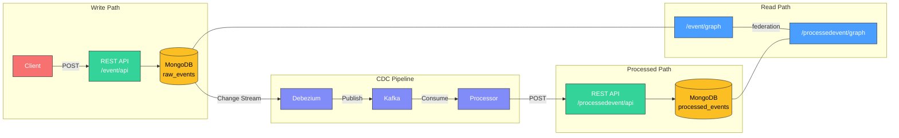
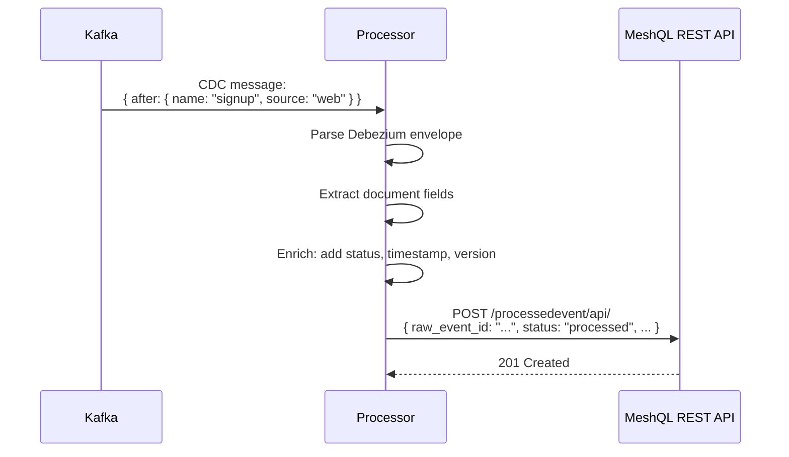

# Events Example (CDC Pipeline)

The events example demonstrates how MeshQL integrates with event-driven architecture using Change Data Capture (CDC).

[View source on GitHub](https://github.com/tsmarsh/meshql/tree/main/examples/events){: .btn .btn-outline }

---

## Architecture



---

## What This Demonstrates

### 1. MeshQL as a Write Interface for Event Pipelines

Raw events are written through MeshQL's REST API. Debezium watches the MongoDB collection and publishes changes to Kafka. A processor consumes events, enriches them, and writes the result back through MeshQL's REST API.

MeshQL doesn't need to know about Kafka. It just provides the CRUD interface — the CDC pipeline runs alongside it.

### 2. Federation Between Event Types

The ProcessedEvent graphlette defines a resolver to the Event graphlette:

```graphql
# processedevent.graphql
type ProcessedEvent {
    id: ID!
    raw_event_id: String
    status: String
    processed_at: Date
    raw_event: Event    # Resolved via federation
}

# ProcessedEvent's projection of Event
type Event {
    id: ID!
    name: String
    source: String
}
```

A single GraphQL query can fetch a processed event and its original raw event:

```graphql
{
  getById(id: "processed-1") {
    status
    processed_at
    raw_event {
      name
      source
    }
  }
}
```

### 3. Schema Ownership at Federation Boundaries

The `Event` type in `processedevent.graphql` is not a copy of the canonical Event. It's the ProcessedEvent service's **contract** — the minimum it needs from the Event service. They're independently defined and independently evolvable.

---

## The Processor

The `RawToProcessedProcessor` is a Kafka consumer that:

1. Consumes Debezium CDC messages from the raw events topic
2. Parses the Debezium envelope (handles MongoDB's double-encoded JSON)
3. Enriches the event with processing metadata (timestamp, status, version)
4. Writes the processed event back through MeshQL's REST API



This pattern keeps the processor simple — it's just a transformer between two MeshQL endpoints. All persistence, validation, and authorization is handled by MeshQL.

---

## Running the Example

```bash
cd examples/events

# Start the full stack
docker-compose up -d

# The stack includes:
# - MongoDB (with replica set for CDC)
# - Kafka + Zookeeper
# - Debezium connector
# - MeshQL server
# - Event processor
```

### Send a Test Event

```bash
# Create a raw event
curl -X POST http://localhost:3033/event/api/ \
  -H "Content-Type: application/json" \
  -d '{"name": "user_signup", "source": "web", "data": {"user": "alice"}}'

# Wait a few seconds for CDC processing...

# Query the processed event via GraphQL
curl -X POST http://localhost:3033/processedevent/graph \
  -H "Content-Type: application/json" \
  -d '{"query": "{ getByRawEventId(id: \"EVENT_ID\") { status processed_at raw_event { name source } } }"}'
```

---

## When to Use This Pattern

The CDC pattern is useful when you need:

- **Asynchronous processing**: Don't block the write path with expensive transformations
- **Event sourcing**: Raw events are immutable, processed events are derived
- **Decoupled consumers**: Multiple downstream systems can consume the same event stream
- **Audit trails**: MeshQL's temporal versioning on both raw and processed events gives you full history

It's not necessary for simpler applications. The [Farm example](farm) shows how to build a complete system with just synchronous federation.
