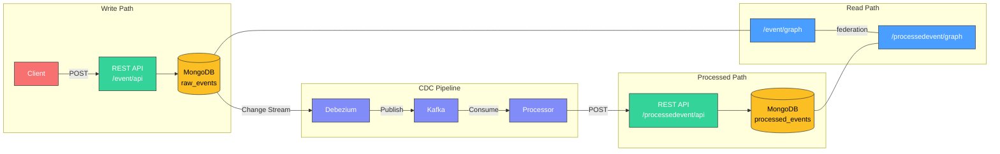
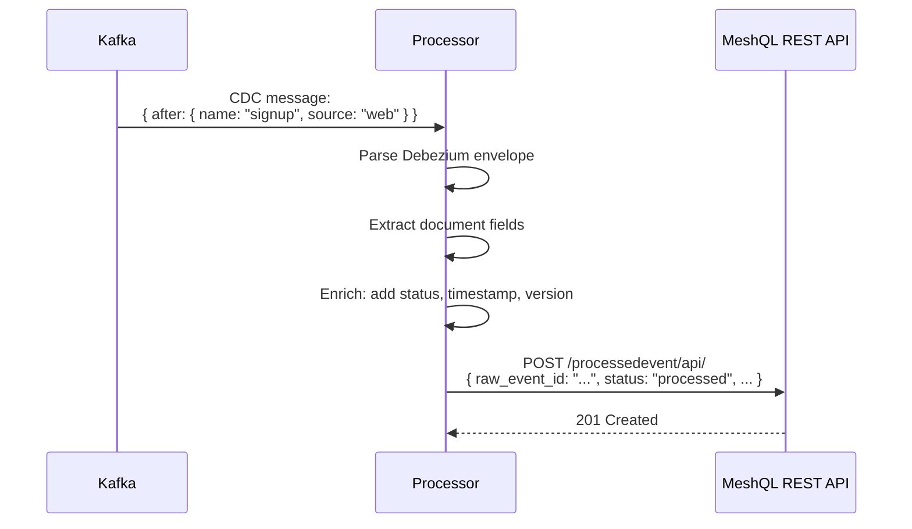

# Events Example (CDC Pipeline)

The events example demonstrates how MeshQL integrates with event-driven architecture using Change Data Capture (CDC).

[View source on GitHub](https://github.com/tsmarsh/meshql/tree/main/examples/events){: .btn .btn-outline }

---

## Architecture



---

## What This Demonstrates

### 1. MeshQL as a Write Interface for Event Pipelines

Raw events are written through MeshQL's REST API. Debezium watches the MongoDB collection and publishes changes to Kafka. A processor consumes events, enriches them, and writes the result back through MeshQL's REST API.

MeshQL doesn't need to know about Kafka. It just provides the CRUD interface — the CDC pipeline runs alongside it.

### 2. Federation Between Event Types

A single GraphQL query can fetch a processed event and its original raw event — crossing entity boundaries transparently.

### 3. Schema Ownership at Federation Boundaries

The `Event` type in `processedevent.graphql` is not a copy of the canonical Event schema. It's the ProcessedEvent service's **contract** — the minimum it needs from the Event service. They're independently defined and independently evolvable.

---

## GraphQL Schemas

### event.graphql

The raw event schema — canonical owner of Event, with a projection of ProcessedEvent for its `processedEvents` resolver:

```graphql
scalar Date

enum ProcessingStatus {
  SUCCESS
  FAILED
  PARTIAL
}

type Query {
  getById(id: ID, at: Float): Event
  getByName(name: String, at: Float): [Event]
}

type Event {
  id: ID
  name: String!
  data: String!
  source: String
  version: String
  timestamp: Date!
  correlationId: String
  processedEvents: [ProcessedEvent]   # Resolved via federation → ProcessedEvent.getByEvent
}

type ProcessedEvent {                  # Event's projection of ProcessedEvent
  id: ID!
  raw_event_id: String!
  name: String!
  correlationId: String
  processed_data: String!
  processed_timestamp: Date!
  processing_time_ms: Float
  status: ProcessingStatus!
  error_message: String
}
```

### processedevent.graphql

The processed event schema — canonical owner of ProcessedEvent, with a projection of Event for its `rawEvent` resolver:

```graphql
scalar Date

enum ProcessingStatus {
  SUCCESS
  FAILED
  PARTIAL
}

type Query {
  getById(id: ID, at: Float): ProcessedEvent
  getByName(name: String, at: Float): [ProcessedEvent]
  getByRawEventId(raw_event_id: String, at: Float): [ProcessedEvent]
  getByEvent(id: ID, at: Float): [ProcessedEvent]
}

type ProcessedEvent {
  id: ID!
  raw_event_id: String!
  name: String!
  correlationId: String
  processed_data: String!
  processed_timestamp: Date!
  processing_time_ms: Float
  status: ProcessingStatus!
  error_message: String
  rawEvent: Event              # Resolved via federation → Event.getById
}

type Event {                    # ProcessedEvent's projection of Event
  id: ID
  name: String!
  data: String!
  source: String
  version: String
  timestamp: Date!
  correlationId: String
}
```

---

## JSON Schemas (REST Validation)

### event.schema.json

```json
{
    "type": "object",
    "additionalProperties": false,
    "required": ["name", "data", "timestamp"],
    "properties": {
        "id":            { "type": "string", "format": "uuid" },
        "name":          { "type": "string" },
        "data":          { "type": "string" },
        "source":        { "type": "string" },
        "version":       { "type": "string" },
        "timestamp":     { "type": "string", "format": "date-time" },
        "correlationId": { "type": "string" }
    }
}
```

### processedevent.schema.json

```json
{
    "type": "object",
    "additionalProperties": false,
    "required": ["raw_event_id", "name", "processed_data", "processed_timestamp", "status"],
    "properties": {
        "id":                   { "type": "string", "format": "uuid" },
        "raw_event_id":         { "type": "string", "format": "uuid" },
        "name":                 { "type": "string" },
        "correlationId":        { "type": "string" },
        "processed_data":       { "type": "string" },
        "processed_timestamp":  { "type": "string", "format": "date-time" },
        "processing_time_ms":   { "type": "number" },
        "status":               { "type": "string", "enum": ["SUCCESS", "FAILED", "PARTIAL"] },
        "error_message":        { "type": "string" }
    }
}
```

---

## Server Configuration (Main.java)

The MeshQL server configures two meshobjs — one for raw events, one for processed events — with bidirectional federation:

```java
Config config = Config.builder()
    .port(port)

    // --- Raw Event graphlette ---
    .graphlette(GraphletteConfig.builder()
        .path("/event/graph")
        .storage(eventDB)
        .schema("/app/config/graph/event.graphql")
        .rootConfig(RootConfig.builder()
            .singleton("getById", "{\"id\": \"{{id}}\"}")
            .vector("getByName", "{\"payload.name\": \"{{name}}\"}")
            .vectorResolver("processedEvents", "id", "getByRawEventId",
                platformUrl + "/processedevent/graph")))

    // --- Processed Event graphlette ---
    .graphlette(GraphletteConfig.builder()
        .path("/processedevent/graph")
        .storage(processedEventDB)
        .schema("/app/config/graph/processedevent.graphql")
        .rootConfig(RootConfig.builder()
            .singleton("getById", "{\"id\": \"{{id}}\"}")
            .vector("getByName", "{\"payload.name\": \"{{name}}\"}")
            .vector("getByRawEventId",
                "{\"payload.raw_event_id\": \"{{raw_event_id}}\"}")
            .vector("getByEvent", "{\"payload.raw_event_id\": \"{{id}}\"}")
            .singletonResolver("rawEvent", "raw_event_id", "getById",
                platformUrl + "/event/graph")))

    // --- REST endpoints ---
    .restlette(RestletteConfig.builder()
        .path("/event/api").port(port).storage(eventDB)
        .schema(loadJsonSchema("/app/config/json/event.schema.json")))
    .restlette(RestletteConfig.builder()
        .path("/processedevent/api").port(port).storage(processedEventDB)
        .schema(loadJsonSchema("/app/config/json/processedevent.schema.json")))
    .build();

Server server = new Server(Map.of("mongo", new MongoPlugin(new NoAuth())));
server.init(config);
```

The Kafka processor is started alongside the server:

```java
RawToProcessedProcessor processor = new RawToProcessedProcessor(
    kafkaBroker,     // e.g. "kafka:9093"
    rawTopic,        // e.g. "events.events_development.event"
    processedApiBase // e.g. "http://localhost:4055/processedevent/api"
);
processor.start();
```

---

## The Processor

The `RawToProcessedProcessor` is a Kafka consumer that transforms raw events into processed events. The key insight: it uses MeshQL's REST API for both input (via CDC) and output — keeping it simple.



The core processing logic:

```java
private void processRecord(ConsumerRecord<String, String> record) throws Exception {
    // Parse Debezium CDC envelope
    JsonNode envelope = mapper.readTree(record.value());
    JsonNode payload = envelope.get("payload");

    // Extract the 'after' document (double-encoded JSON from Debezium)
    String afterString = payload.get("after").asText();
    JsonNode afterDoc = mapper.readTree(afterString);

    // Get the raw event ID
    String rawEventId = afterDoc.get("id").asText();

    // Build enriched processed event
    ObjectNode processedEvent = mapper.createObjectNode();
    processedEvent.put("raw_event_id", rawEventId);
    processedEvent.put("name", afterDoc.get("payload").get("name").asText());
    processedEvent.put("status", "SUCCESS");
    processedEvent.put("processed_timestamp", Instant.now().toString());
    processedEvent.put("processed_data",
        mapper.writeValueAsString(enrichedPayload));

    // Write back to MeshQL via REST
    HttpRequest request = HttpRequest.newBuilder()
        .uri(URI.create(processedApiBase))
        .header("Content-Type", "application/json")
        .POST(HttpRequest.BodyPublishers.ofString(
            mapper.writeValueAsString(processedEvent)))
        .build();
    httpClient.send(request, HttpResponse.BodyHandlers.ofString());
}
```

---

## Running the Example

The events example requires a full CDC stack. A docker-compose file starts everything:

```bash
cd examples/events

# Start the full stack
docker-compose up -d
```

The docker-compose stack includes:

| Service | Image | Purpose |
|:--------|:------|:--------|
| `mongodb` | mongo:8 | Storage with replica set (required for CDC) |
| `kafka` | apache/kafka:3.7.0 | Message broker (KRaft mode, no Zookeeper) |
| `debezium` | quay.io/debezium/server:2.6 | CDC connector (watches MongoDB, publishes to Kafka) |
| `events` | Built from source | MeshQL server + Kafka processor |

### Send a Test Event

```bash
# Create a raw event
EVENT_ID=$(curl -s -X POST http://localhost:4055/event/api \
  -H "Content-Type: application/json" \
  -d '{
    "name": "user_signup",
    "data": "{\"user\": \"alice\", \"plan\": \"pro\"}",
    "source": "web",
    "timestamp": "2026-02-11T10:00:00Z"
  }' | jq -r '.id')

echo "Event ID: $EVENT_ID"
```

### Wait for CDC processing

The pipeline takes a few seconds: MongoDB change stream → Debezium → Kafka → Processor → REST write.

### Query the processed event with federation

```bash
# Find processed events by raw event ID, and federate back to the original
curl -s -X POST http://localhost:4055/processedevent/graph \
  -H "Content-Type: application/json" \
  -d "{\"query\": \"{ getByRawEventId(raw_event_id: \\\"$EVENT_ID\\\") { status processed_timestamp processing_time_ms rawEvent { name source data } } }\"}" | jq .
```

Response:
```json
{
  "data": {
    "getByRawEventId": [
      {
        "status": "SUCCESS",
        "processed_timestamp": "2026-02-11T15:00:01.234Z",
        "processing_time_ms": 12,
        "rawEvent": {
          "name": "user_signup",
          "source": "web",
          "data": "{\"user\": \"alice\", \"plan\": \"pro\"}"
        }
      }
    ]
  }
}
```

### Query from the other direction

From the raw event, traverse to its processed results:

```bash
curl -s -X POST http://localhost:4055/event/graph \
  -H "Content-Type: application/json" \
  -d "{\"query\": \"{ getById(id: \\\"$EVENT_ID\\\") { name source processedEvents { status processed_timestamp } } }\"}" | jq .
```

```json
{
  "data": {
    "getById": {
      "name": "user_signup",
      "source": "web",
      "processedEvents": [
        {
          "status": "SUCCESS",
          "processed_timestamp": "2026-02-11T15:00:01.234Z"
        }
      ]
    }
  }
}
```

---

## When to Use This Pattern

The CDC pattern is useful when you need:

- **Asynchronous processing**: Don't block the write path with expensive transformations
- **Event sourcing**: Raw events are immutable, processed events are derived
- **Decoupled consumers**: Multiple downstream systems can consume the same event stream
- **Audit trails**: MeshQL's temporal versioning on both raw and processed events gives you full history

It's not necessary for simpler applications. The [Farm example](farm) shows how to build a complete system with just synchronous federation.
