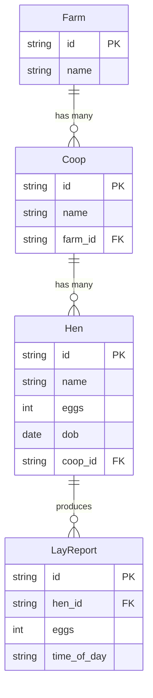
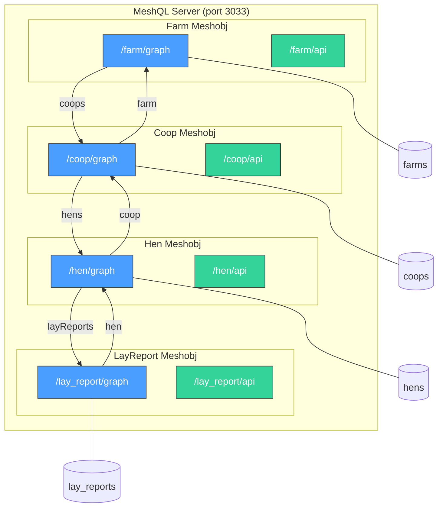
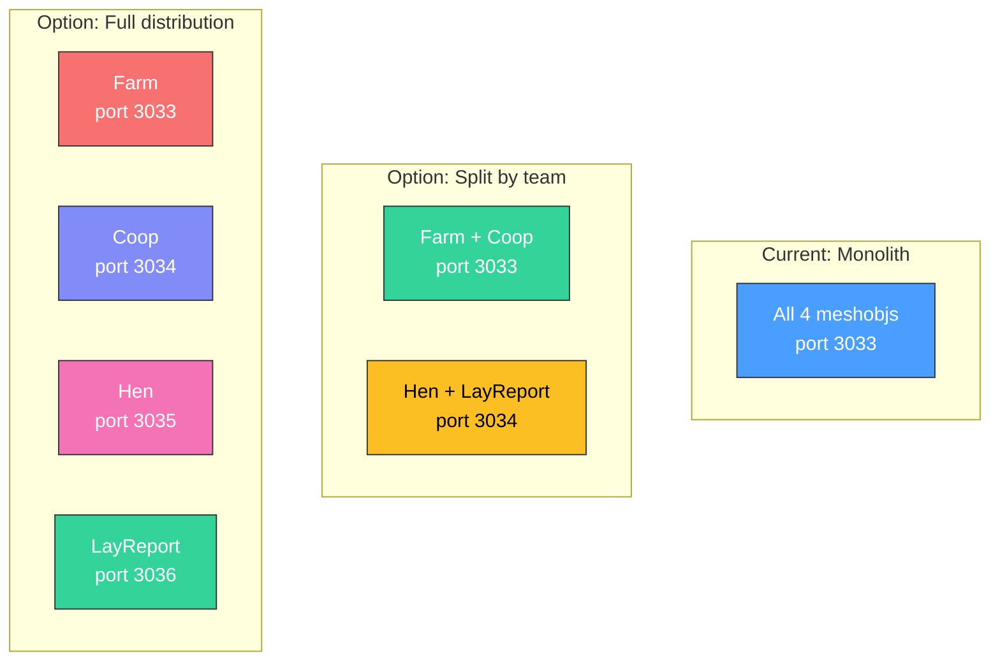

# Farm Example

The farm example is a complete 4-entity application demonstrating MeshQL's federation model. It's the reference implementation for building multi-entity systems.

[View source on GitHub](https://github.com/tsmarsh/meshql/tree/main/examples/farm){: .btn .btn-outline }

---

## Domain Model

A farm management system with four entities in a clear hierarchy:



---

## Architecture

All four entities run as meshobjs in a single JVM, each with its own MongoDB collection:



---

## GraphQL Schemas

Each entity owns a GraphQL schema that defines its canonical type plus projections of any foreign types it references.

### farm.graphql

Farm is the top of the hierarchy. It has a single query and defines projections of Coop and Hen for its `coops` resolver chain:

```graphql
scalar Date

type Query {
  getById(id: ID, at: Float): Farm
}

type Farm {
  name: String!
  id: ID
  coops: [Coop]       # Resolved via vector resolver → Coop.getByFarm
}

type Coop {            # Farm's projection of Coop
  name: String!
  id: ID
  hens: [Hen]
}

type Hen {             # Farm's projection of Hen
  name: String!
  coop: Coop
  eggs: Int
  dob: Date
  id: ID
}
```

### coop.graphql

Coop is the workhorse — it links up to Farm and down to Hen, and carries projections of both plus LayReport:

```graphql
scalar Date

type Farm {            # Coop's projection of Farm — minimal
  name: String!
  id: ID
}

type Query {
  getByName(name: String, at: Float): Coop
  getById(id: ID, at: Float): Coop
  getByFarm(id: ID, at: Float): [Coop]    # Called by Farm's vector resolver
}

type Coop {
  name: String!
  farm: Farm!          # Resolved via singleton resolver → Farm.getById
  id: ID
  hens: [Hen]          # Resolved via vector resolver → Hen.getByCoop
}

type Hen {             # Coop's projection of Hen
  name: String!
  eggs: Int
  dob: Date
  id: ID
  layReports: [LayReport]
}

type LayReport {       # Coop's projection of LayReport
  time_of_day: String!
  eggs: Int!
  id: ID
}
```

### hen.graphql

Hen links up to Coop and down to LayReport:

```graphql
scalar Date

type Farm {            # Hen's projection of Farm
  name: String!
  id: ID
  coops: [Coop]
}

type Coop {            # Hen's projection of Coop
  name: String!
  farm: Farm!
  id: ID
}

type Query {
  getByName(name: String, at: Float): [Hen]
  getById(id: ID, at: Float): Hen
  getByCoop(id: ID, at: Float): [Hen]      # Called by Coop's vector resolver
}

type Hen {
  name: String!
  coop: Coop           # Resolved via singleton resolver → Coop.getById
  eggs: Int
  dob: Date
  id: ID
  layReports: [LayReport]  # Resolved via vector resolver → LayReport.getByHen
}

type LayReport {       # Hen's projection of LayReport
  time_of_day: String!
  eggs: Int!
  id: ID
}
```

### lay_report.graphql

LayReport is a leaf entity — it only links up to Hen:

```graphql
scalar Date

type Hen {             # LayReport's projection of Hen
  name: String!
  id: ID
  eggs: Int
  dob: Date
}

type Query {
  getById(id: ID, at: Float): LayReport
  getByHen(id: ID, at: Float): [LayReport]  # Called by Hen's vector resolver
}

type LayReport {
  time_of_day: String!
  eggs: Int!
  hen: Hen             # Resolved via singleton resolver → Hen.getById
  id: ID
}
```

{: .note }
> Each schema defines its own projection of foreign types. The `Hen` type in `lay_report.graphql` is not the same definition as in `hen.graphql` — it's the minimum LayReport needs. This is intentional: schemas are independently evolvable.

---

## JSON Schemas (REST Validation)

Each entity has a JSON schema that validates REST writes. These schemas enforce required fields, types, and constraints.

### farm.schema.json
```json
{
    "type": "object",
    "additionalProperties": false,
    "required": ["name"],
    "properties": {
        "id":   { "type": "string", "format": "uuid" },
        "name": { "type": "string" }
    }
}
```

### coop.schema.json
```json
{
    "type": "object",
    "additionalProperties": false,
    "required": ["name", "farm_id"],
    "properties": {
        "id":      { "type": "string", "format": "uuid" },
        "name":    { "type": "string" },
        "farm_id": { "type": "string", "format": "uuid" }
    }
}
```

### hen.schema.json
```json
{
    "type": "object",
    "additionalProperties": false,
    "required": ["name"],
    "properties": {
        "id":      { "type": "string", "format": "uuid" },
        "name":    { "type": "string" },
        "coop_id": { "type": "string", "format": "uuid" },
        "eggs":    { "type": "integer", "minimum": 0, "maximum": 10 },
        "dob":     { "type": "string", "format": "date" }
    }
}
```

### lay_report.schema.json
```json
{
    "type": "object",
    "additionalProperties": false,
    "required": ["time_of_day", "eggs", "hen_id"],
    "properties": {
        "id":          { "type": "string", "format": "uuid" },
        "time_of_day": { "type": "string", "enum": ["morning", "afternoon", "evening"] },
        "hen_id":      { "type": "string", "format": "uuid" },
        "eggs":        { "type": "integer", "minimum": 0, "maximum": 3 }
    }
}
```

---

## Server Configuration (Main.java)

The entire 4-entity system is configured in a single file using the fluent builder API:

```java
package com.meshql.examples.farm;

import com.meshql.auth.noop.NoAuth;
import com.meshql.core.*;
import com.meshql.core.config.*;
import com.meshql.repositories.mongo.*;
import com.meshql.server.Server;

public class Main {
    public static void main(String[] args) throws Exception {
        String mongoUri    = getEnv("MONGO_URI", "mongodb://localhost:27017");
        String prefix      = getEnv("PREFIX", "farm");
        String env         = getEnv("ENV", "development");
        int port           = Integer.parseInt(getEnv("PORT", "3033"));
        String platformUrl = getEnv("PLATFORM_URL", "http://localhost:" + port);

        // One MongoDB config per entity — each gets its own collection
        MongoConfig farmDB      = createMongoConfig(mongoUri, prefix, env, "farm");
        MongoConfig coopDB      = createMongoConfig(mongoUri, prefix, env, "coop");
        MongoConfig henDB       = createMongoConfig(mongoUri, prefix, env, "hen");
        MongoConfig layReportDB = createMongoConfig(mongoUri, prefix, env, "lay_report");

        Config config = Config.builder()
            .port(port)

            // --- Farm: one query, one vector resolver pointing down to Coop ---
            .graphlette(GraphletteConfig.builder()
                .path("/farm/graph")
                .storage(farmDB)
                .schema("/app/config/graph/farm.graphql")
                .rootConfig(RootConfig.builder()
                    .singleton("getById", "{\"id\": \"{{id}}\"}")
                    .vectorResolver("coops", null, "getByFarm",
                        platformUrl + "/coop/graph")))

            // --- Coop: queries + resolvers up to Farm and down to Hen ---
            .graphlette(GraphletteConfig.builder()
                .path("/coop/graph")
                .storage(coopDB)
                .schema("/app/config/graph/coop.graphql")
                .rootConfig(RootConfig.builder()
                    .singleton("getByName", "{\"payload.name\": \"{{id}}\"}")
                    .singleton("getById", "{\"id\": \"{{id}}\"}")
                    .vector("getByFarm", "{\"payload.farm_id\": \"{{id}}\"}")
                    .singletonResolver("farm", "farm_id", "getById",
                        platformUrl + "/farm/graph")
                    .vectorResolver("hens", null, "getByCoop",
                        platformUrl + "/hen/graph")
                    .vectorResolver("hens.layReports", null, "getByHen",
                        platformUrl + "/lay_report/graph")))

            // --- Hen: queries + resolvers up to Coop and down to LayReport ---
            .graphlette(GraphletteConfig.builder()
                .path("/hen/graph")
                .storage(henDB)
                .schema("/app/config/graph/hen.graphql")
                .rootConfig(RootConfig.builder()
                    .singleton("getById", "{\"id\": \"{{id}}\"}")
                    .vector("getByName", "{\"payload.name\": \"{{name}}\"}")
                    .vector("getByCoop", "{\"payload.coop_id\": \"{{id}}\"}")
                    .singletonResolver("coop", "coop_id", "getById",
                        platformUrl + "/coop/graph")
                    .vectorResolver("layReports", null, "getByHen",
                        platformUrl + "/lay_report/graph")))

            // --- LayReport: queries + resolver up to Hen ---
            .graphlette(GraphletteConfig.builder()
                .path("/lay_report/graph")
                .storage(layReportDB)
                .schema("/app/config/graph/lay_report.graphql")
                .rootConfig(RootConfig.builder()
                    .singleton("getById", "{\"id\": \"{{id}}\"}")
                    .vector("getByHen", "{\"payload.hen_id\": \"{{id}}\"}")
                    .singletonResolver("hen", "hen_id", "getById",
                        platformUrl + "/hen/graph")))

            // --- REST endpoints for each entity ---
            .restlette(RestletteConfig.builder()
                .path("/farm/api").port(port).storage(farmDB)
                .schema(loadJsonSchema("/app/config/json/farm.schema.json")))
            .restlette(RestletteConfig.builder()
                .path("/coop/api").port(port).storage(coopDB)
                .schema(loadJsonSchema("/app/config/json/coop.schema.json")))
            .restlette(RestletteConfig.builder()
                .path("/hen/api").port(port).storage(henDB)
                .schema(loadJsonSchema("/app/config/json/hen.schema.json")))
            .restlette(RestletteConfig.builder()
                .path("/lay_report/api").port(port).storage(layReportDB)
                .schema(loadJsonSchema("/app/config/json/lay_report.schema.json")))
            .build();

        // Auth + plugin registration
        Auth auth = new NoAuth();
        Map<String, Plugin> plugins = Map.of("mongo", new MongoPlugin(auth));

        // Start the server
        Server server = new Server(plugins);
        server.init(config);
    }
}
```

Key things to notice:
- **`platformUrl`** controls where resolvers point. In a monolith, everything resolves to `localhost:3033`. To distribute, change this URL per entity — no code changes.
- **`singleton` vs `vector`** queries return one result or a list. Query templates use Handlebars (`{{id}}`) and target fields inside the Envelope's `payload` field.
- **`singletonResolver`** and **`vectorResolver`** define federation relationships: the field name, the foreign key, the remote query to call, and the remote URL.

---

## Federation Pattern

Each entity defines resolvers for its relationships. Here's the full resolver map:

| Source | Field | Type | Target Query | Direction |
|:-------|:------|:-----|:-------------|:----------|
| Farm | `coops` | Vector | Coop.`getByFarm` | 1:N |
| Coop | `farm` | Singleton | Farm.`getById` | N:1 |
| Coop | `hens` | Vector | Hen.`getByCoop` | 1:N |
| Hen | `coop` | Singleton | Coop.`getById` | N:1 |
| Hen | `layReports` | Vector | LayReport.`getByHen` | 1:N |
| LayReport | `hen` | Singleton | Hen.`getById` | N:1 |

Notice the **bidirectional navigation**: you can go from Farm → Coop → Hen → LayReport, or from LayReport → Hen → Coop → Farm. Each direction is a single-hop resolver.

---

## Running the Example

```bash
# Start MongoDB
docker run -d --name meshql-mongo -p 27017:27017 mongo:8

# Build the project (from repo root)
mvn clean package -pl examples/farm -am -DskipTests

# Run it
java -jar examples/farm/target/farm-0.2.0.jar
```

The server starts on port 3033 with 8 endpoints:
- GraphQL: `/farm/graph`, `/coop/graph`, `/hen/graph`, `/lay_report/graph`
- REST: `/farm/api`, `/coop/api`, `/hen/api`, `/lay_report/api`

---

## Walkthrough: Build a Farm Hierarchy

### Step 1: Create a farm

```bash
FARM_ID=$(curl -s -X POST http://localhost:3033/farm/api \
  -H "Content-Type: application/json" \
  -d '{"name": "Green Acres"}' | jq -r '.id')

echo "Farm ID: $FARM_ID"
```

### Step 2: Create coops in the farm

```bash
COOP1_ID=$(curl -s -X POST http://localhost:3033/coop/api \
  -H "Content-Type: application/json" \
  -d "{\"name\": \"North Coop\", \"farm_id\": \"$FARM_ID\"}" | jq -r '.id')

COOP2_ID=$(curl -s -X POST http://localhost:3033/coop/api \
  -H "Content-Type: application/json" \
  -d "{\"name\": \"South Coop\", \"farm_id\": \"$FARM_ID\"}" | jq -r '.id')
```

### Step 3: Add hens to the coops

```bash
HEN1_ID=$(curl -s -X POST http://localhost:3033/hen/api \
  -H "Content-Type: application/json" \
  -d "{\"name\": \"Henrietta\", \"eggs\": 3, \"coop_id\": \"$COOP1_ID\"}" | jq -r '.id')

curl -s -X POST http://localhost:3033/hen/api \
  -H "Content-Type: application/json" \
  -d "{\"name\": \"Clucksworth\", \"eggs\": 5, \"coop_id\": \"$COOP1_ID\"}"

curl -s -X POST http://localhost:3033/hen/api \
  -H "Content-Type: application/json" \
  -d "{\"name\": \"Pecky\", \"eggs\": 2, \"coop_id\": \"$COOP2_ID\"}"
```

### Step 4: Record lay reports

```bash
curl -s -X POST http://localhost:3033/lay_report/api \
  -H "Content-Type: application/json" \
  -d "{\"hen_id\": \"$HEN1_ID\", \"time_of_day\": \"morning\", \"eggs\": 2}"

curl -s -X POST http://localhost:3033/lay_report/api \
  -H "Content-Type: application/json" \
  -d "{\"hen_id\": \"$HEN1_ID\", \"time_of_day\": \"afternoon\", \"eggs\": 1}"
```

### Step 5: Query the full hierarchy via GraphQL

This single query traverses all four entities via federation:

```bash
curl -s -X POST http://localhost:3033/farm/graph \
  -H "Content-Type: application/json" \
  -d "{\"query\": \"{ getById(id: \\\"$FARM_ID\\\") { name coops { name hens { name eggs layReports { time_of_day eggs } } } } }\"}" | jq .
```

Response:
```json
{
  "data": {
    "getById": {
      "name": "Green Acres",
      "coops": [
        {
          "name": "North Coop",
          "hens": [
            {
              "name": "Henrietta",
              "eggs": 3,
              "layReports": [
                { "time_of_day": "morning", "eggs": 2 },
                { "time_of_day": "afternoon", "eggs": 1 }
              ]
            },
            {
              "name": "Clucksworth",
              "eggs": 5,
              "layReports": []
            }
          ]
        },
        {
          "name": "South Coop",
          "hens": [
            {
              "name": "Pecky",
              "eggs": 2,
              "layReports": []
            }
          ]
        }
      ]
    }
  }
}
```

### Navigate the other direction

From a lay report, traverse back up to the farm:

```bash
curl -s -X POST http://localhost:3033/lay_report/graph \
  -H "Content-Type: application/json" \
  -d "{\"query\": \"{ getByHen(id: \\\"$HEN1_ID\\\") { time_of_day eggs hen { name coop { name farm { name } } } } }\"}" | jq .
```

```json
{
  "data": {
    "getByHen": [
      {
        "time_of_day": "morning",
        "eggs": 2,
        "hen": {
          "name": "Henrietta",
          "coop": {
            "name": "North Coop",
            "farm": { "name": "Green Acres" }
          }
        }
      }
    ]
  }
}
```

---

## Deployment Flexibility

The farm example runs as a single JVM, but it's architecturally ready for distribution:



To split: change the `PLATFORM_URL` environment variable to point resolvers at the correct service. No code changes needed.

---

## Performance Tips

For the farm example, these indexes improve query performance by ~100x:

```javascript
db['farm-development-coop'].createIndex({'payload.farm_id': 1});
db['farm-development-hen'].createIndex({'payload.coop_id': 1});
db['farm-development-lay_report'].createIndex({'payload.hen_id': 1});
```

Always index foreign key fields that appear in vector query templates.
