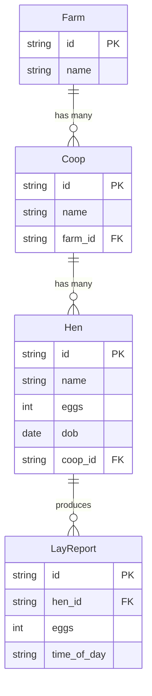
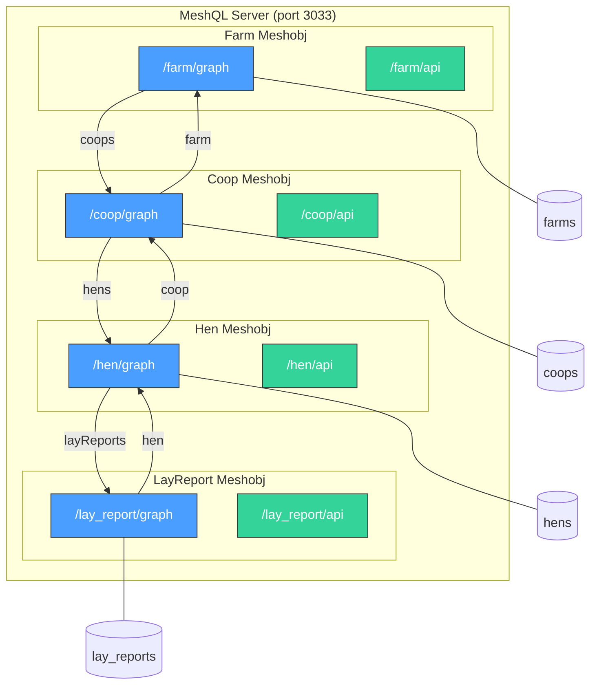
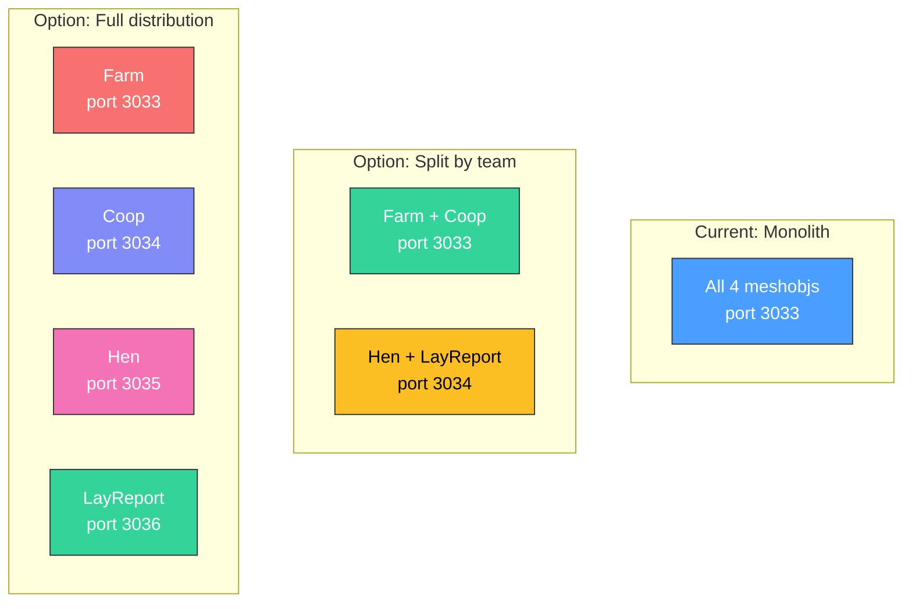

# Farm Example

The farm example is a complete 4-entity application demonstrating MeshQL's federation model. It's the reference implementation for building multi-entity systems.

[View source on GitHub](https://github.com/tsmarsh/meshql/tree/main/examples/farm){: .btn .btn-outline }

---

## Domain Model

A farm management system with four entities in a clear hierarchy:



---

## Architecture

All four entities run as meshobjs in a single JVM, each with its own MongoDB collection:



---

## Federation Pattern

Each entity defines resolvers for its relationships. Here's the full resolver map:

| Source | Field | Type | Target Query | Direction |
|:-------|:------|:-----|:-------------|:----------|
| Farm | `coops` | Vector | Coop.`getByFarm` | 1:N |
| Coop | `farm` | Singleton | Farm.`getById` | N:1 |
| Coop | `hens` | Vector | Hen.`getByCoop` | 1:N |
| Hen | `coop` | Singleton | Coop.`getById` | N:1 |
| Hen | `layReports` | Vector | LayReport.`getByHen` | 1:N |
| LayReport | `hen` | Singleton | Hen.`getById` | N:1 |

Notice the **bidirectional navigation**: you can go from Farm → Coop → Hen → LayReport, or from LayReport → Hen → Coop → Farm. Each direction is a single-hop resolver.

---

## Query Templates

Each entity defines Handlebars-templated queries:

```java
// Farm — simple ID lookup
.singleton("getById", "{\"id\": \"{{id}}\"}")

// Coop — ID lookup, name search, and foreign key query
.singleton("getById", "{\"id\": \"{{id}}\"}")
.singleton("getByName", "{\"payload.name\": \"{{id}}\"}")
.vector("getByFarm", "{\"payload.farm_id\": \"{{id}}\"}")

// Hen — ID, name search, foreign key
.singleton("getById", "{\"id\": \"{{id}}\"}")
.vector("getByName", "{\"payload.name\": \"{{name}}\"}")
.vector("getByCoop", "{\"payload.coop_id\": \"{{id}}\"}")

// LayReport — ID and foreign key
.singleton("getById", "{\"id\": \"{{id}}\"}")
.vector("getByHen", "{\"payload.hen_id\": \"{{id}}\"}")
```

Templates use `payload.` prefix because user data is stored inside the Envelope's payload field.

---

## Schema Ownership

Each entity defines its own view of related types. Here's the Coop schema:

```graphql
# coop.graphql — Coop is the canonical owner

type Query {
    getById(id: ID!, at: Float): Coop
    getByName(id: String!, at: Float): Coop
    getByFarm(id: ID!, at: Float): [Coop]
}

type Coop {
    id: ID!
    name: String
    farm: Farm        # Resolved via singleton resolver
    hens: [Hen]       # Resolved via vector resolver
}

# Projections — Coop's view of foreign types
type Farm {
    id: ID!
    name: String
}

type Hen {
    id: ID!
    name: String
    eggs: Int
    dob: Date
    coop: Coop
    layReports: [LayReport]
}
```

The `Farm` and `Hen` types defined here are **not the canonical definitions** — they're what the Coop service needs. The canonical Farm might have many more fields.

---

## Running the Example

```bash
cd examples/farm

# Start MongoDB
docker-compose up -d mongodb

# Build and run
mvn clean package -pl examples/farm -am
java -jar examples/farm/target/farm-0.2.0.jar
```

### Sample Queries

Create a farm and query the hierarchy:

```bash
# Create a farm
FARM_ID=$(curl -s -X POST http://localhost:3033/farm/api/ \
  -H "Content-Type: application/json" \
  -d '{"name": "Green Acres"}' | jq -r '.id')

# Create a coop in the farm
COOP_ID=$(curl -s -X POST http://localhost:3033/coop/api/ \
  -H "Content-Type: application/json" \
  -d "{\"name\": \"Main Coop\", \"farm_id\": \"$FARM_ID\"}" | jq -r '.id')

# Create a hen in the coop
curl -X POST http://localhost:3033/hen/api/ \
  -H "Content-Type: application/json" \
  -d "{\"name\": \"Henrietta\", \"eggs\": 3, \"coop_id\": \"$COOP_ID\"}"

# Query the full hierarchy via GraphQL
curl -X POST http://localhost:3033/farm/graph \
  -H "Content-Type: application/json" \
  -d "{\"query\": \"{ getById(id: \\\"$FARM_ID\\\") { name coops { name hens { name eggs } } } }\"}"
```

---

## Deployment Flexibility

The farm example runs as a single JVM, but it's architecturally ready for distribution:



To split: change the `PLATFORM_URL` environment variable to point resolvers at the correct service. No code changes needed.

---

## Performance Tips

For the farm example, these indexes improve query performance by ~100x:

```javascript
db['farm-development-coop'].createIndex({'payload.farm_id': 1});
db['farm-development-hen'].createIndex({'payload.coop_id': 1});
db['farm-development-lay_report'].createIndex({'payload.hen_id': 1});
```

Always index foreign key fields that appear in vector query templates.
