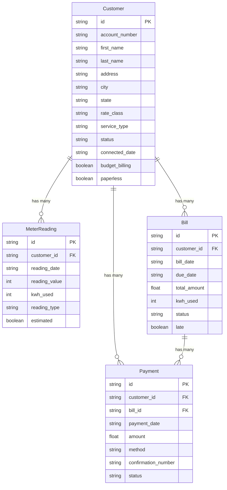
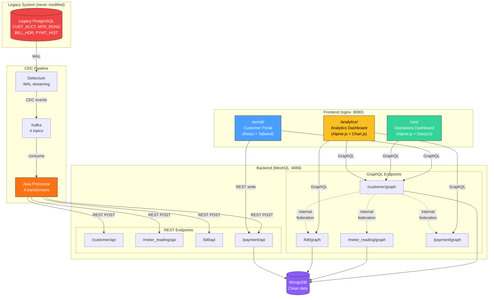

# Case Study: Springfield Electric

This example demonstrates MeshQL as an **anti-corruption layer** — the Domain-Driven Design pattern where you place a translation layer between your new system and a legacy system so the legacy data model doesn't corrupt your clean domain. A legacy PostgreSQL database with SCREAMING_SNAKE columns, YYYYMMDD dates stored as VARCHAR, amounts in cents, and single-character status codes gets transformed into clean domain entities via CDC — and the legacy database is **never modified**.

[View source on GitHub](https://github.com/tailoredshapes/meshql/tree/main/examples/legacy){: .btn .btn-outline .mr-2 }
[Run with Docker Compose](#running-it){: .btn .btn-outline }

---

## The Problem

You're a utility cooperative ("Springfield Electric, est. 1952"). Your billing system has been running on PostgreSQL since the late '90s. Four tables: `CUST_ACCT`, `MTR_RDNG`, `BILL_HDR`, `PYMT_HIST`. Column names like `CUST_NM_FIRST`, `ADDR_LN1`, `RT_CD`. Dates stored as `VARCHAR(8)` in YYYYMMDD format. Dollar amounts stored in cents as integers. Status codes are single characters — `A` for active, `S` for suspended, `D` for delinquent.

The database works. The billing system works. Nobody's touching it.

But now three teams need three new applications: a **customer-facing portal** where account holders can look up their bills and make payments, an **operations dashboard** where utility staff manage accounts and track delinquencies, and an **analytics dashboard** where management reviews revenue and consumption trends.

None of these applications should see `CUST_NM_FIRST: "MARGARET"` or `TOT_AMT: 9840`. They should see `first_name: "Margaret"` and `total_amount: 98.40`. The legacy data model shouldn't leak into the clean domain.

Traditional approach: build an ETL pipeline, stand up a separate database, keep them in sync, handle the inevitable drift. Or worse — point the new apps directly at the legacy DB and scatter transformation logic across three frontend codebases.

**MeshQL approach**: Debezium captures every change from the legacy database via CDC. Kafka streams those changes to a processor that transforms the data — title case, ISO dates, dollars not cents, full words not codes — and POSTs the clean entities to MeshQL's REST API. The clean data lands in MongoDB, queryable via GraphQL with full federation. Three frontend apps consume the clean API. The legacy database is never modified. The legacy data model never leaks.

---

## What Gets Transformed

| Legacy | Clean | Transformation |
|:-------|:------|:---------------|
| `CUST_NM_FIRST: "MARGARET"` | `first_name: "Margaret"` | Title case |
| `CONN_DT: "19980315"` | `connected_date: "1998-03-15"` | YYYYMMDD → ISO 8601 |
| `TOT_AMT: 9840` | `total_amount: 98.40` | Cents → dollars |
| `STAT_CD: "A"` | `status: "active"` | Code → word |
| `RT_CD: "RES"` | `rate_class: "residential"` | Code → word |
| `PYMT_MTHD: "W"` | `method: "web"` | Code → word |
| `EST_FLG: "Y"` | `estimated: true` | Char → boolean |
| `ADDR_LN1: "742 EVERGREEN TERRACE"` | `address: "742 Evergreen Terrace"` | Title case |

Every transformation is explicit, testable, and contained in a single transformer class per entity.

---

## Domain Model



Four entities, 8 federation resolvers connecting them. Customer is the center — it links to MeterReading, Bill, and Payment. Bill also links to Payment (which bills have been paid).

---

## Architecture



The legacy PostgreSQL database sits on the left — never modified, never queried by the new apps. Debezium streams WAL changes through Kafka. The Java processor transforms legacy data into clean domain objects and POSTs them to MeshQL's REST API. Clean data lands in MongoDB. Three frontend apps consume the clean GraphQL API.

**Key difference from the logistics example**: This example uses **internal resolvers** — federation happens inside the JVM with direct method calls, not HTTP. No network overhead between graphlettes.

---

## One Backend, Three Apps

Three different teams, three different frontend stacks, three different use cases — all consuming the same clean API that MeshQL generates from the transformed legacy data.

### Customer Portal: Account Lookup with Full Federation

A customer types their account number into the search box. The React app fires a **single GraphQL query** that traverses all four entities:

```javascript
const query = `{
  getByAccountNumber(account_number: "${accountNumber}") {
    id first_name last_name account_number status
    rate_class service_type address city state zip
    phone email connected_date budget_billing paperless
    bills {
      id bill_date due_date period_from period_to
      total_amount kwh_used status late
    }
    meterReadings {
      id reading_date reading_value previous_value kwh_used
      reading_type estimated
    }
    payments {
      id payment_date amount method confirmation_number status
    }
  }
}`;

const res = await fetch(`${API_BASE}/customer/graph`, {
  method: 'POST',
  headers: { 'Content-Type': 'application/json' },
  body: JSON.stringify({ query })
});
```

One HTTP request. MeshQL's internal federation resolves Customer → Bills, Customer → MeterReadings, and Customer → Payments server-side with zero network overhead. The response arrives fully assembled — the customer sees their account details, billing history, usage data, and payment records in a single page load.

The customer portal also supports making payments via REST POST — the **write path** goes through MeshQL's REST API with JSON Schema validation:

```javascript
await fetch(`${API_BASE}/payment/api`, {
  method: 'POST',
  headers: { 'Content-Type': 'application/json' },
  body: JSON.stringify({
    customer_id: customerId,
    bill_id: selectedBillId,
    payment_date: new Date().toISOString().slice(0, 10),
    amount: paymentAmount,
    method: 'web',
    status: 'success'
  })
});
```

Here's what the customer sees after looking up account `100100-00001` — Margaret Henderson's full account with bills, usage, and payment history, all populated from that single federated query:


{: .mb-6 }

Notice: every field on this page was transformed from the legacy format. `MARGARET` became `Margaret`. `19980315` became `1998-03-15`. `9840` cents became `$98.40`. The customer never sees the legacy data model.

### Operations Dashboard: Staff Account Management

The operations dashboard lists all customer accounts with status badges, rate classes, and city/state info. Staff can filter by status or rate class, and click through to view a customer's full federated profile.

```javascript
async function loadCustomers() {
    const query = `{ getAll {
        id account_number first_name last_name
        rate_class status city state
    } }`;
    const res = await fetch(`${API_BASE}/customer/graph`, {
        method: 'POST',
        headers: { 'Content-Type': 'application/json' },
        body: JSON.stringify({ query })
    });
    const json = await res.json();
    return json.data.getAll;
}
```

The dashboard also includes a **delinquency view** — a single GraphQL query finds all delinquent bills across all customers:

```javascript
const query = `{ getByStatus(status: "delinquent") {
    id bill_date due_date total_amount kwh_used
    customer { first_name last_name account_number }
} }`;
const res = await fetch(`${API_BASE}/bill/graph`, { ... });
```

Federation resolves `customer` on each delinquent bill — the operations team sees both the bill details and which customer owes it, from one query.


{: .mb-6 }

### Analytics Dashboard: Management Reporting

The analytics dashboard fetches flat lists from all entities and aggregates client-side with Chart.js:

```javascript
const [customers, bills, payments] = await Promise.all([
    gqlAll('/customer/graph', '{ getAll { id rate_class status } }'),
    gqlAll('/bill/graph', '{ getAll { id total_amount kwh_used status bill_date customer_id } }'),
    gqlAll('/payment/graph', '{ getAll { id amount method payment_date } }')
]);
```

Three parallel GraphQL requests. The app computes: revenue by rate class (bar chart), monthly consumption (bar chart), payment method breakdown (doughnut chart), delinquency by rate class (horizontal bar). No server-side aggregation — the seed data is small enough to process in the browser.


{: .mb-6 }

### Summary

| App | Stack | Protocol | Pattern | Key Operation |
|:----|:------|:---------|:--------|:--------------|
| **Customer Portal** | React + Tailwind | GraphQL + REST | Deep traversal reads, REST writes | `getByAccountNumber` federating across 4 entities, `POST /payment/api` |
| **Operations** | Alpine.js + DaisyUI | GraphQL | List views, detail views, delinquency queries | `getAll` customers, `getByStatus("delinquent")` bills with federated customer |
| **Analytics** | Alpine.js + Chart.js | GraphQL | Flat list reads, client-side aggregation | `getAll` on 3 entities in parallel, Chart.js rendering |

Three teams, three stacks, three access patterns. One backend. The legacy database model never leaks.

---

## The Backend

### The CDC Pipeline

The pipeline flows through 4 stages:

1. **Legacy PostgreSQL** — configured with `wal_level=logical` and `REPLICA IDENTITY FULL` for Debezium to capture complete row state
2. **Debezium** — connects to PostgreSQL, captures WAL changes, publishes to 4 Kafka topics (`legacy.public.cust_acct`, `legacy.public.mtr_rdng`, `legacy.public.bill_hdr`, `legacy.public.pymt_hist`)
3. **Kafka** — KRaft mode (no ZooKeeper), retains CDC events
4. **Java Processor** — consumes from Kafka, transforms via 4 transformer classes, POSTs clean data to MeshQL REST API

The processor runs in **phases** to handle foreign key dependencies:

```
Phase 1: Process customers (populate customer ID cache)
Phase 2: Process bills (populate bill ID cache, resolve customer_id)
Phase 3: Process meter readings + payments (resolve customer_id, bill_id)
Phase 4: Continuous consumption of all topics
```

Each phase drains its topic completely before moving to the next. After each phase, the processor queries GraphQL to populate an ID resolution cache — because MeshQL's REST API returns clean data without internal IDs, the processor uses GraphQL `getAll` queries to discover the mapping between legacy IDs and MeshQL entity IDs.

### Transformer Architecture

Each legacy table has a dedicated transformer implementing the `LegacyTransformer` interface:

```java
public interface LegacyTransformer {
    ObjectNode transform(JsonNode legacyRow);
}
```

**CustomerTransformer** — the most complex, handles title case, date parsing, enum expansion:
```java
public ObjectNode transform(JsonNode row) {
    ObjectNode clean = mapper.createObjectNode();
    clean.put("account_number", textOrNull(row, "acct_num"));
    clean.put("first_name", titleCase(textOrNull(row, "cust_nm_first")));
    clean.put("last_name", titleCase(textOrNull(row, "cust_nm_last")));
    clean.put("rate_class", RATE_MAP.getOrDefault(
        textOrNull(row, "rt_cd"), "unknown"));  // "RES" → "residential"
    clean.put("status", STATUS_MAP.getOrDefault(
        textOrNull(row, "stat_cd"), "unknown"));  // "A" → "active"
    clean.put("connected_date", parseDate(
        textOrNull(row, "conn_dt")));  // "19980315" → "1998-03-15"
    clean.put("budget_billing",
        "Y".equals(textOrNull(row, "budget_flg")));  // "Y" → true
    // ... address, phone, email
    return clean;
}
```

**BillTransformer** — cents to dollars, FK resolution:
```java
// Cents to dollars
clean.put("total_amount", row.get("tot_amt").asInt() / 100.0);

// Resolve customer_id from legacy acct_id via cache
String customerId = idResolver.resolveCustomerId(acctId);
if (customerId != null) {
    clean.put("customer_id", customerId);
}
```

**MeterReadingTransformer** — reading types, boolean flags, customer FK:
```java
clean.put("reading_type", TYPE_MAP.getOrDefault(
    textOrNull(row, "rdng_type"), "unknown"));  // "A" → "actual", "E" → "estimated"
clean.put("estimated", "Y".equals(textOrNull(row, "est_flg")));
```

**PaymentTransformer** — payment methods, both customer and bill FK resolution:
```java
clean.put("method", METHOD_MAP.getOrDefault(
    textOrNull(row, "pymt_mthd"), "unknown"));  // "W" → "web", "K" → "check"
```

### GraphQL Schemas

Each entity defines its own GraphQL schema. Per MeshQL's federation model, each schema defines its own projections of foreign types.

**customer.graphql** — the richest schema, resolves to 3 other entities:
```graphql
type Query {
  getById(id: ID, at: Float): Customer
  getAll(at: Float): [Customer]
  getByAccountNumber(account_number: String, at: Float): Customer
  getByStatus(status: String, at: Float): [Customer]
  getByRateClass(rate_class: String, at: Float): [Customer]
}

type Customer {
  id: ID
  account_number: String!
  first_name: String!
  last_name: String!
  address: String
  city: String
  state: String
  zip: String
  phone: String
  email: String
  rate_class: String!
  service_type: String!
  status: String!
  connected_date: String
  budget_billing: Boolean
  paperless: Boolean
  meterReadings: [MeterReading]  # Internal federation → /meter_reading/graph
  bills: [Bill]                   # Internal federation → /bill/graph
  payments: [Payment]             # Internal federation → /payment/graph
}
```

**bill.graphql** — resolves customer and payments:
```graphql
type Query {
  getById(id: ID, at: Float): Bill
  getAll(at: Float): [Bill]
  getByCustomer(id: ID, at: Float): [Bill]
  getByStatus(status: String, at: Float): [Bill]
}

type Bill {
  id: ID
  customer_id: String
  bill_date: String!
  due_date: String!
  period_from: String!
  period_to: String!
  total_amount: Float!
  kwh_used: Int!
  status: String!
  late: Boolean
  customer: Customer    # Internal federation → /customer/graph
  payments: [Payment]   # Internal federation → /payment/graph
}
```

**meter_reading.graphql** and **payment.graphql** follow the same pattern — each resolves back to Customer, and Payment also resolves to Bill.

### Server Configuration (Main.java)

The entire backend — 4 graphlettes, 4 restlettes, 8 internal federation resolvers, plus the CDC processor — is configured in a single file:

```java
Config config = Config.builder()
    .port(port)
    // Customer graphlette — resolves to 3 other entities
    .graphlette(GraphletteConfig.builder()
        .path("/customer/graph")
        .storage(customerDB)
        .schema("/app/config/graph/customer.graphql")
        .rootConfig(RootConfig.builder()
            .singleton("getById", "{\"id\": \"{{id}}\"}")
            .singleton("getByAccountNumber",
                "{\"payload.account_number\": \"{{account_number}}\"}")
            .vector("getAll", "{}")
            .vector("getByStatus", "{\"payload.status\": \"{{status}}\"}")
            .vector("getByRateClass", "{\"payload.rate_class\": \"{{rate_class}}\"}")
            .internalVectorResolver("meterReadings", null,
                "getByCustomer", "/meter_reading/graph")
            .internalVectorResolver("bills", null,
                "getByCustomer", "/bill/graph")
            .internalVectorResolver("payments", null,
                "getByCustomer", "/payment/graph")))
    // Bill graphlette — resolves to customer and payments
    .graphlette(GraphletteConfig.builder()
        .path("/bill/graph")
        .storage(billDB)
        .schema("/app/config/graph/bill.graphql")
        .rootConfig(RootConfig.builder()
            .singleton("getById", "{\"id\": \"{{id}}\"}")
            .vector("getAll", "{}")
            .vector("getByCustomer", "{\"payload.customer_id\": \"{{id}}\"}")
            .vector("getByStatus", "{\"payload.status\": \"{{status}}\"}")
            .internalSingletonResolver("customer", "customer_id",
                "getById", "/customer/graph")
            .internalVectorResolver("payments", null,
                "getByBill", "/payment/graph")))
    // ... meter_reading and payment graphlettes follow same pattern
    .build();
```

The key difference from the logistics example: **`internalVectorResolver` and `internalSingletonResolver`** instead of `vectorResolver` and `singletonResolver`. Internal resolvers call directly into the target graphlette's searcher — no HTTP, no serialization, no network overhead. This is possible because all four graphlettes live in the same JVM.

### Federation Map

All 8 resolvers at a glance:

| Source Entity | Field | Type | Target Query | Target Endpoint |
|:-------------|:------|:-----|:-------------|:----------------|
| Customer | `meterReadings` | Internal Vector | `getByCustomer` | `/meter_reading/graph` |
| Customer | `bills` | Internal Vector | `getByCustomer` | `/bill/graph` |
| Customer | `payments` | Internal Vector | `getByCustomer` | `/payment/graph` |
| MeterReading | `customer` | Internal Singleton | `getById` | `/customer/graph` |
| Bill | `customer` | Internal Singleton | `getById` | `/customer/graph` |
| Bill | `payments` | Internal Vector | `getByBill` | `/payment/graph` |
| Payment | `customer` | Internal Singleton | `getById` | `/customer/graph` |
| Payment | `bill` | Internal Singleton | `getById` | `/bill/graph` |

All resolvers are internal — federation happens inside the JVM with direct method calls. If you later split these into separate services, changing `internalVectorResolver` to `vectorResolver` (with a URL) is the only code change needed.

---

## The Legacy Database

The legacy database has 4 tables with the kinds of column names you'd expect from a 1990s-era billing system:

```sql
CREATE TABLE CUST_ACCT (
    ACCT_ID         SERIAL PRIMARY KEY,
    ACCT_NUM        VARCHAR(12) NOT NULL UNIQUE,
    CUST_NM_FIRST   VARCHAR(30) NOT NULL,
    CUST_NM_LAST    VARCHAR(30) NOT NULL,
    ADDR_LN1        VARCHAR(60),
    ADDR_LN2        VARCHAR(60),
    ADDR_CITY       VARCHAR(30),
    ADDR_ST         VARCHAR(2),
    ADDR_ZIP        VARCHAR(10),
    RT_CD           VARCHAR(3) NOT NULL,       -- RES, COM, IND
    SVC_TYPE        VARCHAR(1) NOT NULL,       -- E=Electric, G=Gas, B=Both
    STAT_CD         VARCHAR(1) NOT NULL,       -- A=Active, S=Suspended, C=Closed
    CONN_DT         VARCHAR(8) NOT NULL,       -- YYYYMMDD
    DISC_DT         VARCHAR(8),               -- YYYYMMDD or NULL
    BUDGET_FLG      VARCHAR(1) DEFAULT 'N',   -- Y/N
    PAPERLESS_FLG   VARCHAR(1) DEFAULT 'N'    -- Y/N
);
```

Configured for Debezium CDC with `REPLICA IDENTITY FULL` on all tables and a publication for all tables:

```sql
ALTER TABLE CUST_ACCT REPLICA IDENTITY FULL;
-- ... same for MTR_RDNG, BILL_HDR, PYMT_HIST
CREATE PUBLICATION legacy_pub FOR ALL TABLES;
```

### Seed Data

4 customers representing different scenarios:

| Account | Name | Rate Class | Status | Since |
|:--------|:-----|:-----------|:-------|:------|
| 100100-00001 | Margaret Henderson | Residential | Active | 1998 |
| 200200-00002 | Kenji Nakamura | Commercial | Active | 2005 |
| 100100-00003 | Siobhan O'Connell | Residential | Suspended | 2012 |
| 300300-00004 | James Whitfield | Industrial | Active | 2001 |

Plus 14 meter readings, 10 bills, and 5 payments. O'Connell has delinquent bills and no payments (suspended account). Henderson and Nakamura have paid bills with web/electronic payments. Whitfield pays by check.

---

## Running It

### Docker Compose

```bash
cd examples/legacy
docker compose up --build
```

This starts 9 services:

| Service | Purpose |
|:--------|:--------|
| `legacy-postgres` | Legacy database (wal_level=logical, seeded via init.sql) |
| `mongodb` | Clean MeshQL data store |
| `kafka` | Message broker (KRaft, no ZooKeeper) |
| `debezium` | CDC connector (PostgreSQL → Kafka) |
| `legacy-app` | MeshQL server (4 graphlettes + 4 restlettes) + CDC processor |
| `customer-portal` | React + Tailwind customer-facing app |
| `operations-app` | Alpine.js + DaisyUI operations dashboard |
| `analytics-app` | Alpine.js + Chart.js analytics dashboard |
| `nginx` | Reverse proxy routing by path prefix |

Debezium uses `snapshot.mode=initial` — it captures all existing rows on startup, then streams WAL changes. The seed data flows through the full pipeline automatically: legacy SQL → Debezium → Kafka → processor → MeshQL REST → MongoDB → GraphQL.

Once running (allow ~30 seconds for the pipeline to complete), open:

| URL | App |
|:----|:----|
| `http://localhost:8080/portal/` | Customer Portal — try account `100100-00001` |
| `http://localhost:8080/ops/` | Operations Dashboard |
| `http://localhost:8080/analytics/` | Analytics Dashboard |
| `http://localhost:4066/customer/graph` | GraphQL API (direct) |

---

## Testing It

The example includes 14 Cucumber scenarios covering data transformation, federation, and the full customer journey. The highlight is testing that every transformation applied correctly:

```gherkin
Scenario: Customer names are properly title-cased
  When I query for customer by account number "100100-00001"
  Then the GraphQL result "first_name" should be "Margaret"
  And the GraphQL result "last_name" should be "Henderson"

Scenario: Dates are converted from YYYYMMDD to ISO format
  When I query for customer by account number "100100-00001"
  Then the GraphQL result "connected_date" should be "1998-03-15"

Scenario: Bill amounts are in dollars, not cents
  When I query all bills
  Then the GraphQL results should contain an item with "total_amount" equal to 98.4
  And the GraphQL results should not contain an item with "total_amount" equal to 9840

Scenario: Full story — single query returns clean data from all 4 entities
  When I query customer "100100-00001" with full federation
  Then the GraphQL result "first_name" should be "Margaret"
  And the nested "bills" should contain an item with "status" equal to "paid"
  And the nested "meterReadings" should contain an item with "reading_type" equal to "actual"
  And the nested "payments" should contain an item with "method" equal to "web"
```

One account number. The assertion verifies that data from all four entities — Customer, MeterReading, Bill, Payment — arrives correctly through internal federation, with every transformation applied.

```bash
cd examples/legacy
docker compose up -d
mvn test -pl examples/legacy -Dtest=LegacyBddTest
```

---

## What This Demonstrates

This example maps to specific MeshQL capabilities that the other examples don't cover:

- **Anti-corruption layer** — The legacy database is never modified. The legacy data model never leaks into the clean domain. New applications consume the clean API exclusively. If the legacy system adds a column tomorrow, only the relevant transformer changes — the frontend apps don't know or care.

- **Internal resolvers** — The first example to use `internalSingletonResolver` and `internalVectorResolver`. Federation happens inside the JVM with zero network overhead. When you later split into separate services, changing `internal*Resolver` to `*Resolver` (with a URL) is the only code change needed.

- **CDC pipeline** — PostgreSQL WAL-level replication → Debezium → Kafka → MeshQL. The same pattern works for Oracle, MySQL, SQL Server — swap the Debezium connector, keep everything else. The processor architecture (phased consumption, FK resolution cache) handles the ordering constraints inherent in multi-table CDC.

- **Data transformation at the boundary** — All transformation logic lives in 4 focused transformer classes, not scattered across frontends. Title case, date parsing, cents-to-dollars, code-to-word expansion — each is explicit, testable, and contained.

- **REST for writes, GraphQL for reads** — The customer portal demonstrates this: REST POST to create a payment, GraphQL to read the full federated account. The CDC processor also uses REST POST to write clean data, then queries GraphQL to discover entity IDs for FK resolution.

[Back to Examples](/meshql/examples){: .btn .btn-outline }
