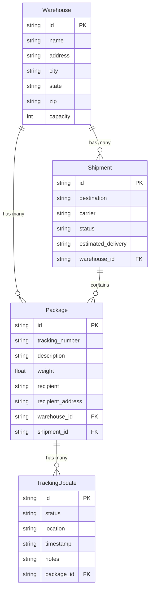
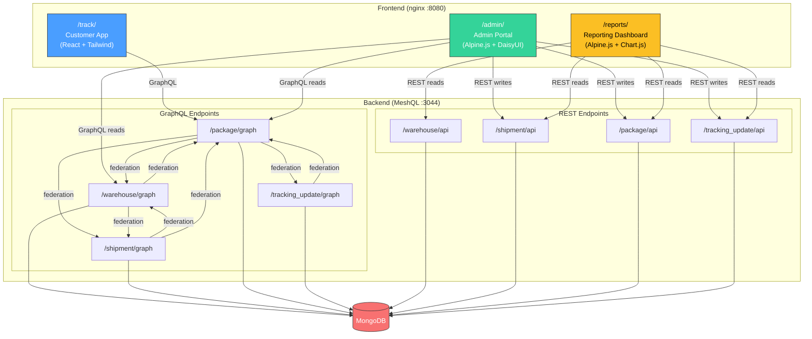
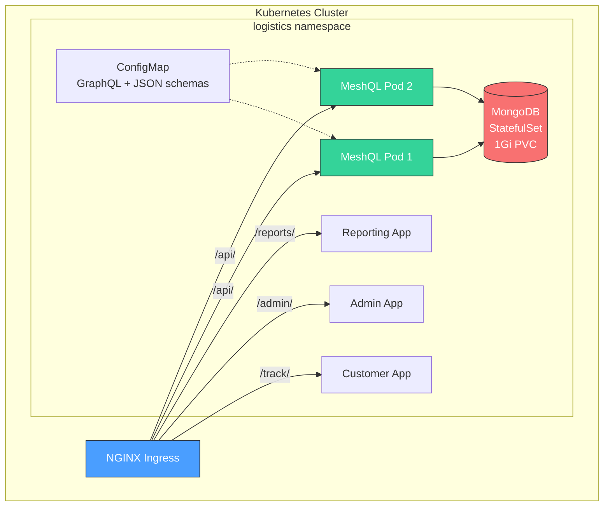

# Case Study: SwiftShip Logistics

SwiftShip is a full-stack package tracking system with **3 frontend applications**, **4 entities**, and **8 federation resolvers** — all powered by a single `Main.java`. It demonstrates what MeshQL looks like when multiple teams build different apps against the same data layer.

[View source on GitHub](https://github.com/tsmarsh/meshql/tree/main/examples/logistics){: .btn .btn-outline .mr-2 }
[Run with Docker Compose](#running-it){: .btn .btn-outline }

---

## The Problem

You're a logistics startup. Three teams need three applications this quarter: a **customer-facing tracking page**, an **admin portal** for warehouse operators, and a **reporting dashboard** for management. They all need the same underlying data — warehouses, shipments, packages, tracking updates — but they access it differently.

The customer app needs to look up a package by tracking number and get everything in one shot: the package details, which warehouse it shipped from, what shipment it's part of, and every tracking update along the way. That's a graph traversal across four entities.

The admin app needs to create packages, manage shipments, and add tracking updates — classic CRUD. But when operators view a warehouse dashboard, they want to see nested shipments and packages in a single read.

The reporting app doesn't care about relationships at all. It fetches flat lists of warehouses, shipments, packages, and tracking updates, then aggregates them client-side into charts.

Traditional choice: build a monolith (fast to ship, hard to split later) or invest in microservices infrastructure (slow to ship, teams block each other). **MeshQL eliminates that choice.** Four entities, eight endpoints, one JVM. Each entity is independently deployable from day one.

---

## Domain Model



Four entities, 8 federation resolvers connecting them. Package is the center — it links to Warehouse, Shipment, and TrackingUpdate.

---

## Architecture



Three frontends, one backend, one database. The backend exposes 4 GraphQL endpoints and 4 REST endpoints — 8 APIs total from a single Java process.

---

## One Backend, Three Apps

This is the centerpiece of the example. Three different teams built three different apps using three different frontend stacks, and none of them had to coordinate on the backend.

### Customer App: GraphQL-Heavy

The customer tracking page is a React + Tailwind app. When a customer enters a tracking number, the app fires a **single GraphQL query** that traverses all four entities:

```javascript
async function fetchPackage(trackingNumber) {
  const query = `{ getByTrackingNumber(tracking_number: "${trackingNumber}") {
    id description weight recipient recipient_address tracking_number
    shipment { id destination carrier status estimated_delivery }
    warehouse { id name city state }
    trackingUpdates { id status location timestamp notes }
  } }`

  const res = await fetch(`${API_BASE}/package/graph`, {
    method: 'POST',
    headers: { 'Content-Type': 'application/json' },
    body: JSON.stringify({ query })
  })
  const json = await res.json()
  return json.data.getByTrackingNumber
}
```

One request. Four entities. The response comes back fully assembled:

```json
{
  "data": {
    "getByTrackingNumber": {
      "id": "abc-123",
      "tracking_number": "PKG-DEN1A001",
      "description": "Electronics - Laptop",
      "weight": 8.5,
      "recipient": "Alice Johnson",
      "recipient_address": "100 Main St, Portland, OR 97201",
      "warehouse": {
        "name": "SwiftShip Denver Hub",
        "city": "Denver",
        "state": "CO"
      },
      "shipment": {
        "destination": "Portland, OR",
        "carrier": "FedEx",
        "status": "delivered"
      },
      "trackingUpdates": [
        { "status": "label_created", "location": "Denver, CO", "timestamp": "2026-01-15T08:00:00Z", "notes": "Shipping label created" },
        { "status": "picked_up", "location": "Denver, CO", "timestamp": "2026-01-15T14:00:00Z", "notes": "Package picked up by FedEx" },
        { "status": "in_transit", "location": "Salt Lake City, UT", "timestamp": "2026-01-17T10:00:00Z", "notes": "In transit through Salt Lake City" },
        { "status": "delivered", "location": "Portland, OR", "timestamp": "2026-01-20T14:30:00Z", "notes": "Delivered - signed by A. Johnson" }
      ]
    }
  }
}
```

Without federation, this would be 4 separate REST calls stitched together in JavaScript — fetch the package, then fetch its warehouse, then its shipment, then its tracking updates. With MeshQL, the graph resolves it all server-side.

### Admin App: REST for Writes, GraphQL for Reads

The admin portal uses Alpine.js + DaisyUI. It demonstrates the hybrid pattern that MeshQL enables: **REST for mutations, GraphQL for reads**.

**Writing data** — creating a package via REST:

```javascript
const pkg = await restPost('/package/api', {
    tracking_number: 'PKG-NEWPKG01',
    description: 'Fragile - Glassware',
    weight: 3.2,
    recipient: 'Bob Smith',
    recipient_address: '200 Oak Ave, Detroit, MI 48201',
    warehouse_id: warehouseId,
    shipment_id: shipmentId
});

// Create initial tracking update
await restPost('/tracking_update/api', {
    package_id: pkg.id,
    status: 'label_created',
    location: 'Denver, CO',
    timestamp: new Date().toISOString(),
    notes: 'Shipping label created'
});
```

**Reading data** — loading a warehouse dashboard with nested federation:

```javascript
const data = await graphqlQuery('/warehouse/graph', `{
    getById(id: "${warehouseId}") {
        id name city state
        shipments { id destination carrier status estimated_delivery }
        packages { id tracking_number description weight recipient }
    }
}`);
```

REST gives clear HTTP semantics for writes (POST = create, PUT = update, DELETE = delete). GraphQL gives a single request for complex reads. Each protocol does what it's good at.

### Reporting App: REST-Heavy

The reporting dashboard uses Alpine.js + Chart.js. It doesn't use GraphQL at all — it fetches flat lists via REST and aggregates client-side:

```javascript
const [warehouses, shipments, packages, updates] = await Promise.all([
    fetchAll('/warehouse/api'),
    fetchAll('/shipment/api'),
    fetchAll('/package/api'),
    fetchAll('/tracking_update/api')
]);
```

Then it computes statistics and renders charts: packages per warehouse, shipment status breakdown, packages by carrier, recent activity. MeshQL doesn't force you into GraphQL — the REST endpoints are always there for flat data access.

### Summary

| App | Stack | Protocol | Pattern | Key Operation |
|:----|:------|:---------|:--------|:--------------|
| **Customer** | React + Tailwind | GraphQL | Read-only, deep traversal | `getByTrackingNumber` across 4 entities |
| **Admin** | Alpine.js + DaisyUI | REST + GraphQL | REST writes, GraphQL reads | `POST /package/api` + federated dashboard |
| **Reporting** | Alpine.js + Chart.js | REST | Flat list reads, client-side aggregation | `GET /warehouse/api`, `/shipment/api`, etc. |

Three apps, three patterns, one backend. No coordination needed.

---

## The Backend

### GraphQL Schemas

Each entity defines its own GraphQL schema. Per MeshQL's federation model, each schema defines its own projections of foreign types — only the fields it needs.

**warehouse.graphql** — resolves its shipments and packages:
```graphql
scalar Date

type Query {
  getById(id: ID, at: Float): Warehouse
  getByCity(city: String, at: Float): [Warehouse]
  getByState(state: String, at: Float): [Warehouse]
}

type Warehouse {
  id: ID
  name: String!
  address: String!
  city: String!
  state: String!
  zip: String!
  capacity: Int
  shipments: [Shipment]    # Resolved via federation → /shipment/graph
  packages: [Package]      # Resolved via federation → /package/graph
}

type Shipment {             # Warehouse's projection of Shipment
  id: ID
  destination: String!
  carrier: String!
  status: String!
  estimated_delivery: String
}

type Package {              # Warehouse's projection of Package
  id: ID
  tracking_number: String!
  description: String!
  weight: Float
  recipient: String!
}
```

**shipment.graphql** — resolves its warehouse and packages:
```graphql
scalar Date

type Query {
  getById(id: ID, at: Float): Shipment
  getByWarehouse(id: ID, at: Float): [Shipment]
  getByStatus(status: String, at: Float): [Shipment]
  getByCarrier(carrier: String, at: Float): [Shipment]
}

type Shipment {
  id: ID
  destination: String!
  carrier: String!
  status: String!
  estimated_delivery: String
  warehouse_id: String
  warehouse: Warehouse      # Resolved via federation → /warehouse/graph
  packages: [Package]       # Resolved via federation → /package/graph
}

type Warehouse {             # Shipment's projection of Warehouse
  id: ID
  name: String!
  city: String!
  state: String!
}

type Package {               # Shipment's projection of Package
  id: ID
  tracking_number: String!
  description: String!
  weight: Float
  recipient: String!
}
```

**package.graphql** — the richest schema, links to 3 other entities:
```graphql
scalar Date

type Query {
  getById(id: ID, at: Float): Package
  getByTrackingNumber(tracking_number: String, at: Float): Package
  getByWarehouse(id: ID, at: Float): [Package]
  getByShipment(id: ID, at: Float): [Package]
  getByRecipient(recipient: String, at: Float): [Package]
}

type Package {
  id: ID
  tracking_number: String!
  description: String!
  weight: Float
  recipient: String!
  recipient_address: String!
  warehouse_id: String
  shipment_id: String
  warehouse: Warehouse          # Resolved via federation → /warehouse/graph
  shipment: Shipment            # Resolved via federation → /shipment/graph
  trackingUpdates: [TrackingUpdate]  # Resolved via federation → /tracking_update/graph
}

type Warehouse {
  id: ID
  name: String!
  city: String!
  state: String!
}

type Shipment {
  id: ID
  destination: String!
  carrier: String!
  status: String!
  estimated_delivery: String
}

type TrackingUpdate {
  id: ID
  status: String!
  location: String!
  timestamp: String!
  notes: String
}
```

**tracking_update.graphql** — resolves back to its package:
```graphql
scalar Date

type Query {
  getById(id: ID, at: Float): TrackingUpdate
  getByPackage(id: ID, at: Float): [TrackingUpdate]
}

type TrackingUpdate {
  id: ID
  status: String!
  location: String!
  timestamp: String!
  notes: String
  package_id: String
  package: Package          # Resolved via federation → /package/graph
}

type Package {               # TrackingUpdate's projection of Package
  id: ID
  tracking_number: String!
  description: String!
  weight: Float
  recipient: String!
}
```

Notice: `Warehouse`, `Shipment`, `Package`, and `TrackingUpdate` each appear in multiple schema files with different fields. This is intentional. Each entity defines its own projection of foreign types — only the fields it needs. No shared type library. No circular dependencies.

### JSON Schemas

REST validation uses JSON Schema v7. Each entity has strict validation — tracking numbers must match `^PKG-[A-Z0-9]{8}$`, carriers are restricted to `FedEx | UPS | USPS | DHL | Amazon`, states must be 2 characters, zip codes must be 5 digits.

<details>
<summary>warehouse.schema.json</summary>

```json
{
    "type": "object",
    "additionalProperties": false,
    "required": ["name", "address", "city", "state", "zip"],
    "properties": {
        "id":       { "type": "string", "format": "uuid" },
        "name":     { "type": "string" },
        "address":  { "type": "string" },
        "city":     { "type": "string" },
        "state":    { "type": "string", "minLength": 2, "maxLength": 2 },
        "zip":      { "type": "string", "pattern": "^[0-9]{5}$" },
        "capacity": { "type": "integer", "minimum": 0 }
    }
}
```
</details>

<details>
<summary>shipment.schema.json</summary>

```json
{
    "type": "object",
    "additionalProperties": false,
    "required": ["destination", "carrier", "status", "warehouse_id"],
    "properties": {
        "id":                 { "type": "string", "format": "uuid" },
        "destination":        { "type": "string" },
        "carrier":            { "type": "string", "enum": ["FedEx", "UPS", "USPS", "DHL", "Amazon"] },
        "status":             { "type": "string", "enum": ["preparing", "in_transit", "out_for_delivery", "delivered", "delayed", "cancelled"] },
        "estimated_delivery": { "type": "string", "format": "date" },
        "warehouse_id":       { "type": "string", "format": "uuid" }
    }
}
```
</details>

<details>
<summary>package.schema.json</summary>

```json
{
    "type": "object",
    "additionalProperties": false,
    "required": ["tracking_number", "description", "weight", "recipient", "recipient_address", "warehouse_id", "shipment_id"],
    "properties": {
        "id":                { "type": "string", "format": "uuid" },
        "tracking_number":   { "type": "string", "pattern": "^PKG-[A-Z0-9]{8}$" },
        "description":       { "type": "string" },
        "weight":            { "type": "number", "minimum": 0.1 },
        "recipient":         { "type": "string" },
        "recipient_address": { "type": "string" },
        "warehouse_id":      { "type": "string", "format": "uuid" },
        "shipment_id":       { "type": "string", "format": "uuid" }
    }
}
```
</details>

<details>
<summary>tracking_update.schema.json</summary>

```json
{
    "type": "object",
    "additionalProperties": false,
    "required": ["status", "location", "timestamp", "package_id"],
    "properties": {
        "id":         { "type": "string", "format": "uuid" },
        "status":     { "type": "string", "enum": ["label_created", "picked_up", "arrived_at_facility", "departed_facility", "in_transit", "out_for_delivery", "delivered", "delivery_attempted", "exception", "returned_to_sender"] },
        "location":   { "type": "string" },
        "timestamp":  { "type": "string", "format": "date-time" },
        "notes":      { "type": "string" },
        "package_id": { "type": "string", "format": "uuid" }
    }
}
```
</details>

### Server Configuration (Main.java)

The entire backend — 4 graphlettes, 4 restlettes, 8 federation resolvers — is configured in a single file:

```java
package com.meshql.examples.logistics;

import com.meshql.auth.noop.NoAuth;
import com.meshql.core.Auth;
import com.meshql.core.Config;
import com.meshql.core.Plugin;
import com.meshql.core.config.*;
import com.meshql.repositories.mongo.MongoConfig;
import com.meshql.repositories.mongo.MongoPlugin;
import com.meshql.server.Server;
import com.networknt.schema.JsonSchema;
import com.networknt.schema.JsonSchemaFactory;
import com.networknt.schema.SpecVersion;
import com.fasterxml.jackson.databind.JsonNode;
import com.fasterxml.jackson.databind.ObjectMapper;
import org.slf4j.Logger;
import org.slf4j.LoggerFactory;

import java.io.File;
import java.util.*;

public class Main {
    private static final Logger logger = LoggerFactory.getLogger(Main.class);

    public static void main(String[] args) throws Exception {
        // Read environment variables with defaults
        String mongoUri = getEnv("MONGO_URI", "mongodb://localhost:27017");
        String prefix = getEnv("PREFIX", "logistics");
        String env = getEnv("ENV", "development");
        int port = Integer.parseInt(getEnv("PORT", "3044"));
        String platformUrl = getEnv("PLATFORM_URL", "http://localhost:" + port);

        // Create storage configs for each collection
        MongoConfig warehouseDB = createMongoConfig(mongoUri, prefix, env, "warehouse");
        MongoConfig shipmentDB = createMongoConfig(mongoUri, prefix, env, "shipment");
        MongoConfig packageDB = createMongoConfig(mongoUri, prefix, env, "package");
        MongoConfig trackingUpdateDB = createMongoConfig(mongoUri, prefix, env, "tracking_update");

        // Build config using fluent builders
        Config config = Config.builder()
                .port(port)
                // Warehouse graphlette
                .graphlette(GraphletteConfig.builder()
                        .path("/warehouse/graph")
                        .storage(warehouseDB)
                        .schema("/app/config/graph/warehouse.graphql")
                        .rootConfig(RootConfig.builder()
                                .singleton("getById", "{\"id\": \"{{id}}\"}")
                                .vector("getByCity", "{\"payload.city\": \"{{city}}\"}")
                                .vector("getByState", "{\"payload.state\": \"{{state}}\"}")
                                .vectorResolver("shipments", null, "getByWarehouse",
                                        platformUrl + "/shipment/graph")
                                .vectorResolver("packages", null, "getByWarehouse",
                                        platformUrl + "/package/graph")))
                // Shipment graphlette
                .graphlette(GraphletteConfig.builder()
                        .path("/shipment/graph")
                        .storage(shipmentDB)
                        .schema("/app/config/graph/shipment.graphql")
                        .rootConfig(RootConfig.builder()
                                .singleton("getById", "{\"id\": \"{{id}}\"}")
                                .vector("getByWarehouse",
                                        "{\"payload.warehouse_id\": \"{{id}}\"}")
                                .vector("getByStatus", "{\"payload.status\": \"{{status}}\"}")
                                .vector("getByCarrier",
                                        "{\"payload.carrier\": \"{{carrier}}\"}")
                                .singletonResolver("warehouse", "warehouse_id", "getById",
                                        platformUrl + "/warehouse/graph")
                                .vectorResolver("packages", null, "getByShipment",
                                        platformUrl + "/package/graph")))
                // Package graphlette — 3 resolvers (warehouse, shipment, trackingUpdates)
                .graphlette(GraphletteConfig.builder()
                        .path("/package/graph")
                        .storage(packageDB)
                        .schema("/app/config/graph/package.graphql")
                        .rootConfig(RootConfig.builder()
                                .singleton("getById", "{\"id\": \"{{id}}\"}")
                                .singleton("getByTrackingNumber",
                                        "{\"payload.tracking_number\": \"{{tracking_number}}\"}")
                                .vector("getByWarehouse",
                                        "{\"payload.warehouse_id\": \"{{id}}\"}")
                                .vector("getByShipment",
                                        "{\"payload.shipment_id\": \"{{id}}\"}")
                                .vector("getByRecipient",
                                        "{\"payload.recipient\": {\"$regex\": \"{{recipient}}\", \"$options\": \"i\"}}")
                                .singletonResolver("warehouse", "warehouse_id", "getById",
                                        platformUrl + "/warehouse/graph")
                                .singletonResolver("shipment", "shipment_id", "getById",
                                        platformUrl + "/shipment/graph")
                                .vectorResolver("trackingUpdates", null, "getByPackage",
                                        platformUrl + "/tracking_update/graph")))
                // Tracking Update graphlette
                .graphlette(GraphletteConfig.builder()
                        .path("/tracking_update/graph")
                        .storage(trackingUpdateDB)
                        .schema("/app/config/graph/tracking_update.graphql")
                        .rootConfig(RootConfig.builder()
                                .singleton("getById", "{\"id\": \"{{id}}\"}")
                                .vector("getByPackage",
                                        "{\"payload.package_id\": \"{{id}}\"}")
                                .singletonResolver("package", "package_id", "getById",
                                        platformUrl + "/package/graph")))
                // Restlettes — one per entity
                .restlette(RestletteConfig.builder()
                        .path("/warehouse/api").port(port).storage(warehouseDB)
                        .schema(loadJsonSchema("/app/config/json/warehouse.schema.json")))
                .restlette(RestletteConfig.builder()
                        .path("/shipment/api").port(port).storage(shipmentDB)
                        .schema(loadJsonSchema("/app/config/json/shipment.schema.json")))
                .restlette(RestletteConfig.builder()
                        .path("/package/api").port(port).storage(packageDB)
                        .schema(loadJsonSchema("/app/config/json/package.schema.json")))
                .restlette(RestletteConfig.builder()
                        .path("/tracking_update/api").port(port).storage(trackingUpdateDB)
                        .schema(loadJsonSchema("/app/config/json/tracking_update.schema.json")))
                .build();

        // Create authentication and register plugins
        Auth auth = new NoAuth();
        Map<String, Plugin> plugins = new HashMap<>();
        plugins.put("mongo", new MongoPlugin(auth));

        // Create and initialize the server
        Server server = new Server(plugins);
        server.init(config);
    }

    private static MongoConfig createMongoConfig(
            String uri, String prefix, String env, String entity) {
        MongoConfig config = new MongoConfig();
        config.uri = uri;
        config.db = prefix + "_" + env;
        config.collection = prefix + "-" + env + "-" + entity;
        return config;
    }

    // ...
}
```

The key line is `platformUrl`. In development, it points to `http://localhost:3044`. In Docker Compose, it becomes `http://meshql:3044`. In Kubernetes, it becomes `http://meshql.logistics.svc.cluster.local:3044`. **No code changes** — just an environment variable.

### Federation Map

All 8 resolvers at a glance:

| Source Entity | Field | Type | Target Query | Target Endpoint |
|:-------------|:------|:-----|:-------------|:----------------|
| Warehouse | `shipments` | Vector | `getByWarehouse` | `/shipment/graph` |
| Warehouse | `packages` | Vector | `getByWarehouse` | `/package/graph` |
| Shipment | `warehouse` | Singleton | `getById` | `/warehouse/graph` |
| Shipment | `packages` | Vector | `getByShipment` | `/package/graph` |
| Package | `warehouse` | Singleton | `getById` | `/warehouse/graph` |
| Package | `shipment` | Singleton | `getById` | `/shipment/graph` |
| Package | `trackingUpdates` | Vector | `getByPackage` | `/tracking_update/graph` |
| TrackingUpdate | `package` | Singleton | `getById` | `/package/graph` |

Singleton resolvers use the entity's foreign key (e.g., `warehouse_id`) to look up a single related object. Vector resolvers use the entity's own `id` to find all related objects (e.g., "find all shipments where `warehouse_id` matches this warehouse's `id`").

---

## Running It

### Docker Compose (Development)

```bash
cd examples/logistics
docker compose up
```

This starts 7 services:

| Service | Purpose |
|:--------|:--------|
| `mongodb` | Data store with health checks |
| `meshql` | MeshQL server — 4 graphlettes + 4 restlettes on port 3044 |
| `customer-app` | React tracking app |
| `admin-app` | Alpine.js admin portal |
| `reporting-app` | Alpine.js + Chart.js dashboard |
| `nginx` | Reverse proxy routing on port 8080 |
| `seed` | Populates demo data (3 warehouses, 6 shipments, 12 packages, tracking updates) |

Once running, open:

| URL | App |
|:----|:----|
| `http://localhost:8080/track/` | Customer tracking page |
| `http://localhost:8080/admin/` | Admin portal |
| `http://localhost:8080/reports/` | Reporting dashboard |
| `http://localhost:8080/api/` | MeshQL API (direct access) |

Try tracking number `PKG-DEN1A001` in the customer app — it shows a full delivery lifecycle from Denver to Portland.

### Kubernetes (Production)

The same application deploys to Kubernetes with no code changes.



The MeshQL deployment runs 2 replicas with health checks and resource limits:

```yaml
# k8s/meshql/deployment.yaml (excerpt)
spec:
  replicas: 2
  template:
    spec:
      containers:
        - name: meshql
          image: logistics-meshql:latest
          env:
            - name: MONGO_URI
              value: "mongodb://mongodb.logistics.svc.cluster.local:27017/logistics_db"
            - name: PLATFORM_URL
              value: "http://meshql.logistics.svc.cluster.local:3044"
          livenessProbe:
            httpGet:
              path: /ready
              port: 3044
          readinessProbe:
            httpGet:
              path: /ready
              port: 3044
          resources:
            requests:
              memory: 256Mi
              cpu: 250m
            limits:
              memory: 512Mi
              cpu: 500m
      volumes:
        - name: schemas
          configMap:
            name: meshql-schemas
```

The only difference from Docker Compose: `PLATFORM_URL` changes from `http://meshql:3044` to `http://meshql.logistics.svc.cluster.local:3044`. Same `Main.java`. Same Docker image. Same schemas.

The full Kubernetes manifests include: namespace, MongoDB StatefulSet with persistent storage, ConfigMap for schemas, 3 frontend deployments, NGINX Ingress routing, and a seed Job.

[View Kubernetes manifests on GitHub](https://github.com/tsmarsh/meshql/tree/main/examples/logistics/k8s){: .btn .btn-outline }

---

## Testing It

The example includes 13 Cucumber scenarios covering REST CRUD, GraphQL queries, and federation resolution. The highlight is the "full customer journey" scenario — it does exactly what the customer app does, but asserts every field:

```gherkin
Scenario: Full customer journey — tracking number lookup returns complete data
  When I query the package graph with full federation for "PKG-BDDTEST1"
  Then the GraphQL result "tracking_number" should be "PKG-BDDTEST1"
  And the GraphQL result "recipient" should be "Jane Doe"
  And the GraphQL result "weight" should be 5.5
  And the nested "warehouse" field "state" should be "CO"
  And the nested "shipment" field "status" should be "in_transit"
  And the nested "trackingUpdates" should contain an item with "status" equal to "label_created"
  And the nested "trackingUpdates" should contain an item with "status" equal to "picked_up"
  And the nested "trackingUpdates" should contain an item with "status" equal to "departed_facility"
  And the nested "trackingUpdates" should contain an item with "status" equal to "in_transit"
  And the nested "trackingUpdates" should contain an item with "location" equal to "Salt Lake City, UT"
```

One tracking number lookup. The assertion verifies that data from all four entities — Package, Warehouse, Shipment, and TrackingUpdate — arrives correctly through federation.

```bash
cd examples/logistics
mvn test
```

---

## What This Demonstrates

This example maps directly to MeshQL's value propositions:

- **MVP to scale, no rewrites** — The same `Main.java` runs in Docker Compose (one replica) and Kubernetes (two replicas with health checks). Scaling is a deployment change, not a code change.

- **Independent teams** — Three frontend teams built three apps with three different stacks (React, Alpine.js, Alpine.js + Chart.js). None of them coordinated on the backend. None of them blocked each other.

- **REST for writes, GraphQL for reads** — The admin app demonstrates this pattern directly: `POST /package/api` to create, GraphQL federation to read the warehouse dashboard. The customer app is pure GraphQL reads. The reporting app is pure REST reads.

- **Every entity is a data product** — Each entity has its own storage, its own schema, its own REST endpoint, its own GraphQL endpoint. Warehouse doesn't know about Package's recipient address. TrackingUpdate doesn't know about Shipment's carrier. Each entity exposes what it owns.

- **Loose contracts, independent teams** — Package defines its own projection of Warehouse (`id`, `name`, `city`, `state`). Warehouse defines its own projection of Package (`id`, `tracking_number`, `description`, `weight`, `recipient`). No shared type library. If Warehouse adds a `phone_number` field tomorrow, Package doesn't need to change.

[Back to Examples](/meshql/examples){: .btn .btn-outline }
