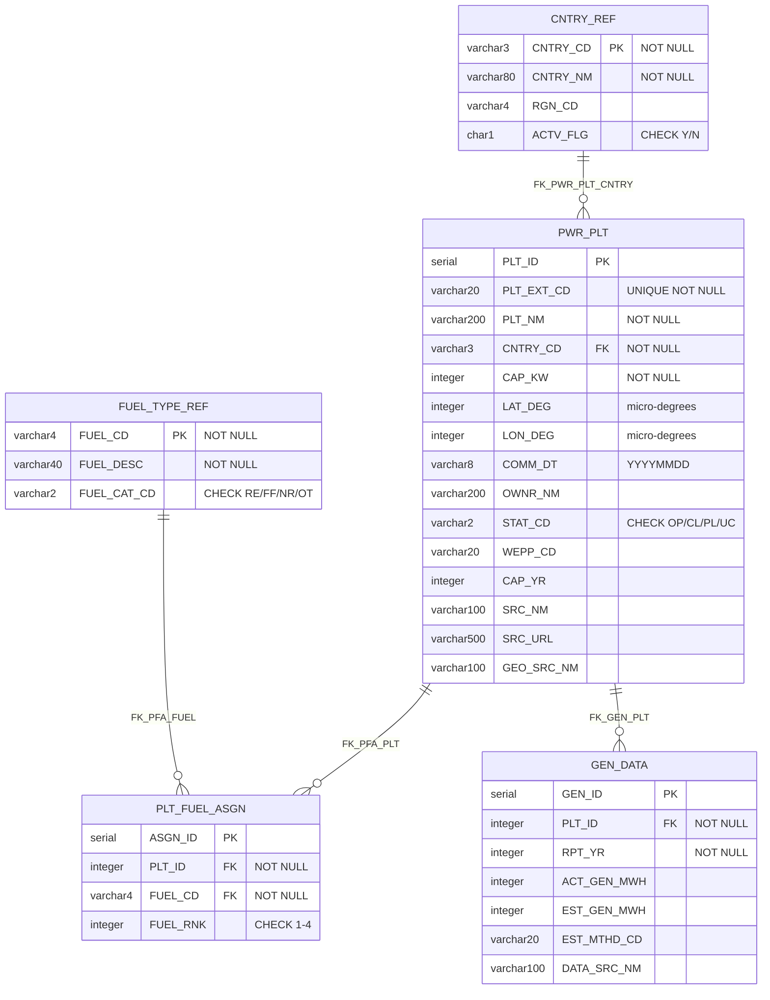
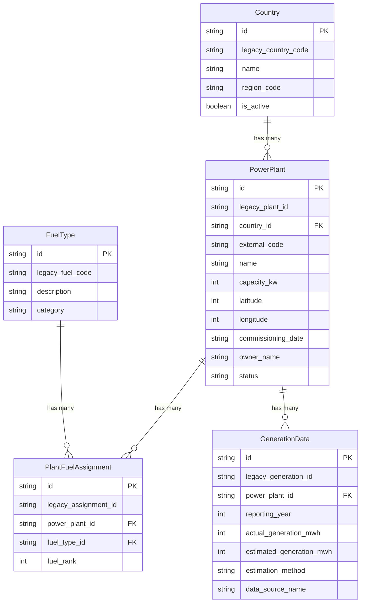
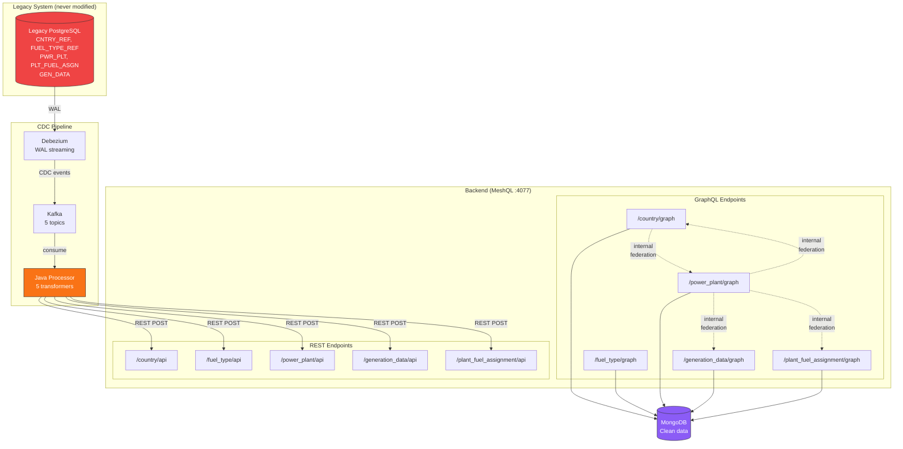
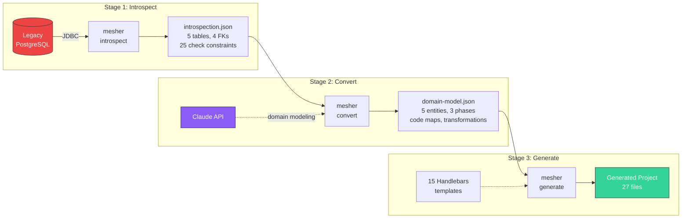
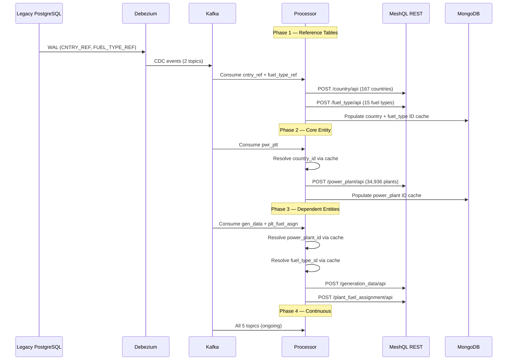

# Case Study: Global Power Plants

This example demonstrates **Mesher** — the MeshQL code generation tool — by pointing it at a legacy energy database containing 34,936 real power plants across 167 countries and generating a complete anti-corruption layer in ~60 seconds. The legacy PostgreSQL database with `PWR_PLT`, `CAP_KW`, `STAT_CD`, `COMM_DT` as VARCHAR(8), and coordinates stored as micro-degrees gets transformed into clean domain entities via CDC — and the legacy database is **never modified**.

[View source on GitHub](https://github.com/tailoredshapes/meshql/tree/main/mesher/demo){: .btn .btn-outline .mr-2 }
[Run with Docker Compose](#running-it){: .btn .btn-outline }

---

## The Problem

You inherit a legacy energy management database. Five tables: `CNTRY_REF`, `FUEL_TYPE_REF`, `PWR_PLT`, `PLT_FUEL_ASGN`, `GEN_DATA`. Column names like `CAP_KW`, `COMM_DT`, `OWNR_NM`, `FUEL_CAT_CD`. Status codes are two-character abbreviations — `OP` for operating, `CL` for closed, `UC` for under construction. Commissioning dates are stored as VARCHAR(8) in YYYYMMDD format. Geographic coordinates are stored as micro-degrees (integer, x1,000,000). Fuel categories are two-letter codes — `RE` for renewable, `FF` for fossil fuel. Active flags are single characters — `Y` or `N`.

The database works. It has 34,936 power plants from the World Resources Institute's Global Power Plant Database. Nobody's touching it.

But your new applications need `power_plant.name`, ISO dates, `status: "Operating"`, `category: "Renewable"`, and `is_active: true`. The legacy data model shouldn't leak into the clean domain.

The [Springfield Electric](legacy) example showed how to **hand-build** an anti-corruption layer with MeshQL — 4 entities, 4 transformers, 8 federation resolvers, all written by hand. It took days.

**Mesher approach**: Point mesher at the legacy database. It introspects the schema, sends the structure to Claude for domain modeling, and generates the entire MeshQL service — 5 graphlettes, 5 restlettes, 8 federation resolvers, 5 transformers, a phased CDC processor, Docker Compose, and all config files. ~60 seconds.

---

## What Gets Transformed

| Legacy | Clean | Transformation |
|:-------|:------|:---------------|
| `PWR_PLT.PLT_NM: "ITAIPU"` | `name: "Itaipu"` | Title case |
| `PWR_PLT.COMM_DT: "19840505"` | `commissioning_date: "1984-05-05"` | YYYYMMDD → ISO 8601 |
| `PWR_PLT.STAT_CD: "OP"` | `status: "Operating"` | Code → word |
| `PWR_PLT.OWNR_NM: "ITAIPU BINACIONAL"` | `owner_name: "Itaipu Binacional"` | Title case |
| `FUEL_TYPE_REF.FUEL_CAT_CD: "RE"` | `category: "Renewable"` | Code → word |
| `CNTRY_REF.ACTV_FLG: "Y"` | `is_active: true` | Char → boolean |
| `CNTRY_REF.CNTRY_NM: "BRAZIL"` | `name: "Brazil"` | Title case |
| `FUEL_TYPE_REF.FUEL_DESC: "HYDRO"` | `description: "Hydro"` | Title case |

Every transformation was **inferred by Claude** from the legacy schema's check constraints and column types, then generated as code by Mesher.

---

## Legacy ER Diagram



Five tables. Abbreviated everything. `CNTRY_CD`, `FUEL_CAT_CD`, `PLT_EXT_CD`, `COMM_DT`, `STAT_CD`, `FUEL_RNK`. Check constraints enforce code values (`OP`/`CL`/`PL`/`UC`, `RE`/`FF`/`NR`/`OT`, `Y`/`N`). Coordinates stored as integers. Dates stored as strings.

---

## Clean Domain Model



Same 5 entities, readable names. `CNTRY_REF` → `Country`. `PWR_PLT` → `PowerPlant`. `PLT_FUEL_ASGN` → `PlantFuelAssignment`. `FUEL_TYPE_REF` → `FuelType`. `GEN_DATA` → `GenerationData`. Every field has a clean name. Status codes are words. Flags are booleans. Dates are ISO 8601.

---

## Architecture



The legacy PostgreSQL database sits on the left — never modified, never queried by the new system. Debezium streams WAL changes through Kafka. The Java processor transforms legacy data into clean domain objects and POSTs them to MeshQL's REST API. Clean data lands in MongoDB, queryable via GraphQL with full federation.

All federation uses **internal resolvers** — federation happens inside the JVM with direct method calls, not HTTP. This entire backend was **generated by Mesher**, not hand-written.

---

## The Mesher Pipeline



Three stages, each producing an inspectable intermediate artifact:

1. **Introspect** — JDBC connects to the legacy database, extracts tables, columns, primary keys, foreign keys, check constraints, and unique constraints. Produces `introspection.json`.

2. **Convert** — Sends the introspection data to Claude, which infers clean entity names, field names, transformation types (titleCase, parseDate, codeMap, flagToBoolean), code map values from check constraints (`OP` → `Operating`, `RE` → `Renewable`), relationship topology, and processing phase ordering. Produces `domain-model.json`.

3. **Generate** — Runs the domain model through 15 Handlebars templates to produce a complete MeshQL project: Java source, GraphQL schemas, JSON schemas, Docker Compose, Dockerfile, Debezium config, and Veriforged test configs.

**What Mesher automates vs. what was hand-built in Springfield Electric**: The Springfield Electric example required manually writing 4 transformer classes, 4 GraphQL schemas, 4 JSON schemas, the Main.java server config, the processor, the ID resolver, Docker Compose, and all relationship wiring. Mesher generates all of this from the database schema.

---

## Phased CDC Processing



The processor runs in **phases** to handle foreign key dependencies:

- **Phase 1**: Consume `CNTRY_REF` and `FUEL_TYPE_REF` topics. Transform and POST. Then query GraphQL to populate ID caches (legacy country code → MeshQL UUID, legacy fuel code → MeshQL UUID).
- **Phase 2**: Consume `PWR_PLT` topic. For each plant, resolve `country_id` from the country cache. Transform and POST. Populate the power plant ID cache.
- **Phase 3**: Consume `GEN_DATA` and `PLT_FUEL_ASGN` topics. Resolve `power_plant_id` and `fuel_type_id` from caches. Transform and POST.
- **Phase 4**: Continuous consumption of all 5 topics for ongoing changes.

Each phase drains its topics completely before moving to the next. After each phase, the processor queries GraphQL `getAll` to discover the mapping between legacy IDs and MeshQL entity IDs.

---

## Generated Code Walkthrough

All code below was **generated by Mesher** — not hand-written.

### PowerPlantTransformer.java

The most complex transformer — title case, date parsing, code map, and FK resolution:

```java
public class PowerPlantTransformer implements LegacyTransformer {
    private static final Map<String, String> STATUS_MAP = Map.of(
            "OP", "Operating",
            "CL", "Closed",
            "PL", "Planned",
            "UC", "Under Construction"
    );

    private final IdResolver idResolver;

    @Override
    public ObjectNode transform(JsonNode row) {
        ObjectNode clean = mapper.createObjectNode();

        // Preserve legacy ID for FK resolution
        if (row.has("plt_id") && !row.get("plt_id").isNull()) {
            clean.put("legacy_plant_id", row.get("plt_id").asText());
        }

        // Resolve parent FK: country (legacy column: cntry_cd)
        if (row.has("cntry_cd") && !row.get("cntry_cd").isNull()) {
            String legacyParentId = row.get("cntry_cd").asText();
            String meshqlId = idResolver.resolveCountryId(legacyParentId);
            if (meshqlId != null) {
                clean.put("country_id", meshqlId);
            }
        }

        putIfPresent(clean, "name", titleCase(textOrNull(row, "plt_nm")));
        putIfPresent(clean, "commissioning_date", parseDate(textOrNull(row, "comm_dt")));
        putIfPresent(clean, "owner_name", titleCase(textOrNull(row, "ownr_nm")));
        clean.put("status", STATUS_MAP.getOrDefault(
                textOrNull(row, "stat_cd"), "unknown"));
        // ... capacity_kw, latitude, longitude, etc.

        return clean;
    }
}
```

### power_plant.graphql

The GraphQL schema with federation fields — querying a power plant also resolves its country, generation data, and fuel assignments:

```graphql
scalar Date

type Query {
  getById(id: ID, at: Float): PowerPlant
  getAll(at: Float): [PowerPlant]
  getByCountry(id: ID, at: Float): [PowerPlant]
  getByStatus(id: ID, at: Float): [PowerPlant]
}

type PowerPlant {
  id: ID
  legacy_plant_id: String
  external_code: String!
  name: String!
  capacity_kw: Int!
  latitude: Int
  longitude: Int
  commissioning_date: String
  owner_name: String
  status: String!
  country_id: ID
  generation_data: [GenerationData]    # Internal federation → /generation_data/graph
  fuel_assignments: [PlantFuelAssignment]  # Internal federation → /plant_fuel_assignment/graph
  country: Country                     # Internal federation → /country/graph
}
```

### Main.java (excerpt)

5 graphlettes, 5 restlettes, 8 internal federation resolvers — all configured in one generated file:

```java
Config config = Config.builder()
    .port(port)
    // PowerPlant graphlette — resolves to 3 other entities
    .graphlette(GraphletteConfig.builder()
        .path("/power_plant/graph")
        .storage(powerPlantDB)
        .schema("/app/config/graph/power_plant.graphql")
        .rootConfig(RootConfig.builder()
            .singleton("getById", "{\"id\": \"{{id}}\"}")
            .vector("getAll", "{}")
            .vector("getByCountry", "{\"payload.country_id\": \"{{id}}\"}")
            .vector("getByStatus", "{\"payload.status\": \"{{status}}\"}")
            .internalVectorResolver("generation_data", null,
                "getByPowerPlant", "/generation_data/graph")
            .internalVectorResolver("fuel_assignments", null,
                "getByPowerPlant", "/plant_fuel_assignment/graph")
            .internalSingletonResolver("country", "country_id",
                "getById", "/country/graph")))
    // ... 4 more graphlettes, 5 restlettes
    .build();
```

---

## Federation Map

All 8 internal resolvers at a glance:

| Source Entity | Field | Type | Target Query | Target Endpoint |
|:-------------|:------|:-----|:-------------|:----------------|
| Country | `power_plants` | Internal Vector | `getByCountry` | `/power_plant/graph` |
| FuelType | `plant_fuel_assignments` | Internal Vector | `getByFuelType` | `/plant_fuel_assignment/graph` |
| PowerPlant | `country` | Internal Singleton | `getById` | `/country/graph` |
| PowerPlant | `generation_data` | Internal Vector | `getByPowerPlant` | `/generation_data/graph` |
| PowerPlant | `fuel_assignments` | Internal Vector | `getByPowerPlant` | `/plant_fuel_assignment/graph` |
| GenerationData | `power_plant` | Internal Singleton | `getById` | `/power_plant/graph` |
| PlantFuelAssignment | `power_plant` | Internal Singleton | `getById` | `/power_plant/graph` |
| PlantFuelAssignment | `fuel_type` | Internal Singleton | `getById` | `/fuel_type/graph` |

All resolvers are internal — federation happens inside the JVM. PowerPlant is the center — it links to Country (parent), GenerationData (children), and PlantFuelAssignment (children). PlantFuelAssignment is the junction table connecting PowerPlant and FuelType (many-to-many).

---

## Generated File Tree

Mesher generates 27 files — a complete, runnable MeshQL project:

```
generated-project/
├── pom.xml                                         # Maven build with MeshQL dependencies
├── Dockerfile                                      # Multi-stage: Maven build → JRE runtime
├── docker-compose.yml                              # Full stack: Postgres, MongoDB, Kafka, Debezium, app
├── nginx.conf                                      # Reverse proxy with /api/ prefix stripping
│
├── config/
│   ├── graph/
│   │   ├── country.graphql                         # Country type + power_plants federation
│   │   ├── fuel_type.graphql                       # FuelType type + plant_fuel_assignments federation
│   │   ├── power_plant.graphql                     # PowerPlant type + 3 federation fields
│   │   ├── generation_data.graphql                 # GenerationData type + power_plant federation
│   │   └── plant_fuel_assignment.graphql           # PlantFuelAssignment + power_plant + fuel_type
│   └── json/
│       ├── country.schema.json                     # REST validation: name, region_code, is_active
│       ├── fuel_type.schema.json                   # REST validation: description, category
│       ├── power_plant.schema.json                 # REST validation: 13 fields
│       ├── generation_data.schema.json             # REST validation: year, mwh, method
│       └── plant_fuel_assignment.schema.json       # REST validation: fuel_rank
│
├── debezium/
│   └── application.properties                      # CDC connector: PostgreSQL → Kafka, 5 tables
│
├── legacy-db/
│   └── init.sql                                    # Original DDL + REPLICA IDENTITY FULL
│
├── src/main/java/com/meshql/examples/legacy/
│   ├── Main.java                                   # Server: 5 graphlettes, 5 restlettes, 8 resolvers
│   ├── LegacyTransformer.java                      # Interface: ObjectNode transform(JsonNode)
│   ├── CountryTransformer.java                     # titleCase, flagToBoolean
│   ├── FuelTypeTransformer.java                    # titleCase, codeMap (RE→Renewable)
│   ├── PowerPlantTransformer.java                  # titleCase, parseDate, codeMap, FK resolution
│   ├── GenerationDataTransformer.java              # direct (integers), FK resolution
│   ├── PlantFuelAssignmentTransformer.java         # direct, dual FK resolution (plant + fuel)
│   ├── LegacyToCleanProcessor.java                 # Kafka consumer, 3-phase processing
│   └── IdResolver.java                             # ConcurrentHashMap caches, GraphQL population
│
└── veriforged/
    ├── schema.pl                                   # Prolog schema for test data generation
    └── gen.toml                                    # Veriforged configuration
```

---

## Running It

### 1. Start the Legacy Database

```bash
cd mesher/demo
docker compose up -d
```

This starts PostgreSQL 16 on port 5434 and loads the WRI dataset (34,936 plants, 167 countries, 15 fuel types) via the Python ETL script.

**Note**: The CSV file (`global_power_plant_database.csv`) must be downloaded separately — it's too large for git. See the [WRI dataset page](https://datasets.wri.org/dataset/globalpowerplantdatabase).

### 2. Explore the Legacy Schema

```bash
psql -h localhost -p 5434 -U postgres -d power_plants

# Check row counts
SELECT 'CNTRY_REF' AS tbl, COUNT(*) FROM CNTRY_REF
UNION ALL SELECT 'FUEL_TYPE_REF', COUNT(*) FROM FUEL_TYPE_REF
UNION ALL SELECT 'PWR_PLT', COUNT(*) FROM PWR_PLT
UNION ALL SELECT 'PLT_FUEL_ASGN', COUNT(*) FROM PLT_FUEL_ASGN
UNION ALL SELECT 'GEN_DATA', COUNT(*) FROM GEN_DATA;

# See the ugly legacy columns
SELECT PLT_NM, CNTRY_CD, CAP_KW, STAT_CD, COMM_DT FROM PWR_PLT LIMIT 5;
```

### 3. Run Mesher

```bash
# Build mesher (from meshql root)
mvn package -pl mesher -DskipTests

# Option A: All-in-one
export ANTHROPIC_API_KEY=sk-ant-...
java -jar mesher/target/mesher-0.2.0.jar run \
    --jdbc-url jdbc:postgresql://localhost:5434/power_plants \
    --username postgres --password postgres \
    --project-name global-power-plants \
    --port 4077 \
    --output ./generated-power-plants

# Option B: Step by step (inspect intermediate files)
java -jar mesher/target/mesher-0.2.0.jar introspect \
    --jdbc-url jdbc:postgresql://localhost:5434/power_plants \
    --username postgres --password postgres \
    --output introspection.json

# Look at what was introspected
cat introspection.json | python3 -m json.tool | head -50

java -jar mesher/target/mesher-0.2.0.jar convert introspection.json \
    --project-name global-power-plants \
    --port 4077 \
    --output domain-model.json

# Review and edit the domain model
cat domain-model.json | python3 -m json.tool | head -80

java -jar mesher/target/mesher-0.2.0.jar generate domain-model.json \
    --output ./generated-power-plants
```

### 4. Examine the Generated Project

```bash
find generated-power-plants -type f | sort
```

You'll see a complete MeshQL project: GraphQL schemas with clean field names, JSON schemas for REST validation, Java transformers that convert `PLT_NM` → `name`, `STAT_CD` → `status`, `COMM_DT` → `commissioning_date`, a CDC processor with phased FK resolution, Docker Compose for the full stack, and everything ready to `docker compose up`.

### 5. Clean Up

```bash
docker compose down -v
```

---

## What This Demonstrates

- **Mesher automation** — What took days to hand-build for Springfield Electric (4 entities, 4 transformers, 8 resolvers, Docker Compose, GraphQL schemas, JSON schemas, processor, ID resolver), Mesher generates in ~60 seconds for a more complex schema (5 entities, 5 transformers, 8 resolvers).

- **Real-world scale** — 34,936 power plants across 167 countries, not 4 seed rows. The generated CDC processor handles the full dataset through phased processing.

- **Complex FK topology** — 5 tables, 3 processing phases, a many-to-many relationship via junction table (`PLT_FUEL_ASGN` connects `PWR_PLT` to `FUEL_TYPE_REF`), and dual FK resolution in the junction table transformer.

- **Multiple transformation types** — `direct` (integers, strings), `titleCase` (names), `parseDate` (YYYYMMDD → ISO 8601), `flagToBoolean` (Y/N → true/false), `codeMap` (OP → Operating, RE → Renewable).

- **Code map inference** — Claude reads the check constraints (`STAT_CD IN ('OP', 'CL', 'PL', 'UC')`, `FUEL_CAT_CD IN ('RE', 'FF', 'NR', 'OT')`) and infers the full code-to-word mappings. The developer doesn't need to provide a data dictionary.

- **Inspectable pipeline** — Each stage produces a JSON file you can inspect and edit before proceeding. Don't like what Claude named a field? Edit `domain-model.json` and re-run `generate`.

---

## Dataset Attribution

> Global Power Plant Database, Version 1.3.0. World Resources Institute.
> Available at: [https://datasets.wri.org/dataset/globalpowerplantdatabase](https://datasets.wri.org/dataset/globalpowerplantdatabase)
>
> Licensed under [Creative Commons Attribution 4.0 International (CC BY 4.0)](https://creativecommons.org/licenses/by/4.0/).

[Back to Examples](/meshql/examples){: .btn .btn-outline }
