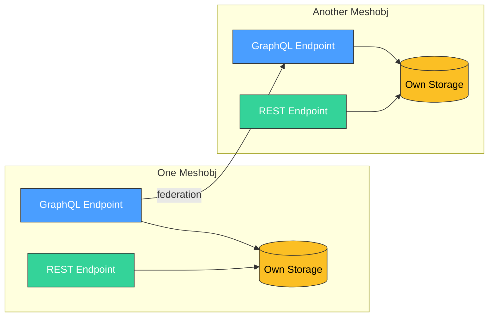
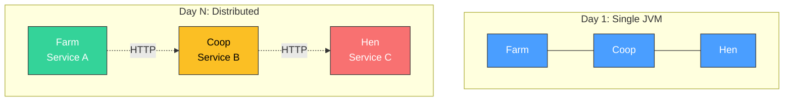

# MeshQL
{: .fs-9 }

Build scalable data APIs that grow with you. From MVP to enterprise scale — no rewrites required.
{: .fs-6 .fw-300 }

[Get Started](/meshql/getting-started){: .btn .btn-primary .fs-5 .mb-4 .mb-md-0 .mr-2 }
[View on GitHub](https://github.com/tsmarsh/meshql){: .btn .fs-5 .mb-4 .mb-md-0 }

---

## The Problem

You're building a data-backed application. You need REST for your mobile team, GraphQL for your frontend, and the architecture needs to handle your first 100 users *and* your first 100,000.

Most frameworks force a choice: build fast with a monolith you'll rewrite later, or invest months in microservices infrastructure you don't need yet.

**MeshQL eliminates that choice.**

---

## What MeshQL Does

MeshQL is a Java 21 framework for building data APIs where **each entity is an independently deployable unit** — a *meshobj* — that exposes both REST and GraphQL endpoints, owns its own data, and federates with other entities through well-defined contracts.

---

## Key Differentiators

### Deploy As One, Scale As Many
{: .fs-5 }

Start with everything in a single JVM. When load demands it, split into separate services by changing a URL. No code changes. No rewrite. The HTTP boundaries between meshobjs exist from day one.

### Every Entity Is a Data Product
{: .fs-5 }

Each meshobj owns its data completely: its own storage, its own schema, its own authorization rules. Temporal versioning is built in — every write creates a new version, and any query can travel back in time.

### Loose Contracts, Independent Teams
{: .fs-5 }

When Service A needs data from Service B, it defines its *own* projection of B's types — not a shared definition. Teams publish schemas independently. No shared type libraries. No circular dependencies. No breaking changes that cascade across the organization.

### Polyglot Persistence Without the Pain
{: .fs-5 }

One entity on MongoDB, another on PostgreSQL, a third on SQLite for edge deployment. Same interfaces, same behavior, guaranteed by a shared certification test suite.

---

## At a Glance

| Feature | Details |
|:--------|:--------|
| **Runtime** | Java 21+ with virtual threads (Project Loom) |
| **Server** | Jetty 12 — thousands of concurrent requests without thread pool exhaustion |
| **REST** | Auto-generated CRUD + bulk ops + Swagger/OpenAPI |
| **GraphQL** | Schema-first with DataLoader batching and federation |
| **Storage** | MongoDB, PostgreSQL, SQLite, in-memory |
| **Auth** | JWT (gateway-validated), Casbin RBAC, NoAuth |
| **Versioning** | Built-in temporal queries across all backends |
| **Federation** | Single-hop resolvers — internal (zero overhead) or external (HTTP) |

---

## Who Is MeshQL For?

**Startup architects** who need to ship an MVP this quarter but don't want to rewrite it next year. MeshQL gives you a modular monolith that's already structured for decomposition.

**Enterprise architects** managing multiple teams that need to build and release independently. MeshQL's schema-first, contract-based federation means teams can work in parallel without stepping on each other.

**Platform engineers** building internal data platforms. MeshQL's certification suite guarantees that every storage backend behaves identically — swap Mongo for Postgres without changing a line of application code.

---

## Inspired By

MeshQL's architecture draws from the principles in [*Software Architecture: The Hard Parts*](https://www.oreilly.com/library/view/software-architecture-the/9781492086888/) by Neal Ford, Mark Richards, Pramod Sadalage, and Zhamak Dehghani. Each design decision maps to a specific architectural pattern from the book.

[See the full mapping](/meshql/architecture/hard-parts){: .btn .btn-outline .fs-4 }
