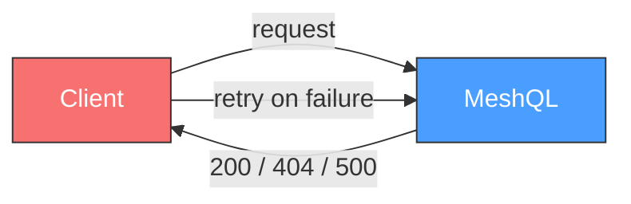
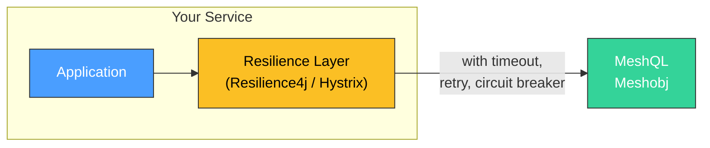
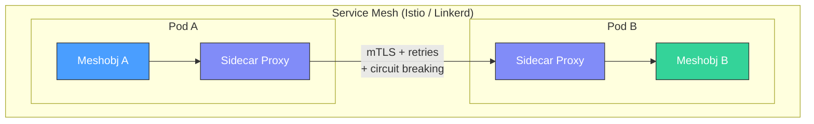
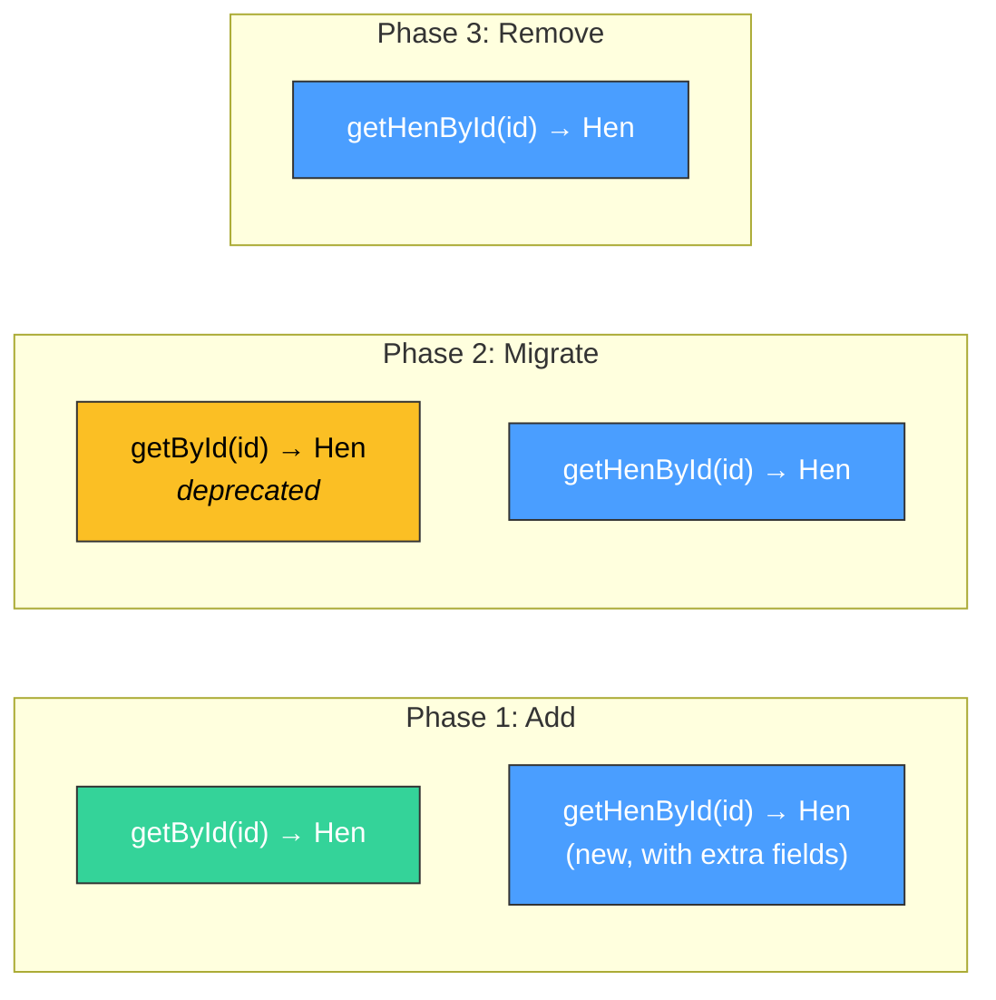
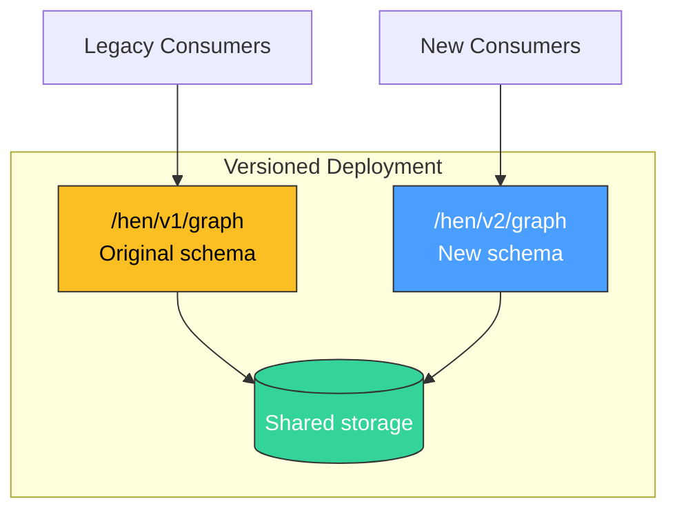
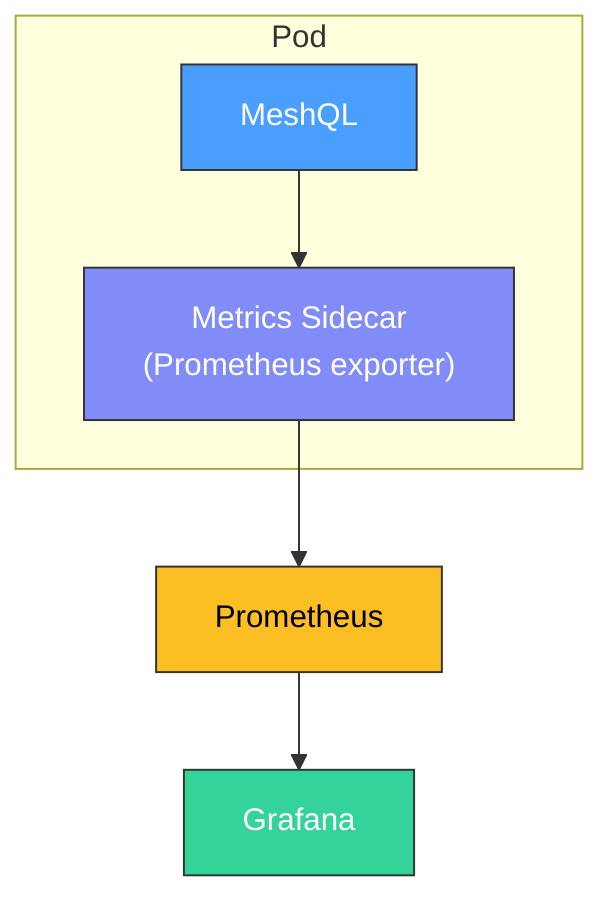
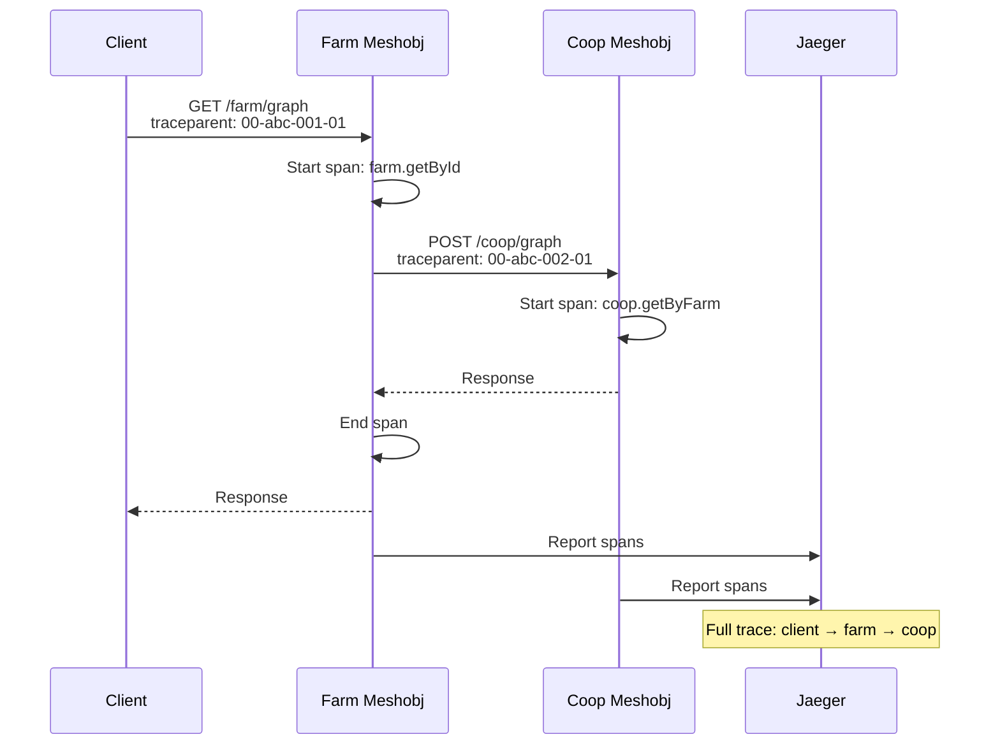

# Operational Blueprints

MeshQL provides primitives, not policies. This page documents concrete patterns for resilience, schema evolution, and observability built on those primitives.

Choose the pattern that fits your scale and requirements. These aren't prescriptive — they're starting points.

---

## Resilience

### MVP: Let It Crash

At MVP scale, simplicity beats sophistication. If a resolver fails, return null. If a write fails, return the error. Let the client retry.



**What MeshQL gives you**: HTTP status codes, idempotent reads, temporal storage (data survives crashes).

**Good enough for**: Single-JVM deployments, small teams, low traffic.

### Growth: Client-Side Resilience

As you distribute meshobjs across services, add resilience at the client level:



**Pattern**: Wrap resolver HTTP calls with [Resilience4j](https://resilience4j.readme.io/):
- **Timeouts**: 2-5s for external resolvers (prevents thread starvation)
- **Retries**: 1-2 retries with exponential backoff for transient failures
- **Circuit breaker**: Open after 5 consecutive failures, half-open after 30s

**Good enough for**: Multi-service deployments, moderate traffic.

### Scale: Service Mesh

At scale, push resilience to the infrastructure layer:



**Pattern**: Configure Istio/Linkerd to handle:
- **Retries**: Automatic retry on 503/connection errors
- **Circuit breaking**: Per-destination connection limits and outlier detection
- **Timeouts**: Enforced at the mesh level
- **mTLS**: Service-to-service authentication without application changes
- **Load balancing**: Distribute requests across meshobj replicas

MeshQL's external resolvers use standard HTTP — any service mesh works without code changes.

**Good enough for**: Large-scale distributed deployments, high availability requirements.

### Recovery from Failures

MeshQL's persistent storage and temporal versioning provide natural recovery primitives:

| Failure | Recovery |
|:--------|:---------|
| Resolver returns null | Client retries or gracefully degrades |
| Write fails mid-operation | Idempotent retry; temporal versioning prevents duplicates |
| Service crashes | Restart and resume; all data is persisted |
| CDC processor falls behind | Kafka retains events; processor catches up on restart |
| Accidental deletion | Soft deletes; query at earlier timestamp to recover data |

---

## Schema Evolution

### The Ground Rules

MeshQL's loose contract model (consumer-defined projections) already insulates consumers from most changes. But when you need to evolve a query interface, follow these guidelines inspired by [Google's Protocol Buffer compatibility rules](https://protobuf.dev/programming-guides/proto3/#updating):

**Safe changes** (no coordination needed):
- Adding new fields to a type
- Adding new queries to a graphlette
- Adding new optional arguments to existing queries
- Adding a new meshobj

**Requires consumer coordination**:
- Removing a field that consumers reference in their projections
- Changing a field's type
- Renaming a query
- Changing a query's required arguments

**Never do**:
- Change the meaning of an existing field
- Change a field's type silently (e.g., `Int` to `String`)
- Remove a query without deprecation

### Pattern: Additive Evolution

The safest approach — add new fields and queries, deprecate old ones:



1. **Add** the new query alongside the old one
2. **Notify** consumers to migrate their resolver configurations
3. **Remove** the old query after all consumers have migrated

### Pattern: Versioned Meshobjs

For breaking changes that can't be done additively, run two versions side by side:



Both versions read from the same storage (the Envelope format is stable). The graphlette schemas differ, but the underlying data is the same. Consumers migrate at their own pace.

### Pattern: Expand-Contract for Field Changes

When a field needs to change type or be renamed:

1. **Expand**: Add the new field alongside the old one
2. **Migrate**: Backfill data so both fields are populated (via REST bulk update or migration script)
3. **Update consumers**: Point resolver configs and projections to the new field
4. **Contract**: Remove the old field from the schema and query templates

```
Step 1: { name: "Henrietta", display_name: "Henrietta" }  ← both fields
Step 2: Consumers switch to display_name
Step 3: { display_name: "Henrietta" }                      ← old field removed
```

---

## Observability

### The Primitives

MeshQL already flows identifiers through the system that you can observe:

| Primitive | Where It Flows | What It Tells You |
|:----------|:---------------|:-----------------|
| Document `id` | Storage → REST response → GraphQL → federation → CDC | Which entity is being accessed |
| Auth tokens | HTTP header → Auth → Repository/Searcher filter | Who is making the request |
| HTTP requests | Between meshobjs via external resolvers | Federation topology and latency |
| `createdAt` timestamps | Every Envelope version | Write patterns and data velocity |
| Kafka offsets | CDC pipeline | Processing lag and throughput |

### Pattern: Structured Logging

Configure SLF4J with a structured backend (Logback JSON encoder, Log4j2 JSON layout):

```xml
<!-- logback.xml -->
<configuration>
    <appender name="STDOUT" class="ch.qos.logback.core.ConsoleAppender">
        <encoder class="net.logstash.logback.encoder.LogstashEncoder"/>
    </appender>

    <logger name="com.meshql" level="DEBUG"/>
    <root level="INFO">
        <appender-ref ref="STDOUT"/>
    </root>
</configuration>
```

Pipe to your aggregator of choice (CloudWatch, Datadog, Splunk, ELK).

### Pattern: Sidecar Metrics

Since MeshQL uses standard HTTP between meshobjs, any HTTP-aware sidecar can collect metrics:



Key metrics to track:
- **Request latency** per graphlette/restlette endpoint
- **Resolver latency** (time spent in federation calls)
- **Error rate** per endpoint
- **DataLoader batch sizes** (are you hitting the 100-ID max?)
- **Temporal query frequency** (how often do consumers use `at` parameters?)

### Pattern: Distributed Tracing

MeshQL's external resolvers forward the `Authorization` header. To add trace propagation, add a servlet filter that injects trace context headers (`traceparent`, `X-Request-ID`) and forward them through resolver HTTP calls:



Compatible with OpenTelemetry, Jaeger, Zipkin, or any W3C Trace Context implementation.

### Pattern: Health and Readiness

MeshQL exposes built-in health endpoints:

```
GET /health → {"status": "ok"}
GET /ready  → {"status": "ok"}
```

Use these for Kubernetes liveness and readiness probes:

```yaml
livenessProbe:
  httpGet:
    path: /health
    port: 3033
readinessProbe:
  httpGet:
    path: /ready
    port: 3033
```
