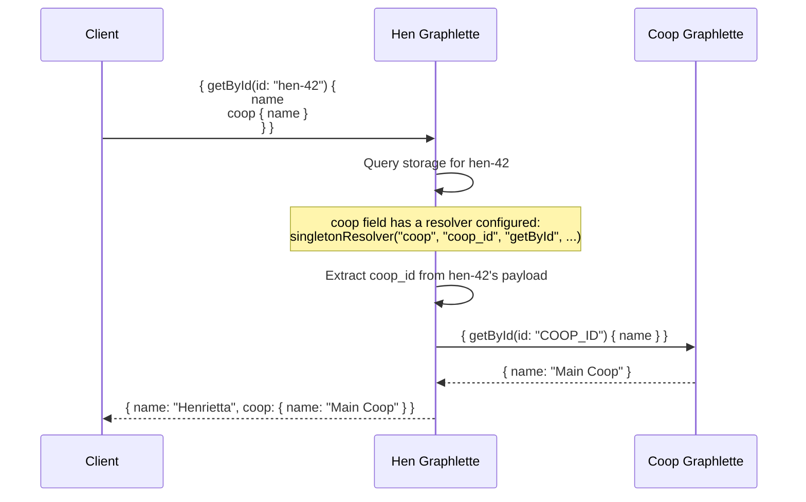

# GraphQL API Reference

Each Graphlette exposes a schema-first GraphQL endpoint with federation support.

---

## Request Format

All GraphQL requests use `POST`:

```
POST /item/graph
Content-Type: application/json
Authorization: Bearer eyJ...

{
  "query": "{ getById(id: \"item-42\") { name price } }"
}
```

---

## Query Types

### Singleton Queries

Return a single object. Configured via `QueryConfig` in `RootConfig.singletons`:

```graphql
type Query {
    getById(id: ID!, at: Float): Item
    getByName(name: String!, at: Float): Item
}
```

```java
.singleton("getById", "{\"id\": \"{{id}}\"}")
.singleton("getByName", "{\"payload.name\": \"{{name}}\"}")
```

### Vector Queries

Return a list of objects. Configured via `QueryConfig` in `RootConfig.vectors`:

```graphql
type Query {
    getByCoop(id: ID!, at: Float): [Hen]
    getByCategory(category: String!, at: Float): [Item]
}
```

```java
.vector("getByCoop", "{\"payload.coop_id\": \"{{id}}\"}")
.vector("getByCategory", "{\"payload.category\": \"{{category}}\"}")
```

---

## Temporal Queries

Every query supports an optional `at` parameter — a Unix timestamp (milliseconds) for point-in-time queries:

```graphql
# Current data
{ getById(id: "item-42") { name price } }

# Data as of a specific moment
{ getById(id: "item-42", at: 1705327200000) { name price } }
```

When `at` is provided, the query returns the latest version of the document created at or before that timestamp. When omitted, it returns the current version.

The `at` parameter propagates through federation resolvers, so nested queries return data from the same point in time.

---

## Federation Resolvers

Fields that reference other entities are resolved through federation:

```graphql
type Hen {
    id: ID!
    name: String
    coop: Coop          # Resolved via singleton resolver
    layReports: [LayReport]  # Resolved via vector resolver
}
```

### How Resolution Works



### DataLoader Batching

When multiple objects need the same resolver (e.g., 10 hens each resolving their coop), DataLoader batches them:

```graphql
# This query triggers DataLoader batching
{
  getByCoop(id: "coop-1") {
    name
    layReports { eggs time_of_day }
  }
}
```

Instead of N separate requests for N hens' lay reports, DataLoader sends one batched request:

```graphql
{
  item_0: getByHen(id: "hen-1") { eggs time_of_day }
  item_1: getByHen(id: "hen-2") { eggs time_of_day }
  item_2: getByHen(id: "hen-3") { eggs time_of_day }
}
```

---

## Response Format

Standard GraphQL response:

```json
{
  "data": {
    "getById": {
      "name": "Henrietta",
      "eggs": 3,
      "coop": {
        "name": "Main Coop"
      }
    }
  }
}
```

### Errors

```json
{
  "data": null,
  "errors": [
    {
      "message": "Exception while fetching data (/getById)",
      "locations": [{"line": 1, "column": 3}],
      "path": ["getById"]
    }
  ]
}
```

---

## Custom Scalars

MeshQL registers a `Date` scalar type:

```graphql
scalar Date
```

Dates are serialized as ISO-8601 strings or Unix timestamps depending on the storage backend.

---

## Schema Patterns

### Minimal Entity Schema

```graphql
scalar Date

type Query {
    getById(id: ID!, at: Float): Item
}

type Item {
    id: ID!
    name: String!
    createdAt: Date
}
```

### Entity with Federation

```graphql
scalar Date

type Query {
    getById(id: ID!, at: Float): Hen
    getByCoop(id: ID!, at: Float): [Hen]
}

type Hen {
    id: ID!
    name: String
    coop: Coop              # Singleton resolver
    layReports: [LayReport]  # Vector resolver
}

# Projections of foreign types
type Coop {
    id: ID!
    name: String
}

type LayReport {
    id: ID!
    eggs: Int
}
```

{: .note }
> Foreign type projections (Coop, LayReport above) are intentionally minimal. They define only the fields this service needs, not the full canonical type. See [Federation](../architecture/federation) for details on why.
