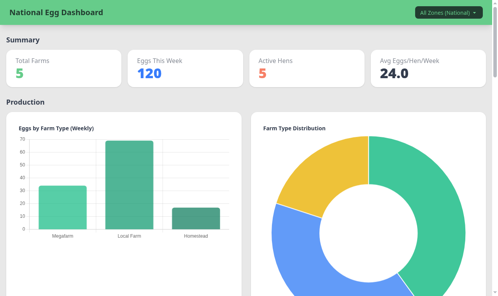
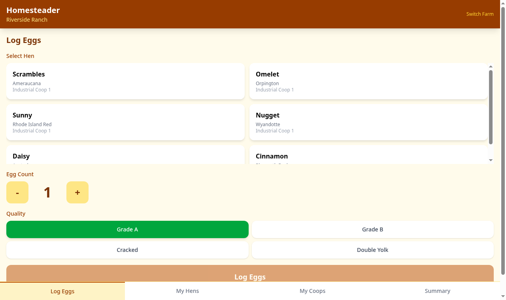
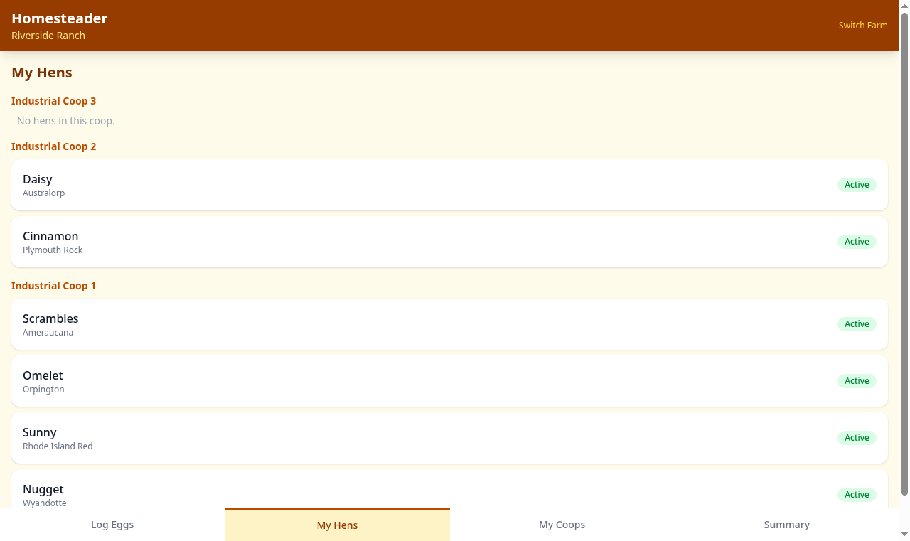
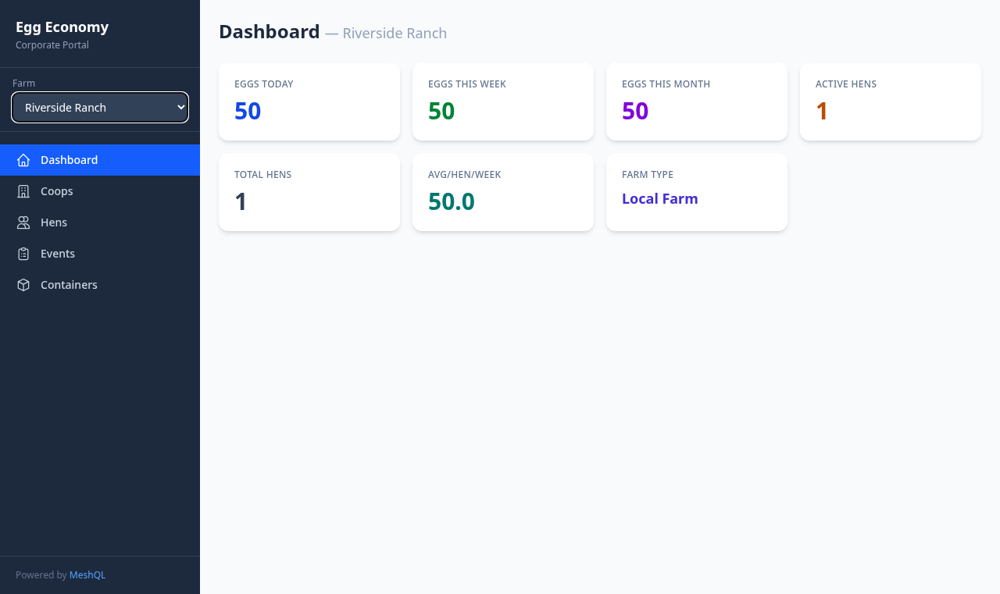
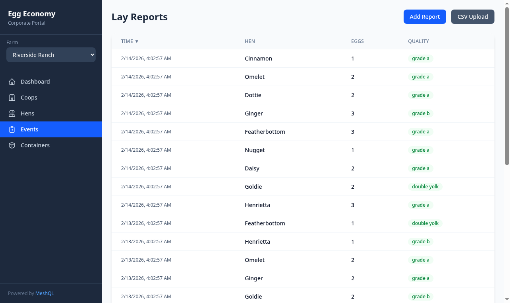

# Egg Economy — Event-Sourced MeshQL Example

An event-sourced egg farm economy demonstrating **CDC workflow processing**, **materialized projections**, and **MongoDB sharding** with MeshQL.

## Architecture

```
Events (REST POST) → MongoDB (events shard) → Debezium → Kafka → WorkflowProcessor → Projections (REST PUT) → MongoDB (projections shard)
                                                                                            ↓
                                                                                    GraphQL reads (all 13 entities)
```

### 13 Entities

- **5 Actors**: Farm, Coop, Hen, Container, Consumer (low write volume)
- **5 Events**: LayReport, StorageDeposit, StorageWithdrawal, ContainerTransfer, ConsumptionReport (append-only, high volume)
- **3 Projections**: ContainerInventory, HenProductivity, FarmOutput (materialized by workflow processor)

### 3 MongoDB Shards

| Shard | Collections | Purpose |
|-------|-------------|---------|
| `mongodb-actors` | farm, coop, hen, container, consumer | Low writes, frequent reads |
| `mongodb-events` | lay_report, storage_deposit, storage_withdrawal, container_transfer, consumption_report | High writes, append-only |
| `mongodb-projections` | container_inventory, hen_productivity, farm_output | Moderate writes, frequent reads |

Sharding in MeshQL is pure configuration — each graphlette/restlette's `MongoConfig` points at the appropriate shard.

## Quick Start

```bash
# Build
mvn clean package -pl examples/egg-economy -am -DskipTests

# Start everything (3 MongoDB + Kafka + Debezium + app + 3 frontends + nginx)
cd examples/egg-economy
docker compose up --build

# Seed data (5 farms, 20 hens, ~85 events)
./scripts/seed.sh

# Open frontends
open http://localhost:8088/dashboard/     # National Dashboard
open http://localhost:8088/homestead/     # Homesteader App
open http://localhost:8088/corporate/     # Corporate Portal

# Direct API access (bypassing nginx)
curl -X POST http://localhost:5088/farm/graph \
  -H "Content-Type: application/json" \
  -d '{"query": "{ getAll { name farm_type coops { name hens { name } } } }"}'
```

## Frontends

Three frontend applications serve different personas, all backed by the same MeshQL API via an nginx reverse proxy on port **8088**.

```
http://localhost:8088/
├── /dashboard/   → National Egg Dashboard (Alpine.js + Chart.js + DaisyUI)
├── /homestead/   → Homesteader App (React PWA)
├── /corporate/   → Corporate Portal (React + Vite + Tailwind)
└── /api/         → MeshQL API (proxied to egg-economy:5088)
```

### National Egg Dashboard

**Persona**: Public reporting — anyone can view national and regional egg production statistics.

**Stack**: Alpine.js 3 + DaisyUI 4 + Chart.js 4 (all CDN, no build step)



| Section | Content | Data Source |
|---------|---------|-------------|
| Summary Cards | Total farms, eggs this week, active hens, avg eggs/hen/week | `farm_output/graph` |
| Production Charts | Bar: eggs by farm type. Doughnut: farm type distribution | `farm_output/graph` |
| Container Utilization | Horizontal bar chart + stat cards (in storage, consumed) | `container_inventory/graph`, `container/graph` |
| Top Producers | Top 10 farms by weekly eggs, top 10 hens by total eggs | `farm_output/graph`, `hen_productivity/graph` |
| Consumption | Doughnut by purpose, recent consumption table | `consumption_report/graph` |

- Zone filter in navbar updates all charts and tables client-side (no re-fetch)
- Read-only — no writes
- DaisyUI `emerald` theme (green/nature)

### Homesteader App

**Persona**: Small-scale farmer using a phone once or twice a week to log eggs and manage a small flock.

**Stack**: React 19 + Vite 6 + Tailwind 4, PWA with `manifest.json` and service worker




| Tab | Purpose | API Calls |
|-----|---------|-----------|
| **Log Eggs** | Big touch-friendly form: select hen card, +/- egg count, quality picker | `GET /coop/graph` (getByFarm), `POST /lay_report/api` |
| **My Hens** | Hen list grouped by coop, tap to see lay report history | `GET /coop/graph` (getByFarm), `GET /lay_report/graph` (getByHen) |
| **My Coops** | View/add coops, add hens inline | `GET /coop/graph` (getByFarm), `POST /coop/api`, `POST /hen/api` |
| **Summary** | Weekly KPI cards + hen leaderboard from projections | `GET /farm_output/graph` (getByFarm), `GET /hen_productivity/graph` (getAll) |

- Large tap targets (min 48px), big fonts for outdoor use
- Warm amber/green palette — farmhouse feel
- Bottom tab bar (mobile convention)
- PWA installable: `"display": "standalone"` with offline shell caching
- Farm ID stored in localStorage after first-run farm picker (no login)

### Corporate Portal

**Persona**: Farm operations manager at a megafarm or regional office. Desktop browser, bulk operations.

**Stack**: React 19 + Vite 6 + Tailwind 4




| Section | Purpose | API Calls |
|---------|---------|-----------|
| **Dashboard** | KPI cards: eggs today/week/month, active hens, avg/hen/week | `GET /farm_output/graph` (getByFarm) |
| **Coops** | Sortable table with capacity & hen count, add coop form | `GET /coop/graph` (getByFarm), `POST /coop/api` |
| **Hens** | Sortable/filterable table by coop, CSV bulk upload | `GET /coop/graph` (getByFarm), `POST /hen/api` |
| **Events** | Lay report table with manual entry + CSV bulk upload | `GET /lay_report/graph` (getByFarm), `POST /lay_report/api` |
| **Containers** | Container inventory with utilization badges | `GET /container/graph` (getAll), `GET /container_inventory/graph` (getAll) |

- Professional blue/slate palette, fixed sidebar with SVG icons
- Farm selector dropdown in sidebar (multi-farm support)
- CSV upload: client-side parse with FileReader, POST each row, progress bar
- Sortable table headers with ascending/descending indicators
- Desktop-optimized (min-width ~1024px)

## Endpoints

| Entity | REST | GraphQL |
|--------|------|---------|
| Farm | `/farm/api` | `/farm/graph` |
| Coop | `/coop/api` | `/coop/graph` |
| Hen | `/hen/api` | `/hen/graph` |
| Container | `/container/api` | `/container/graph` |
| Consumer | `/consumer/api` | `/consumer/graph` |
| LayReport | `/lay_report/api` | `/lay_report/graph` |
| StorageDeposit | `/storage_deposit/api` | `/storage_deposit/graph` |
| StorageWithdrawal | `/storage_withdrawal/api` | `/storage_withdrawal/graph` |
| ContainerTransfer | `/container_transfer/api` | `/container_transfer/graph` |
| ConsumptionReport | `/consumption_report/api` | `/consumption_report/graph` |
| ContainerInventory | `/container_inventory/api` | `/container_inventory/graph` |
| HenProductivity | `/hen_productivity/api` | `/hen_productivity/graph` |
| FarmOutput | `/farm_output/api` | `/farm_output/graph` |

## CDC Pipeline

1. Events are POSTed via REST to MongoDB (events shard)
2. Debezium captures change streams and publishes to Kafka (5 topics)
3. `EventWorkflowProcessor` consumes events and routes to updaters
4. Updaters read-modify-write projections via GraphQL GET + REST PUT
5. Projections are queryable via GraphQL with full federation

## Federation

All 19 resolvers are internal (in-JVM, zero HTTP overhead). Example traversal:

```graphql
{
  getAll {
    name
    farm_type
    coops {
      name
      hens {
        name
        productivity { eggs_week quality_rate }
        layReports { eggs timestamp }
      }
    }
    farmOutput { eggs_week avg_per_hen_per_week }
  }
}
```

## Docker Compose Services

| Service | Image | Port | Purpose |
|---------|-------|------|---------|
| `mongodb-actors` | mongo:8 | 27017 | Actors shard (farm, coop, hen, container, consumer) |
| `mongodb-events` | mongo:8 | 27017 | Events shard (lay_report, storage_deposit, etc.) |
| `mongodb-projections` | mongo:8 | 27017 | Projections shard (container_inventory, etc.) |
| `kafka` | apache/kafka:3.7.0 | 9092 | Event streaming (KRaft mode) |
| `debezium` | debezium/server:2.6 | 8080 | CDC from events MongoDB |
| `egg-economy` | Built from `Dockerfile` | 5088 | MeshQL API (13 entities) |
| `homesteader-app` | Built from `homesteader-app/` | 80 | React PWA (mobile farmer) |
| `corporate-app` | Built from `corporate-app/` | 80 | React portal (operations manager) |
| `dashboard-app` | Built from `dashboard-app/` | 80 | Alpine.js dashboard (public) |
| `nginx` | nginx:alpine | **8088** | Reverse proxy (all frontends + API) |

## Scale Target

Full-week simulation at production scale:
- 900,000 hens across 10,105 farms
- ~5.4M events/week (~4.5M LayReports + deposits/transfers/consumption)
- 60,530 containers, 1,000,000 consumers
